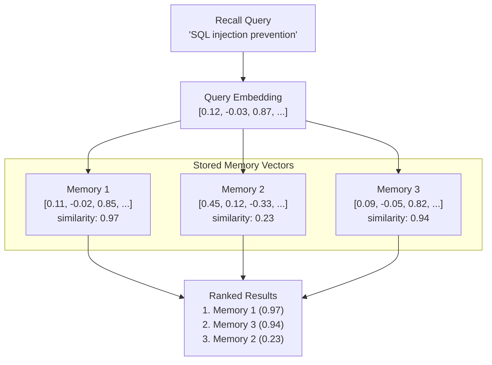

# ベクトル検索

ベクトル検索はPRX-Memoryのセマンティックメモリ検索を可能にするコアメカニズムです。キーワードマッチングの代わりに、ベクトル検索はクエリとメモリ埋め込みの数学的類似度を比較して概念的に関連する結果を見つけます。

## 動作の仕組み

1. **クエリ埋め込み：** 検索クエリが設定済みの埋め込みプロバイダに送信され、ベクトルが生成されます。
2. **類似度計算：** クエリベクトルがコサイン類似度を使用して保存されているすべてのメモリベクトルと比較されます。
3. **スコアリング：** 各メモリは-1.0から1.0の類似度スコアを受け取ります（高いほど類似度が高い）。
4. **ランキング：** 結果はスコアで並べ替えられ、他のシグナル（語彙マッチ、重要度、再近接度）と組み合わされます。



## コサイン類似度

PRX-Memoryは距離メトリクスとしてコサイン類似度を使用します。コサイン類似度は2つのベクトル間の角度を測定し、大きさを無視します：

```
similarity(A, B) = (A . B) / (|A| * |B|)
```

| スコア | 意味 |
|-------|------|
| 0.95〜1.0 | ほぼ同一の意味 |
| 0.80〜0.95 | 高度に関連 |
| 0.60〜0.80 | ある程度関連 |
| < 0.60 | おそらく無関係 |

## 複合ランキング

ベクトル類似度はPRX-Memoryのマルチシグナルランキングの1つのシグナルです。最終スコアは以下を組み合わせます：

| シグナル | 重み | 説明 |
|---------|-----|------|
| ベクトル類似度 | 高 | 埋め込み比較からのセマンティック関連度 |
| 語彙マッチ | 中 | クエリとメモリテキスト間のキーワード重複 |
| 重要度スコア | 中 | ユーザー割り当てまたはシステム計算の重要度 |
| 再近接度 | 低 | より最近のメモリに小さなブースト |

正確な重み付けは検索設定と埋め込みおよびリランキングが有効かどうかによって異なります。

## パフォーマンス

100kエントリのベンチマーク結果：

| メトリクス | 値 |
|---------|---|
| データセットサイズ | 100,000件 |
| p95レイテンシ | 122.683ms |
| しきい値 | 300ms以内 |
| メソッド | 語彙 + 重要度 + 再近接度（ネットワーク呼び出しなし） |

::: info
このベンチマークはネットワーク埋め込みまたはリランク呼び出しなしの検索ランキングパスのみを測定します。エンドツーエンドのレイテンシはプロバイダのレスポンスタイムに依存します。
:::

## スケーリングの考慮事項

| データセットサイズ | 推奨アプローチ |
|--------------|------------|
| 10,000件未満 | ブルートフォースコサイン類似度（JSONまたはSQLiteバックエンド） |
| 10,000〜100,000件 | インメモリベクトルスキャンを持つSQLite |
| 100,000件以上 | ANNインデックスを持つLanceDB |

100,000件を超えるデータセットでは、サブ線形クエリタイムを提供する近似最近傍（ANN）検索のためにLanceDBバックエンドを有効にしてください。

## 次のステップ

- [埋め込みエンジン](../embedding/) -- ベクトルの生成方法
- [リランキング](../reranking/) -- 第2段階の精度向上
- [ストレージバックエンド](./index) -- 適切なストレージバックエンドを選択
