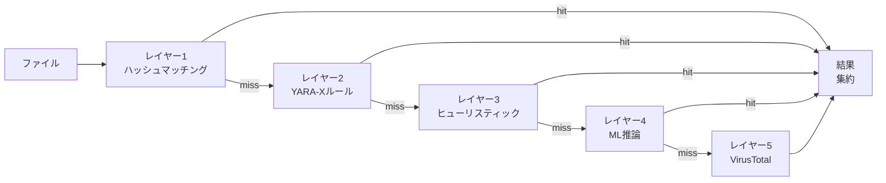

# 検出エンジン

PRX-SDはマルウェアを識別するために多層検出パイプラインを使用します。各レイヤーは異なる技術を使用し、最も高速なものから最も徹底的なものへと順番に実行されます。この多層防御アプローチにより、一つのレイヤーが脅威を見逃しても、後続のレイヤーが捕捉できることが保証されます。

## パイプライン概要

検出パイプラインは各ファイルを最大5つのレイヤーで処理します：



## レイヤーサマリー

| レイヤー | エンジン | 速度 | カバレッジ | 必須 |
|-------|--------|-------|----------|----------|
| **レイヤー1** | LMDBハッシュマッチング | ~1マイクロ秒/ファイル | 既知のマルウェア（完全一致） | はい（デフォルト） |
| **レイヤー2** | YARA-Xルールスキャン | ~0.3ミリ秒/ファイル | パターンベース（38,800以上のルール） | はい（デフォルト） |
| **レイヤー3** | ヒューリスティック分析 | ~1〜5ミリ秒/ファイル | ファイルタイプ別の動作指標 | はい（デフォルト） |
| **レイヤー4** | ONNX ML推論 | ~10〜50ミリ秒/ファイル | 新規/多態性マルウェア | オプション（`--features ml`） |
| **レイヤー5** | VirusTotal API | ~200〜500ミリ秒/ファイル | 70以上のベンダーコンセンサス | オプション（`--features virustotal`） |

## レイヤー1: ハッシュマッチング

最も高速なレイヤー。PRX-SDは各ファイルのSHA-256ハッシュを計算し、既知の悪意のあるハッシュを含むLMDBデータベースで照合します。LMDBはメモリマップI/OによりO(1)のルックアップ時間を提供し、このレイヤーのパフォーマンスへの影響を最小限に抑えます。

**データソース:**
- abuse.ch MalwareBazaar（最新48時間、5分ごとに更新）
- abuse.ch URLhaus（1時間ごとに更新）
- abuse.ch Feodo Tracker（Emotet/Dridex/TrickBot、5分ごと）
- abuse.ch ThreatFox（IOC共有プラットフォーム）
- VirusShare（2000万以上のMD5ハッシュ、オプションの`--full`更新）
- 組み込みブロックリスト（EICAR、WannaCry、NotPetya、Emotetなど）

ハッシュマッチングは即座に`MALICIOUS`判定を生成します。残りのレイヤーはそのファイルについてスキップされます。

詳細については[ハッシュマッチング](./hash-matching)を参照してください。

## レイヤー2: YARA-Xルール

ハッシュマッチングが見つからない場合、ファイルはYARA-Xエンジン（YARAの次世代Rustリライト）を使用して38,800以上のYARAルールに対してスキャンされます。ルールはファイル内容のバイトパターン、文字列、構造的条件を照合することでマルウェアを検出します。

**ルールソース:**
- 64の組み込みルール（ランサムウェア、トロイの木馬、バックドア、ルートキット、マイナー、ウェブシェル）
- Yara-Rules/rules（コミュニティメンテナンス、GitHub）
- Neo23x0/signature-base（高品質APTおよびコモディティマルウェアルール）
- ReversingLabs YARA（商用グレードのオープンソースルール）
- ESET IOC（高度な持続的脅威追跡）
- InQuest（ドキュメントマルウェア：OLE、DDE、悪意のあるマクロ）

YARAルールマッチングは`MALICIOUS`判定を生成し、レポートにルール名が含まれます。

詳細については[YARAルール](./yara-rules)を参照してください。

## レイヤー3: ヒューリスティック分析

ハッシュとYARAチェックを通過したファイルは、ファイルタイプ対応のヒューリスティックを使用して分析されます。PRX-SDはマジックナンバー検出によりファイルタイプを識別し、対象を絞ったチェックを適用します：

| ファイルタイプ | ヒューリスティックチェック |
|-----------|-----------------|
| PE（Windows） | セクションエントロピー、疑わしいAPIインポート、パッカー検出、タイムスタンプ異常 |
| ELF（Linux） | セクションエントロピー、LD_PRELOAD参照、cron/systemd永続性、SSHバックドアパターン |
| Mach-O（macOS） | セクションエントロピー、dylib注入、LaunchAgent永続性、Keychainアクセス |
| Office（docx/xlsx） | VBAマクロ、DDEフィールド、外部テンプレートリンク、自動実行トリガー |
| PDF | 埋め込みJavaScript、Launch操作、URI操作、難読化ストリーム |

各チェックは累積スコアに寄与します：

| スコア | 判定 |
|-------|---------|
| 0〜29 | **クリーン** |
| 30〜59 | **疑わしい** -- 手動確認を推奨 |
| 60〜100 | **悪意あり** -- 高確信度の脅威 |

詳細については[ヒューリスティック分析](./heuristics)を参照してください。

## レイヤー4: ML推論（オプション）

`ml`フィーチャーでコンパイルした場合、PRX-SDは数百万のマルウェアサンプルで訓練されたONNX機械学習モデルを通じてファイルを実行できます。このレイヤーは署名ベースの検出を回避する新規および多態性マルウェアの検出に特に効果的です。

```bash
# MLサポートでビルド
cargo build --release --features ml
```

MLモデルはONNX Runtimeを使用してローカルで実行されます。クラウド接続は不要です。

::: tip MLを使用するタイミング
ML推論はレイテンシを追加します（ファイルあたり約10〜50ミリ秒）。最初の3つのレイヤーで十分なカバレッジを提供するフルディスクスキャンではなく、疑わしいファイルやディレクトリの対象を絞ったスキャンに有効にしてください。
:::

## レイヤー5: VirusTotal（オプション）

`virustotal`フィーチャーでコンパイルし、APIキーで設定した場合、PRX-SDは70以上のアンチウイルスベンダーのコンセンサスのためにVirusTotalにファイルハッシュを送信できます。

```bash
# VirusTotalサポートでビルド
cargo build --release --features virustotal

# APIキーを設定
sd config set virustotal.api_key "YOUR_API_KEY"
```

::: warning レート制限
無料のVirusTotal APIは1分に4リクエスト、1日に500リクエストを許可します。PRX-SDはこれらの制限を自動的に遵守します。このレイヤーはバルクスキャンではなく最終確認ステップとして最もよく使用されます。
:::

## 結果集約

ファイルが複数のレイヤーでスキャンされると、最終判定はすべてのレイヤーで見つかった**最高重要度**によって決定されます：

```
MALICIOUS > SUSPICIOUS > CLEAN
```

レイヤー1が`MALICIOUS`を返した場合、他のレイヤーが何を言っても、そのファイルは悪意あるとして報告されます。レイヤー3が`SUSPICIOUS`を返し、他のレイヤーが`MALICIOUS`を返さない場合、ファイルは疑わしいとして報告されます。

スキャンレポートには調査員に完全なコンテキストを提供するために、調査結果を生成したすべてのレイヤーの詳細が含まれます。

## レイヤーの無効化

特殊なユースケースでは、個々のレイヤーを無効化できます：

```bash
# ハッシュのみスキャン（最速、既知の脅威のみ）
sd scan /path --no-yara --no-heuristics

# ヒューリスティックをスキップ（ハッシュ + YARAのみ）
sd scan /path --no-heuristics
```

## 次のステップ

- [ハッシュマッチング](./hash-matching) -- LMDBハッシュデータベースの詳細
- [YARAルール](./yara-rules) -- ルールソースとカスタムルール管理
- [ヒューリスティック分析](./heuristics) -- ファイルタイプ対応の動作チェック
- [対応ファイルタイプ](./file-types) -- ファイル形式マトリックスとマジック検出
