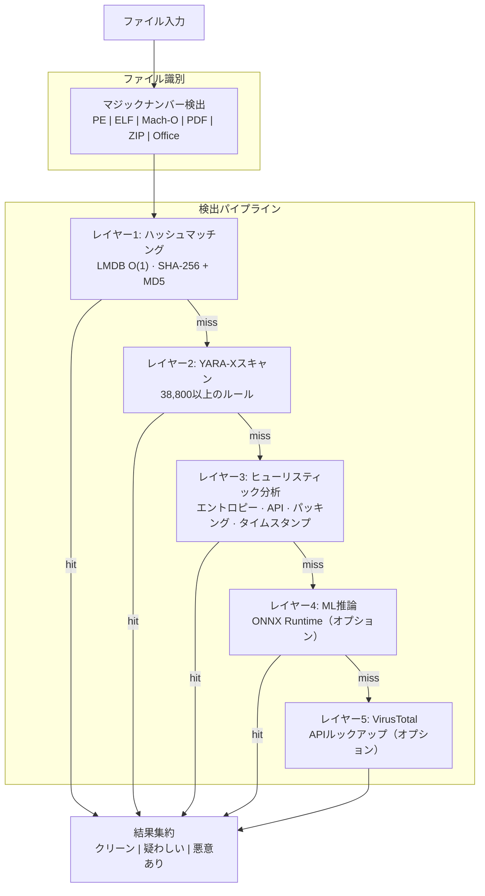

# PRX-SD

**PRX-SD** はRustで書かれた高性能オープンソースのアンチウイルスエンジンです。ハッシュベースのシグネチャマッチング、38,800以上のYARAルール、ファイルタイプ対応のヒューリスティック分析、オプションのML推論を単一の多層検出パイプラインに統合しています。PRX-SDはコマンドラインツール（`sd`）、リアルタイム保護のためのシステムデーモン、Tauri + Vue 3デスクトップGUIとして提供されます。

PRX-SDは、高速で透明性があり拡張可能なマルウェア検出エンジンを必要とするセキュリティエンジニア、システム管理者、インシデント対応者向けに設計されています。数百万のファイルをスキャンし、ディレクトリをリアルタイムで監視し、ルートキットを検出し、外部の脅威インテリジェンスフィードと統合できます。すべて不透明な商用ブラックボックスに依存することなく実現します。

## なぜPRX-SDなのか？

従来のアンチウイルス製品はクローズドソースでリソースを大量消費し、カスタマイズが困難です。PRX-SDは異なるアプローチを取ります：

- **オープンで監査可能。** すべての検出ルール、ヒューリスティックチェック、スコアリング閾値がソースコードで確認できます。隠れたテレメトリなし、クラウド依存不要。
- **多層防御。** 5つの独立した検出レイヤーにより、一つの方法が脅威を見逃しても次のレイヤーが捕捉します。
- **Rustファーストのパフォーマンス。** ゼロコピーI/O、LMDB O(1)ハッシュルックアップ、並列スキャンにより、コモディティハードウェアで商用エンジンに匹敵するスループットを実現します。
- **設計による拡張性。** WASMプラグイン、カスタムYARAルール、モジュラーアーキテクチャにより、特殊な環境への適応が容易です。

## 主な機能

<div class="vp-features">

- **多層検出パイプライン** -- ハッシュマッチング、YARA-Xルール、ヒューリスティック分析、オプションのML推論、オプションのVirusTotal統合が連携して検出率を最大化します。

- **リアルタイム保護** -- `sd monitor`デーモンがinotify（Linux）/ FSEvents（macOS）を使用してディレクトリを監視し、新しいファイルや変更されたファイルを即座にスキャンします。

- **ランサムウェア防御** -- 専用のYARAルールとヒューリスティックがWannaCry、LockBit、Conti、REvil、BlackCatなどのランサムウェアファミリーを検出します。

- **38,800以上のYARAルール** -- 8つのコミュニティおよび商用グレードのソースから集約：Yara-Rules、Neo23x0 signature-base、ReversingLabs、ESET IOC、InQuest、64の組み込みルール。

- **LMDBハッシュデータベース** -- abuse.ch MalwareBazaar、URLhaus、Feodo Tracker、ThreatFox、VirusShare（2000万以上）、組み込みブロックリストのSHA-256/MD5ハッシュがO(1)ルックアップのためLMDBに保存されます。

- **クロスプラットフォーム** -- Linux（x86_64、aarch64）、macOS（Apple Silicon、Intel）、Windows（WSL2）。PE、ELF、Mach-O、PDF、Office、アーカイブ形式のネイティブファイルタイプ検出。

- **WASMプラグインシステム** -- WebAssemblyプラグインを通じて検出ロジックを拡張し、カスタムスキャナーを追加し、独自の脅威フィードと統合できます。

</div>

## アーキテクチャ



## クイックインストール

```bash
curl -fsSL https://openprx.dev/install-sd.sh | bash
```

またはCargoでインストール：

```bash
cargo install prx-sd
```

シグネチャデータベースを更新：

```bash
sd update
```

すべてのインストール方法（Dockerやソースからのビルドを含む）については[インストールガイド](./getting-started/installation)を参照してください。

## ドキュメントセクション

| セクション | 説明 |
|---------|-------------|
| [インストール](./getting-started/installation) | Linux、macOS、Windows WSL2へのPRX-SDインストール |
| [クイックスタート](./getting-started/quickstart) | 5分でPRX-SDスキャンを開始 |
| [ファイル＆ディレクトリスキャン](./scanning/file-scan) | `sd scan`コマンドの完全リファレンス |
| [メモリスキャン](./scanning/memory-scan) | 実行中のプロセスメモリの脅威スキャン |
| [ルートキット検出](./scanning/rootkit) | カーネルおよびユーザースペースのルートキット検出 |
| [USBスキャン](./scanning/usb-scan) | リムーバブルメディアの自動スキャン |
| [検出エンジン](./detection/) | 多層パイプラインの仕組み |
| [ハッシュマッチング](./detection/hash-matching) | LMDBハッシュデータベースとデータソース |
| [YARAルール](./detection/yara-rules) | 8ソースからの38,800以上のルール |
| [ヒューリスティック分析](./detection/heuristics) | ファイルタイプ対応の動作分析 |
| [対応ファイルタイプ](./detection/file-types) | ファイル形式マトリックスとマジック検出 |

## プロジェクト情報

- **ライセンス:** MIT OR Apache-2.0
- **言語:** Rust（2024エディション）
- **リポジトリ:** [github.com/openprx/prx-sd](https://github.com/openprx/prx-sd)
- **最小Rustバージョン:** 1.85.0
- **GUI:** Tauri 2 + Vue 3
