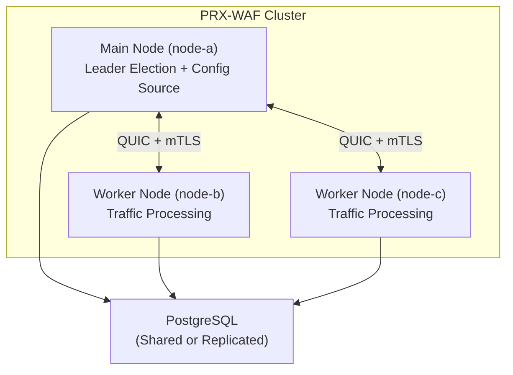

# クラスターモード

PRX-WAFは水平スケーリングと高可用性のためのマルチノードクラスターデプロイメントをサポートします。クラスターモードはQUICベースのノード間通信、Raftインスパイアのリーダー選出、すべてのノード間でのルール、設定、セキュリティイベントの自動同期を使用します。

::: info
クラスターモードは完全にオプトインです。デフォルトでは、PRX-WAFはクラスターのオーバーヘッドなしでスタンドアロンモードで実行されます。設定に`[cluster]`セクションを追加することで有効化します。
:::

## アーキテクチャ

PRX-WAFクラスターは1つの**メイン**ノードと1つ以上の**ワーカー**ノードで構成されます：



### ノードロール

| ロール | 説明 |
|------|-------------|
| `main` | 権威ある設定とルールセットを保持。ワーカーに更新をプッシュ。リーダー選出に参加。 |
| `worker` | トラフィックを処理しWAFパイプラインを適用。メインノードから設定とルールの更新を受信。セキュリティイベントをメインにプッシュバック。 |
| `auto` | Raftインスパイアのリーダー選出に参加。どのノードもメインになれる。 |

## 同期されるデータ

| データ | 方向 | 間隔 |
|------|-----------|----------|
| ルール | メインからワーカー | 10秒ごと（設定可能） |
| 設定 | メインからワーカー | 30秒ごと（設定可能） |
| セキュリティイベント | ワーカーからメイン | 5秒ごとまたは100イベント（先に達した方） |
| 統計 | ワーカーからメイン | 10秒ごと |

## ノード間通信

すべてのクラスター通信は相互TLS（mTLS）を持つQUIC（Quinn経由）でUDP上で使用します：

- **ポート：** `16851`（デフォルト）
- **暗号化：** 自動生成または事前プロビジョニング済み証明書を使用したmTLS
- **プロトコル：** QUICストリーム上のカスタムバイナリプロトコル
- **接続：** 自動再接続を伴う持続的接続

## リーダー選出

`role = "auto"`が設定されている場合、ノードはRaftインスパイアの選出プロトコルを使用します：

| パラメーター | デフォルト | 説明 |
|-----------|---------|-------------|
| `timeout_min_ms` | `150` | 最小選出タイムアウト（ランダム範囲） |
| `timeout_max_ms` | `300` | 最大選出タイムアウト（ランダム範囲） |
| `heartbeat_interval_ms` | `50` | メインからワーカーへのハートビート間隔 |
| `phi_suspect` | `8.0` | Phi累積障害検知器の疑わしきしきい値 |
| `phi_dead` | `12.0` | Phi累積障害検知器の死亡しきい値 |

メインノードが到達不能になると、ワーカーは選出を開始する前に設定された範囲内でランダムなタイムアウトを待機します。多数票を最初に受けたノードが新しいメインになります。

## ヘルス監視

クラスターヘルスチェッカーはすべてのノードで実行され、ピア接続を監視します：

```toml
[cluster.health]
check_interval_secs   = 5    # Health check frequency
max_missed_heartbeats = 3    # Mark peer as unhealthy after N misses
```

不健全なノードはリカバリして再同期するまでクラスターから除外されます。

## 証明書管理

クラスターノードはmTLS証明書を使用して互いを認証します：

- **自動生成モード：** メインノードが最初の起動時にCA証明書を生成し、ノード証明書を自動的に署名します。ワーカーノードはジョインプロセス中に証明書を受け取ります。
- **事前プロビジョニングモード：** 証明書はオフラインで生成され、起動前に各ノードに配布されます。

```toml
[cluster.crypto]
ca_cert        = "/certs/cluster-ca.pem"
node_cert      = "/certs/node-a.pem"
node_key       = "/certs/node-a.key"
auto_generate  = true
ca_validity_days    = 3650   # 10 years
node_validity_days  = 365    # 1 year
renewal_before_days = 7      # Auto-renew 7 days before expiry
```

## 次のステップ

- [クラスターデプロイメント](./deployment) -- ステップバイステップのマルチノードセットアップガイド
- [設定リファレンス](../configuration/reference) -- すべてのクラスター設定キー
- [トラブルシューティング](../troubleshooting/) -- 一般的なクラスターの問題
