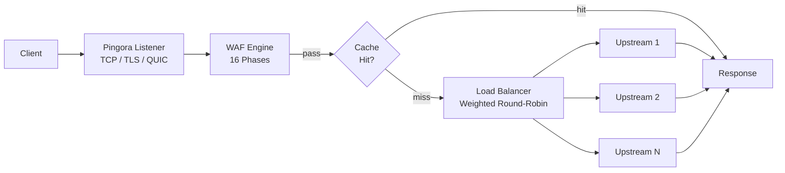

# ゲートウェイ

PRX-WAFはCloudflareのRust HTTPプロキシライブラリである[Pingora](https://github.com/cloudflare/pingora)を基盤として構築されています。ゲートウェイはすべての受信トラフィックを処理し、リクエストを上流バックエンドにルーティングし、転送前にWAF検出パイプラインを適用します。

## プロトコルサポート

| プロトコル | ステータス | 備考 |
|----------|--------|-------|
| HTTP/1.1 | サポート | デフォルト |
| HTTP/2 | サポート | ALPN経由の自動アップグレード |
| HTTP/3（QUIC） | オプション | Quinnライブラリ経由、`[http3]`設定が必要 |
| WebSocket | サポート | 全二重プロキシ |

## 主な機能

### 負荷分散

PRX-WAFは重み付きラウンドロビン負荷分散を使用して上流バックエンド全体にトラフィックを分散します。各ホストエントリは相対的な重みを持つ複数の上流サーバーを指定できます：

```toml
[[hosts]]
host        = "example.com"
port        = 80
remote_host = "10.0.0.1"
remote_port = 8080
guard_status = true
```

ホストは管理UIまたは`/api/hosts`のREST APIで管理することもできます。

### レスポンスキャッシング

ゲートウェイには上流サーバーの負荷を軽減するためのmokaベースのLRUインメモリキャッシュが含まれています：

```toml
[cache]
enabled          = true
max_size_mb      = 256       # Maximum cache size
default_ttl_secs = 60        # Default TTL for cached responses
max_ttl_secs     = 3600      # Maximum TTL cap
```

キャッシュは標準HTTPキャッシュヘッダー（`Cache-Control`、`Expires`、`ETag`、`Last-Modified`）を尊重し、管理API経由のキャッシュ無効化をサポートします。

### リバーストンネル

PRX-WAFはCloudflare Tunnelsに似たWebSocketベースのリバーストンネルを作成でき、受信ファイアウォールポートを開かずに内部サービスを公開できます：

```bash
# List active tunnels
curl -H "Authorization: Bearer $TOKEN" http://localhost:9527/api/tunnels

# Create a tunnel
curl -X POST -H "Authorization: Bearer $TOKEN" \
  -H "Content-Type: application/json" \
  -d '{"name":"internal-api","target":"http://192.168.1.10:3000"}' \
  http://localhost:9527/api/tunnels
```

### アンチホットリンク

ゲートウェイはホストごとにRefererベースのホットリンク保護をサポートします。有効にすると、設定されたドメインからの有効なRefererヘッダーなしのリクエストはブロックされます。これはホストごとに管理UIまたはAPIで設定します。

## アーキテクチャ



## 次のステップ

- [リバースプロキシ](./reverse-proxy) -- 詳細なバックエンドルーティングと負荷分散設定
- [SSL/TLS](./ssl-tls) -- HTTPS、Let's Encrypt、HTTP/3のセットアップ
- [設定リファレンス](../configuration/reference) -- すべてのゲートウェイ設定キー
