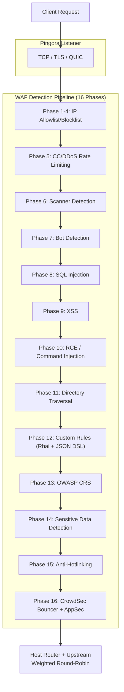

# PRX-WAF

**PRX-WAF**は[Pingora](https://github.com/cloudflare/pingora)（CloudflareのRust HTTPプロキシライブラリ）を基盤とした本番環境対応のWebアプリケーションファイアウォールプロキシです。16フェーズの攻撃検出パイプライン、Rhaiスクリプティングエンジン、OWASP CRSサポート、ModSecurityルールインポート、CrowdSec統合、WASMプラグイン、Vue 3管理UIを1つのデプロイ可能なバイナリに統合しています。

PRX-WAFはDevOpsエンジニア、セキュリティチーム、プラットフォームオペレーターのために設計されています。高速で透過的かつ拡張可能なWAFを必要とする方々 -- 数百万のリクエストをプロキシし、OWASPトップ10攻撃を検出し、TLS証明書を自動更新し、クラスターモードで水平スケールし、外部脅威インテリジェンスフィードと統合できる、プロプライエタリなクラウドWAFサービスに依存しないソリューションです。

## なぜPRX-WAF？

従来のWAF製品はプロプライエタリで高価、カスタマイズが困難です。PRX-WAFは異なるアプローチを取ります：

- **オープンで監査可能。** すべての検出ルール、しきい値、スコアリングメカニズムがソースコードで確認できます。隠れたデータ収集なし、ベンダーロックインなし。
- **多層防御。** 16の順次検出フェーズにより、1つのチェックが攻撃を見逃しても後続フェーズが捕捉します。
- **Rustファーストなパフォーマンス。** Pingoraを基盤として、汎用ハードウェアで最小レイテンシオーバーヘッドのほぼライン速度スループットを実現。
- **設計による拡張性。** YAMLルール、Rhaiスクリプト、WASMプラグイン、ModSecurityルールインポートにより、あらゆるアプリケーションスタックへの適応が容易。

## 主な機能

<div class="vp-features">

- **Pingoraリバースプロキシ** -- HTTP/1.1、HTTP/2、QUICを通じたHTTP/3（Quinn）。上流バックエンドへの重み付きラウンドロビン負荷分散。

- **16フェーズ検出パイプライン** -- IPアローリスト/ブロックリスト、CC/DDoSレート制限、スキャナー検出、ボット検出、SQLi、XSS、RCE、ディレクトリトラバーサル、カスタムルール、OWASP CRS、機密データ検出、アンチホットリンク、CrowdSec統合。

- **YAMLルールエンジン** -- 11のオペレーター、12のリクエストフィールド、パラノイアレベル1-4、ダウンタイムなしのホットリロードを備えた宣言型YAMLルール。

- **OWASP CRSサポート** -- OWASP ModSecurity Core Rule Set v4から変換された310以上のルール。SQLi、XSS、RCE、LFI、RFI、スキャナー検出などをカバー。

- **CrowdSec統合** -- バウンサーモード（LAPIからの決定キャッシュ）、AppSecモード（リモートHTTP検査）、コミュニティ脅威インテリジェンスのログプッシャー。

- **クラスターモード** -- QUICベースのノード間通信、Raftインスパイアのリーダー選出、ルール/設定/イベントの自動同期、mTLS証明書管理。

- **Vue 3管理UI** -- JWT + TOTP認証、リアルタイムWebSocketモニタリング、ホスト管理、ルール管理、セキュリティイベントダッシュボード。

- **SSL/TLS自動化** -- ACME v2を通じたLet's Encrypt（instant-acme）、自動証明書更新、HTTP/3 QUICサポート。

</div>

## アーキテクチャ

PRX-WAFは7つのCargoワークスペースクレートで構成されています：

| クレート | 役割 |
|-------|------|
| `prx-waf` | バイナリ：CLIエントリポイント、サーバーブートストラップ |
| `gateway` | Pingoraプロキシ、HTTP/3、SSL自動化、キャッシング、トンネル |
| `waf-engine` | 検出パイプライン、ルールエンジン、チェック、プラグイン、CrowdSec |
| `waf-storage` | PostgreSQLレイヤー（sqlx）、マイグレーション、モデル |
| `waf-api` | Axum REST API、JWT/TOTP認証、WebSocket、静的UI |
| `waf-common` | 共有型：RequestCtx、WafDecision、HostConfig、設定 |
| `waf-cluster` | クラスターコンセンサス、QUICトランスポート、ルール同期、証明書管理 |

### リクエストフロー



## クイックインストール

```bash
git clone https://github.com/openprx/prx-waf
cd prx-waf
docker compose up -d
```

管理UI：`http://localhost:9527`（デフォルト認証情報：`admin` / `admin`）

Cargoインストールやソースからのビルドを含むすべての方法については[インストールガイド](./getting-started/installation)を参照してください。

## ドキュメントセクション

| セクション | 説明 |
|---------|-------------|
| [インストール](./getting-started/installation) | Docker、Cargo、またはソースビルドでPRX-WAFをインストール |
| [クイックスタート](./getting-started/quickstart) | 5分でPRX-WAFでアプリを保護 |
| [ルールエンジン](./rules/) | YAMLルールエンジンの仕組み |
| [YAML構文](./rules/yaml-syntax) | 完全なYAMLルールスキーマリファレンス |
| [内蔵ルール](./rules/builtin-rules) | OWASP CRS、ModSecurity、CVEパッチ |
| [カスタムルール](./rules/custom-rules) | 独自の検出ルールを作成 |
| [ゲートウェイ](./gateway/) | Pingoraリバースプロキシ概要 |
| [リバースプロキシ](./gateway/reverse-proxy) | バックエンドルーティングと負荷分散 |
| [SSL/TLS](./gateway/ssl-tls) | HTTPS、Let's Encrypt、HTTP/3 |
| [クラスターモード](./cluster/) | マルチノードデプロイメント概要 |
| [クラスターデプロイメント](./cluster/deployment) | ステップバイステップのクラスターセットアップ |
| [管理UI](./admin-ui/) | Vue 3管理ダッシュボード |
| [設定](./configuration/) | 設定概要 |
| [設定リファレンス](./configuration/reference) | すべてのTOMLキーのドキュメント |
| [CLIリファレンス](./cli/) | すべてのCLIコマンドとサブコマンド |
| [トラブルシューティング](./troubleshooting/) | 一般的な問題と解決策 |

## プロジェクト情報

- **ライセンス：** MIT OR Apache-2.0
- **言語：** Rust（2024エディション）
- **リポジトリ：** [github.com/openprx/prx-waf](https://github.com/openprx/prx-waf)
- **最小Rust：** 1.82.0
- **管理UI：** Vue 3 + Tailwind CSS
- **データベース：** PostgreSQL 16+
