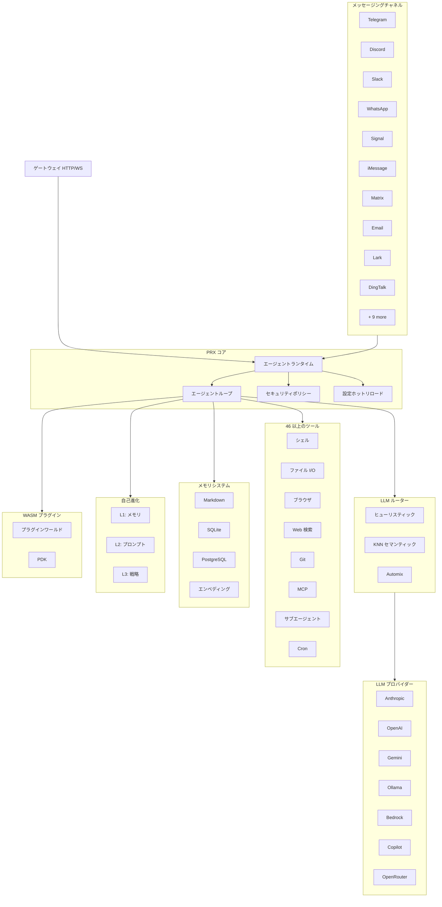

# PRX

**PRX** は、Rust で書かれた高性能な自己進化型 AI エージェントランタイムです。大規模言語モデルを 19 のメッセージングプラットフォームに接続し、46 以上の組み込みツールを提供し、WASM プラグイン拡張をサポートし、3 層の自己進化システムを通じて自律的に動作を改善します。

PRX は、Telegram や Discord から Slack、WhatsApp、Signal、iMessage、DingTalk、Lark などに至るまで、使用するすべてのメッセージングプラットフォームで動作する単一の統合エージェントを必要とする開発者やチーム向けに設計されています。本番環境レベルのセキュリティ、可観測性、信頼性を維持しながら運用できます。

## なぜ PRX なのか？

ほとんどの AI エージェントフレームワークは、単一の統合ポイントに焦点を当てているか、異なるサービスを接続するために大量のグルーコードを必要とします。PRX は異なるアプローチを取ります：

- **1 つのバイナリで全チャネル対応。** 単一の `prx` バイナリが 19 のメッセージングプラットフォームすべてに同時接続します。個別のボットもマイクロサービスの乱立もありません。
- **自己進化。** PRX はインタラクションのフィードバックに基づいて、メモリ、プロンプト、戦略を自律的に洗練します。すべてのレイヤーで安全なロールバック機能を備えています。
- **Rust ファーストの高性能。** 177K 行の Rust コードにより、低レイテンシ、最小限のメモリフットプリント、GC 停止ゼロを実現しています。デーモンは Raspberry Pi 上でも快適に動作します。
- **拡張性を前提とした設計。** WASM プラグイン、MCP ツール統合、トレイトベースのアーキテクチャにより、フォークすることなく PRX を容易に拡張できます。

## 主な機能

<div class="vp-features">

- **19 のメッセージングチャネル** -- Telegram、Discord、Slack、WhatsApp、Signal、iMessage、Matrix、Email、Lark、DingTalk、QQ、IRC、Mattermost、Nextcloud Talk、LINQ、CLI など。

- **9 つの LLM プロバイダー** -- Anthropic Claude、OpenAI、Google Gemini、GitHub Copilot、Ollama、AWS Bedrock、GLM（智譜）、OpenAI Codex、OpenRouter、さらに任意の OpenAI 互換エンドポイント。

- **46 以上の組み込みツール** -- シェル実行、ファイル I/O、ブラウザ自動化、Web 検索、HTTP リクエスト、Git 操作、メモリ管理、cron スケジューリング、MCP 統合、サブエージェントなど。

- **3 層の自己進化** -- L1 メモリ進化、L2 プロンプト進化、L3 戦略進化 -- それぞれに安全境界と自動ロールバック機能を搭載。

- **WASM プラグインシステム** -- 6 つのプラグインワールド（tool、middleware、hook、cron、provider、storage）にまたがる WebAssembly コンポーネントで PRX を拡張可能。47 のホスト関数を持つ完全な PDK。

- **LLM ルーター** -- ヒューリスティックスコアリング（能力、Elo、コスト、レイテンシ）、KNN セマンティックルーティング、Automix 信頼度ベースのエスカレーションによるインテリジェントなモデル選択。

- **本番環境向けセキュリティ** -- 4 段階の自律性制御、ポリシーエンジン、サンドボックス分離（Docker/Firejail/Bubblewrap/Landlock）、ChaCha20 シークレットストア、ペアリング認証。

- **可観測性** -- OpenTelemetry トレーシング、Prometheus メトリクス、構造化ログ、組み込み Web コンソール。

</div>

## アーキテクチャ



## クイックインストール

```bash
curl -fsSL https://openprx.dev/install.sh | bash
```

または Cargo でインストール：

```bash
cargo install openprx
```

その後、オンボーディングウィザードを実行します：

```bash
prx onboard
```

Docker やソースからのビルドを含むすべての方法については、[インストールガイド](./getting-started/installation)を参照してください。

## ドキュメントセクション

| セクション | 説明 |
|---------|-------------|
| [インストール](./getting-started/installation) | Linux、macOS、Windows WSL2 への PRX のインストール |
| [クイックスタート](./getting-started/quickstart) | 5 分で PRX を起動する |
| [オンボーディングウィザード](./getting-started/onboarding) | LLM プロバイダーと初期設定の構成 |
| [チャネル](./channels/) | Telegram、Discord、Slack、その他 16 のプラットフォームへの接続 |
| [プロバイダー](./providers/) | Anthropic、OpenAI、Gemini、Ollama などの設定 |
| [ツール](./tools/) | シェル、ブラウザ、Git、メモリなど 46 以上の組み込みツール |
| [自己進化](./self-evolution/) | L1/L2/L3 自律的改善システム |
| [プラグイン (WASM)](./plugins/) | WebAssembly コンポーネントによる PRX の拡張 |
| [設定](./config/) | 完全な設定リファレンスとホットリロード |
| [セキュリティ](./security/) | ポリシーエンジン、サンドボックス、シークレット、脅威モデル |
| [CLI リファレンス](./cli/) | `prx` バイナリの完全なコマンドリファレンス |

## プロジェクト情報

- **ライセンス:** MIT OR Apache-2.0
- **言語:** Rust (2024 edition)
- **リポジトリ:** [github.com/openprx/prx](https://github.com/openprx/prx)
- **最低 Rust バージョン:** 1.92.0
