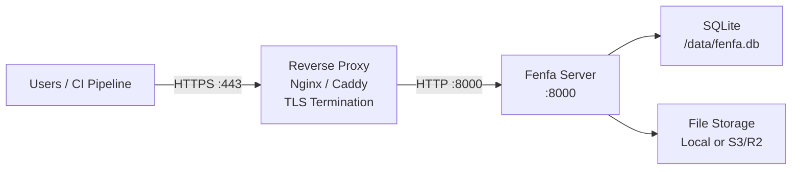

# Production განასახება

ეს სახელმძღვანელო production გარემოში Fenfa-ს გასაშვებად საჭირო ყველაფერს მოიცავს: reverse proxy TLS-ით, უსაფრთხო token-ის კონფიგურაცია, backup სტრატეგია და მონიტორინგი.

## არქიტექტურა



## Reverse Proxy კონფიგურაცია

### Caddy (სასურველია)

Caddy Let's Encrypt-იდან TLS სერთიფიკატებს ავტომატურად იღებს და განაახლებს:

```
dist.example.com {
    reverse_proxy localhost:8000
}
```

ეს ყველაფერია. Caddy HTTPS-ს, HTTP/2-ს და სერთიფიკატების მართვას ავტომატურად ამუშავებს.

### Nginx

```nginx
server {
    listen 443 ssl http2;
    server_name dist.example.com;

    ssl_certificate /etc/letsencrypt/live/dist.example.com/fullchain.pem;
    ssl_certificate_key /etc/letsencrypt/live/dist.example.com/privkey.pem;

    client_max_body_size 2G;

    location / {
        proxy_pass http://127.0.0.1:8000;
        proxy_set_header Host $host;
        proxy_set_header X-Real-IP $remote_addr;
        proxy_set_header X-Forwarded-For $proxy_add_x_forwarded_for;
        proxy_set_header X-Forwarded-Proto $scheme;

        # Large file uploads
        proxy_request_buffering off;
        proxy_read_timeout 600s;
    }
}

server {
    listen 80;
    server_name dist.example.com;
    return 301 https://$host$request_uri;
}
```

::: warning client_max_body_size
`client_max_body_size` დააყენეთ საკმარისად დიდი თქვენი უდიდესი build-ებისთვის. IPA და APK ფაილები ასეულობით მეგაბაიტი შეიძლება იყოს. ზემოაღნიშნული მაგალითი 2 GB-მდე იძლევა.
:::

### TLS სერთიფიკატის მიღება

Certbot-ის Nginx-ით გამოყენება:

```bash
sudo certbot --nginx -d dist.example.com
```

Certbot standalone-ის გამოყენება:

```bash
sudo certbot certonly --standalone -d dist.example.com
```

## უსაფრთხოების Checklist

### 1. ნაგულისხმევი Token-ების შეცვლა

გენერირეთ უსაფრთხო რანდომული token-ები:

```bash
# Generate a random 32-character token
openssl rand -hex 16
```

გარემოს ცვლადებით ან config-ით დაყენება:

```bash
FENFA_ADMIN_TOKEN=$(openssl rand -hex 16)
FENFA_UPLOAD_TOKEN=$(openssl rand -hex 16)
```

### 2. Localhost-ზე Bind

Fenfa მხოლოდ reverse proxy-ს მეშვეობით ექსპოზდება:

```yaml
ports:
  - "127.0.0.1:8000:8000"  # Not 0.0.0.0:8000
```

### 3. Primary Domain-ის დაყენება

iOS manifest-ებისა და callback-ებისთვის სწორი საჯარო დომენის კონფიგურაცია:

```bash
FENFA_PRIMARY_DOMAIN=https://dist.example.com
```

::: danger iOS Manifest-ები
`primary_domain`-ი არასწორია, iOS OTA ინსტალაცია ვერ მოხდება. Manifest plist ჩამოტვირთვის URL-ებს შეიცავს, iOS-ი IPA ფაილის გამოსატანად იყენებს. ეს URL-ები მომხმარებლის მოწყობილობიდან მიწვდომადი უნდა იყოს.
:::

### 4. Upload Token-ების გამოყოფა

სხვადასხვა CI/CD pipeline-ებს ან გუნდის წევრებს სხვადასხვა upload token-ების გაცემა:

```json
{
  "auth": {
    "upload_tokens": [
      "token-for-ios-pipeline",
      "token-for-android-pipeline",
      "token-for-desktop-pipeline"
    ],
    "admin_tokens": [
      "admin-token-for-ops-team"
    ]
  }
}
```

ეს სხვა pipeline-ების შეფერხების გარეშე ცალკეული token-ების გაუქმების საშუალებას იძლევა.

## Backup სტრატეგია

### რისი Backup-ი სჭირდება

| კომპონენტი | Path | ზომა | სიხშირე |
|-----------|------|------|---------|
| SQLite მონაცემთა ბაზა | `/data/fenfa.db` | მცირე (ჩვეულებრივ < 100 MB) | ყოველდღე |
| ატვირთული ფაილები | `/app/uploads/` | შეიძლება დიდი იყოს | ყოველი ატვირთვის შემდეგ (ან S3-ის გამოყენება) |
| Config ფაილი | `config.json` | ძალიან მცირე | ცვლილებისას |

### SQLite Backup

```bash
# Copy the database file (safe while Fenfa is running -- SQLite uses WAL mode)
cp /data/fenfa.db /backups/fenfa-$(date +%Y%m%d).db
```

### ავტომატური Backup სკრიპტი

```bash
#!/bin/bash
BACKUP_DIR="/backups/fenfa"
DATE=$(date +%Y%m%d-%H%M)

mkdir -p "$BACKUP_DIR"

# Database
cp /path/to/data/fenfa.db "$BACKUP_DIR/fenfa-$DATE.db"

# Uploads (if using local storage)
tar czf "$BACKUP_DIR/uploads-$DATE.tar.gz" /path/to/uploads/

# Cleanup old backups (keep 30 days)
find "$BACKUP_DIR" -name "*.db" -mtime +30 -delete
find "$BACKUP_DIR" -name "*.tar.gz" -mtime +30 -delete
```

::: tip S3 Storage
S3-compatible storage-ის (R2, AWS S3, MinIO) გამოყენებისას ატვირთული ფაილები უკვე სარეზერვო storage backend-ზეა. SQLite მონაცემთა ბაზის backup-ი მხოლოდ ლოკალურად სჭირდება.
:::

## მონიტორინგი

### Health Check

`/healthz` endpoint-ის მონიტორინგი:

```bash
curl -sf http://localhost:8000/healthz || echo "Fenfa is down"
```

### Uptime მონიტორინგით

Uptime მონიტორინგის სერვისი (UptimeRobot, Hetrix და სხვ.) მიმართეთ:

```
https://dist.example.com/healthz
```

მოსალოდნელი პასუხი: `{"ok": true}` HTTP 200-ით.

### ლოგის მონიტორინგი

Fenfa stdout-ზე ლოგს გამოაქვს. კონტეინერის runtime-ის log driver გამოიყენეთ aggregation სისტემაში ლოგების გადასაგზავნად:

```yaml
services:
  fenfa:
    logging:
      driver: "json-file"
      options:
        max-size: "10m"
        max-file: "3"
```

## სრული Production Docker Compose

```yaml
version: "3.8"

services:
  fenfa:
    image: fenfa/fenfa:latest
    container_name: fenfa
    restart: unless-stopped
    ports:
      - "127.0.0.1:8000:8000"
    environment:
      FENFA_ADMIN_TOKEN: ${FENFA_ADMIN_TOKEN}
      FENFA_UPLOAD_TOKEN: ${FENFA_UPLOAD_TOKEN}
      FENFA_PRIMARY_DOMAIN: https://dist.example.com
    volumes:
      - fenfa-data:/data
      - fenfa-uploads:/app/uploads
    healthcheck:
      test: ["CMD", "wget", "-q", "--spider", "http://localhost:8000/healthz"]
      interval: 30s
      timeout: 5s
      retries: 3
      start_period: 10s
    logging:
      driver: "json-file"
      options:
        max-size: "10m"
        max-file: "3"
    deploy:
      resources:
        limits:
          memory: 512M

volumes:
  fenfa-data:
  fenfa-uploads:
```

## შემდეგი ნაბიჯები

- [Docker განასახება](./docker) -- Docker ბაზები და კონფიგურაცია
- [კონფიგურაციის ცნობარი](../configuration/) -- ყველა პარამეტრი
- [პრობლემების მოგვარება](../troubleshooting/) -- გავრცელებული production პრობლემები
