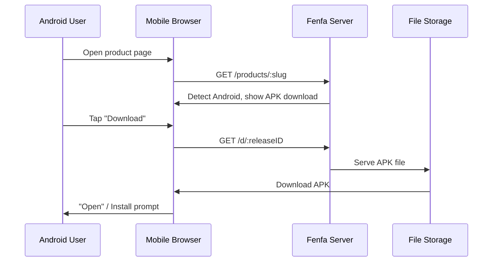

# Android განაწილება

Fenfa-ში Android განაწილება მარტივია: ატვირთეთ APK ფაილი და მომხმარებლები პირდაპირ პროდუქტის გვერდიდან ჩამოტვირთავენ. Fenfa Android მოწყობილობებს ავტო-გამოავლენს და შესაბამის ჩამოტვირთვის ღილაკს ჩვენებს.

## მეკანიზმი



iOS-ისგან განსხვავებით, Android ინსტალაციისთვის სპეციალური პროტოკოლი არ სჭირდება. APK ფაილი HTTP(S)-ის მეშვეობით პირდაპირ ჩამოიტვირთება და მომხმარებელი სისტემური package installer-ით დააინსტალირებს.

## Android Variant-ის კონფიგურაცია

პროდუქტისთვის Android variant-ის შექმნა:

```bash
curl -X POST http://localhost:8000/admin/api/products/prd_abc123/variants \
  -H "X-Auth-Token: YOUR_ADMIN_TOKEN" \
  -H "Content-Type: application/json" \
  -d '{
    "platform": "android",
    "display_name": "Android",
    "identifier": "com.example.myapp",
    "arch": "universal",
    "installer_type": "apk"
  }'
```

::: tip არქიტექტურის Variant-ები
თუ ცალ-ცალკე APK-ებს arqitekt-ის მიხედვით build-ავთ, შექმენით მრავალი variant:
- `Android ARM64` (arch: `arm64-v8a`)
- `Android ARM` (arch: `armeabi-v7a`)
- `Android x86_64` (arch: `x86_64`)

Universal APK ან AAB-ის გაგზავნის შემთხვევაში, `universal` არქიტექტურის ერთი variant საკმარისია.
:::

## APK ფაილების ატვირთვა

### სტანდარტული ატვირთვა

```bash
curl -X POST http://localhost:8000/upload \
  -H "X-Auth-Token: YOUR_UPLOAD_TOKEN" \
  -F "variant_id=var_android" \
  -F "app_file=@app-release.apk" \
  -F "version=2.1.0" \
  -F "build=210" \
  -F "changelog=Added dark mode support"
```

### Smart ატვირთვა

Smart upload APK ფაილებიდან metadata-ს ავტო-ამოიღებს:

```bash
curl -X POST http://localhost:8000/admin/api/smart-upload \
  -H "X-Auth-Token: YOUR_ADMIN_TOKEN" \
  -F "variant_id=var_android" \
  -F "app_file=@app-release.apk"
```

ამოიღება metadata-ი:
- Package name (`com.example.myapp`)
- Version name (`2.1.0`)
- Version code (`210`)
- აპლიკაციის ხატი
- მინიმალური SDK ვერსია

## მომხმარებლის ინსტალაცია

Android მოწყობილობაზე პროდუქტის გვერდის მონახულებისას:

1. გვერდი Android პლატფორმას ავტო-გამოავლენს.
2. მომხმარებელი **Download** ღილაკს დააჭერს.
3. ბრაუზერი APK ფაილს ჩამოტვირთავს.
4. Android APK-ს ინსტალაციის prompt-ს ჩვენებს.

::: warning Unknown Sources
Fenfa-სგან APK-ების ინსტალაციამდე მომხმარებლებმა მოწყობილობის პარამეტრებში "Install from unknown sources" (ან Android-ის ახალ ვერსიებზე "Install unknown apps") ჩართვა სჭირდება. ეს sideloaded აპლიკაციებისთვის Android-ის სტანდარტული მოთხოვნაა.
:::

## პირდაპირი ჩამოტვირთვის ბმული

ყოველ release-ს პირდაპირი ჩამოტვირთვის URL-ი აქვს, რომელიც ნებისმიერ HTTP კლიენტთან მუშაობს:

```bash
# Download via curl
curl -LO http://localhost:8000/d/rel_xxx

# Download via wget
wget http://localhost:8000/d/rel_xxx
```

ეს URL HTTP Range request-ებს ნელი კავშირებზე განახლებადი ჩამოტვირთვებისთვის მხარს უჭერს.

## შემდეგი ნაბიჯები

- [Desktop განაწილება](./desktop) -- macOS, Windows და Linux განაწილება
- [Release მართვა](../products/releases) -- APK release-ების ვერსიები და მართვა
- [Upload API](../api/upload) -- APK ატვირთვების CI/CD-იდან ავტომატიზება
