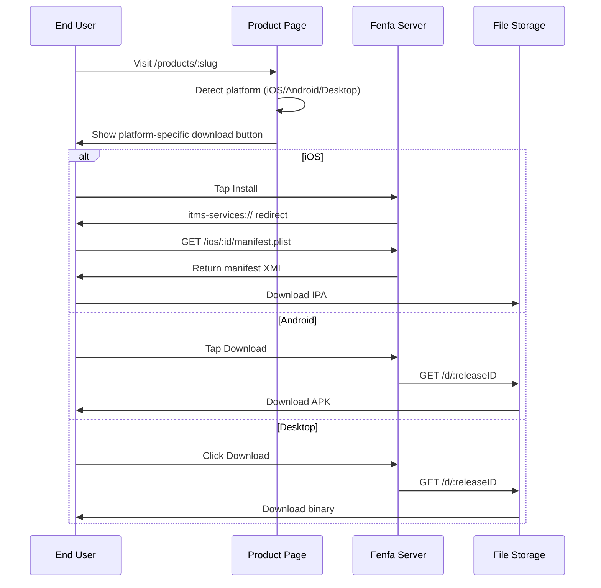

# განაწილების მიმოხილვა

Fenfa ყველა პლატფორმისთვის ერთიანი განაწილების გამოცდილებას უზრუნველყოფს. ყოველ პროდუქტს საჯარო ჩამოტვირთვის გვერდი ეძლევა, რომელიც ვიზიტორის პლატფორმას ავტომატურად გამოავლენს და შესაბამის ჩამოტვირთვის ღილაკს ჩვენებს.

## განაწილების მეკანიზმი



## პროდუქტის ჩამოტვირთვის გვერდი

ყოველ გამოქვეყნებულ პროდუქტს საჯარო გვერდი აქვს `/products/:slug`-ზე. გვერდი მოიცავს:

- **აპლიკაციის ხატი და სახელი** პროდუქტის კონფიგურაციიდან
- **პლატფორმის გამოვლენა** -- გვერდი ბრაუზერის User-Agent-ს იყენებს პირველ რიგში სწორი ჩამოტვირთვის ღილაკის სჩვენებლად
- **QR კოდი** -- ავტომატურად გენერირებული მობილური სკანირებისთვის
- **Release ისტორია** -- არჩეული variant-ის ყველა release, უახლესი პირველი
- **Changelog-ები** -- Release-ზე შენიშვნები inline ჩვენებით
- **მრავალი variant** -- თუ პროდუქტს რამდენიმე პლატფორმის variant-ი აქვს, მომხმარებლებს შორის გადართვა შეუძლიათ

## პლატფორმა-სპეციფიკური განაწილება

| პლატფორმა | მეთოდი | დეტალები |
|-----------|--------|---------|
| iOS | OTA `itms-services://`-ის მეშვეობით | Manifest plist + პირდაპირი IPA ჩამოტვირთვა. HTTPS სჭირდება. |
| Android | APK-ის პირდაპირი ჩამოტვირთვა | ბრაუზერი APK-ს ჩამოტვირთავს. მომხმარებელი "Install from unknown sources"-ს ჩართავს. |
| macOS | პირდაპირი ჩამოტვირთვა | DMG, PKG ან ZIP ფაილები ბრაუზერის მეშვეობით. |
| Windows | პირდაპირი ჩამოტვირთვა | EXE, MSI ან ZIP ფაილები ბრაუზერის მეშვეობით. |
| Linux | პირდაპირი ჩამოტვირთვა | DEB, RPM, AppImage ან tar.gz ფაილები ბრაუზერის მეშვეობით. |

## პირდაპირი ჩამოტვირთვის ბმულები

ყოველ release-ს პირდაპირი ჩამოტვირთვის URL-ი აქვს:

```
https://your-domain.com/d/:releaseID
```

ეს URL:
- ბინარულ ფაილს სწორი `Content-Type` და `Content-Disposition` header-ებით აბრუნებს
- HTTP Range request-ებს განახლებადი ჩამოტვირთვებისთვის მხარს უჭერს
- ჩამოტვირთვის counter-ს ზრდის
- ნებისმიერ HTTP კლიენტთან (curl, wget, ბრაუზერები) მუშაობს

## Event თვალყური

Fenfa სამი ტიპის event-ს ადევნებს თვალს:

| Event | გამომწვევი | თვალყურისდევნებული მონაცემები |
|-------|-----------|------------------------------|
| `visit` | მომხმარებელი პროდუქტის გვერდს ხსნის | IP, User-Agent, variant |
| `click` | მომხმარებელი ჩამოტვირთვის ღილაკს დააჭერს | IP, User-Agent, release ID |
| `download` | ფაილი სინამდვილეში ჩამოიტვირთება | IP, User-Agent, release ID |

Event-ები admin panel-ში ან CSV-ად ექსპორტით ნახვა შეიძლება:

```bash
curl -o events.csv http://localhost:8000/admin/exports/events.csv \
  -H "X-Auth-Token: YOUR_ADMIN_TOKEN"
```

## HTTPS მოთხოვნა

::: warning iOS-ს HTTPS სჭირდება
iOS OTA ინსტალაცია `itms-services://`-ის მეშვეობით სერვერს ვალიდური TLS სერთიფიკატით HTTPS-ის გამოყენებას მოითხოვს. ლოკალური ტესტირებისთვის შეგიძლიათ გამოიყენოთ `ngrok` ან `mkcert`. Production-ისთვის გამოიყენეთ Let's Encrypt-ით reverse proxy. იხ. [Production განასახება](../deployment/production).
:::

## პლატფორმის სახელმძღვანელოები

- [iOS განაწილება](./ios) -- OTA ინსტალაცია, manifest გენერაცია, UDID მოწყობილობის binding
- [Android განაწილება](./android) -- APK განაწილება და ინსტალაცია
- [Desktop განაწილება](./desktop) -- macOS, Windows და Linux განაწილება
