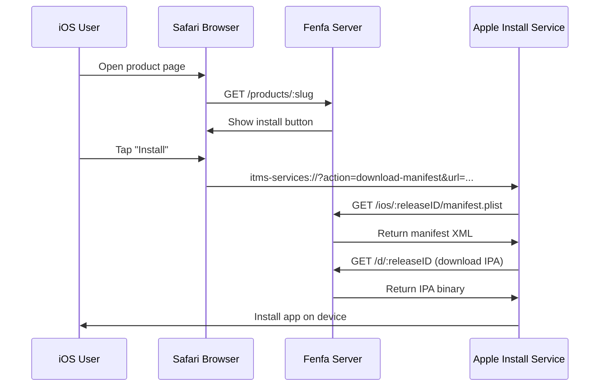
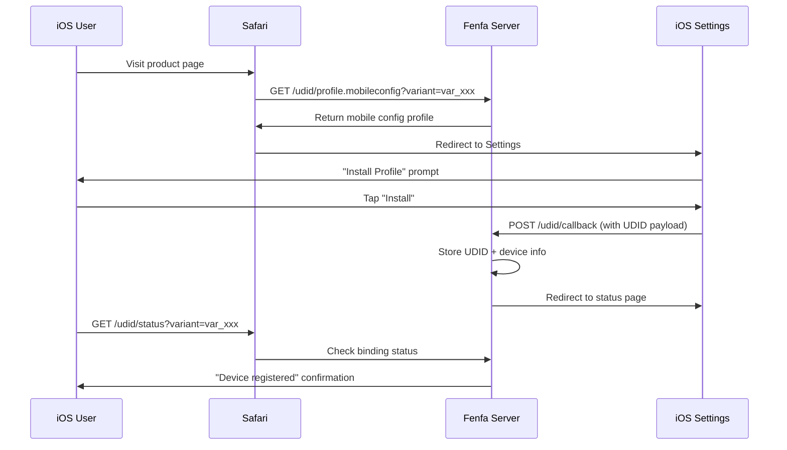

# iOS განაწილება

Fenfa iOS OTA (Over-The-Air) განაწილების სრულ მხარდაჭერას უზრუნველყოფს, მათ შორის `itms-services://` manifest გენერაციას, UDID მოწყობილობის binding-ს ad-hoc provisioning-ისთვის და optional Apple Developer API ინტეგრაციას ავტომატური მოწყობილობის რეგისტრაციისთვის.

## iOS OTA-ს მოქმედების პრინციპი



iOS `itms-services://` პროტოკოლს იყენებს აპლიკაციების web გვერდიდან პირდაპირ ინსტალაციისთვის. ინსტალის ღილაკის შეხების შემდეგ Safari სისტემური installer-ისთვის გადასცემს, რომელიც:

1. Fenfa-სგან manifest plist-ს გამოიტანს
2. IPA ფაილს ჩამოტვირთავს
3. მოწყობილობაზე აპლიკაციას დააინსტალირებს

::: warning HTTPS სავალდებულოა
iOS OTA ინსტალაციას ვალიდური TLS სერთიფიკატით HTTPS სჭირდება. Self-signed სერთიფიკატები არ მუშაობს. ლოკალური ტესტირებისთვის გამოიყენეთ `ngrok` დროებითი HTTPS tunnel-ის შესაქმნელად.
:::

## Manifest გენერაცია

Fenfa ყოველი iOS release-ისთვის `manifest.plist` ფაილს ავტომატურად ქმნის. Manifest შემდეგ მისამართზე ემსახურება:

```
GET /ios/:releaseID/manifest.plist
```

Manifest შეიცავს:
- Bundle identifier (variant-ის identifier ველიდან)
- Bundle version (release-ის ვერსიიდან)
- ჩამოტვირთვის URL (`/d/:releaseID`-ზე მიმართული)
- აპლიკაციის სათაური

`itms-services://` ინსტალის ბმული:

```
itms-services://?action=download-manifest&url=https://your-domain.com/ios/rel_xxx/manifest.plist
```

ეს ბმული ავტომატურად შედის upload API პასუხში და პროდუქტის გვერდზე ჩანს.

## UDID მოწყობილობის Binding

Ad-hoc განაწილებისთვის iOS მოწყობილობები რეგისტრირებული უნდა იყოს აპლიკაციის provisioning profile-ში. Fenfa UDID binding flow-ს უზრუნველყოფს, რომელიც მომხმარებლებისგან მოწყობილობის იდენტიფიკატორებს გროვებს.

### UDID Binding-ის მეკანიზმი



### UDID Endpoint-ები

| Endpoint | მეთოდი | აღწერა |
|----------|--------|--------|
| `/udid/profile.mobileconfig?variant=:variantID` | GET | Mobile configuration profile-ის ჩამოტვირთვა |
| `/udid/callback` | POST | iOS-იდან callback profile-ის ინსტალაციის შემდეგ (UDID-ს შეიცავს) |
| `/udid/status?variant=:variantID` | GET | მიმდინარე მოწყობილობის binding სტატუსის შემოწმება |

### უსაფრთხოება

UDID binding flow ერთჯერადი nonce-ებს იყენებს replay შეტევების თავიდან ასაცილებლად:
- ყოველი profile ჩამოტვირთვა უნიკალურ nonce-ს ქმნის
- Nonce callback URL-ში ჩაშენებულია
- ერთჯერ გამოყენების შემდეგ nonce-ის ხელახალი გამოყენება შეუძლებელია
- Nonce-ები კონფიგურირებადი timeout-ის შემდეგ ვადასრულდება

## Apple Developer API ინტეგრაცია

Fenfa მოწყობილობებს Apple Developer ანგარიშთან ავტომატურად დაარეგისტრირებს, Apple Developer Portal-ში UDID-ების ხელით დამატების ნაბიჯი აღარ სჭირდება.

### კონფიგურაცია

1. გადადით **Admin Panel > Settings > Apple Developer API**.
2. შეიყვანეთ App Store Connect API სერთიფიკატები:

| ველი | აღწერა |
|------|--------|
| Key ID | API Key ID (მაგ., "ABC123DEF4") |
| Issuer ID | Issuer ID (UUID ფორმატი) |
| Private Key | PEM-ფორმატის private key კონტენტი |
| Team ID | Apple Developer Team ID |

::: tip API გასაღებების შექმნა
[Apple Developer Portal](https://developer.apple.com/account/resources/authkeys/list)-ში შექმენით API გასაღები "Devices" ნებართვით. ჩამოტვირთეთ `.p8` private key ფაილი -- მხოლოდ ერთხელ ჩამოიტვირთება.
:::

### მოწყობილობების რეგისტრაცია

კონფიგურაციის შემდეგ admin panel-იდან Apple-ში მოწყობილობების რეგისტრაცია შეიძლება:

**ერთი მოწყობილობა:**

```bash
curl -X POST http://localhost:8000/admin/api/devices/DEVICE_ID/register-apple \
  -H "X-Auth-Token: YOUR_ADMIN_TOKEN"
```

**Batch რეგისტრაცია:**

```bash
curl -X POST http://localhost:8000/admin/api/devices/register-apple \
  -H "X-Auth-Token: YOUR_ADMIN_TOKEN"
```

### Apple API სტატუსის შემოწმება

```bash
curl http://localhost:8000/admin/api/apple/status \
  -H "X-Auth-Token: YOUR_ADMIN_TOKEN"
```

### Apple-ში რეგისტრირებული მოწყობილობების ჩამოთვლა

```bash
curl http://localhost:8000/admin/api/apple/devices \
  -H "X-Auth-Token: YOUR_ADMIN_TOKEN"
```

## Ad-Hoc განაწილების სამუშაო ნაკადი

iOS ad-hoc განაწილების სრული სამუშაო ნაკადი:

1. **მომხმარებელი bind-ავს მოწყობილობას** -- ეწვევა პროდუქტის გვერდს, დააინსტალირებს mobileconfig profile-ს, UDID-ი გროვდება.
2. **ადმინი მოწყობილობას არეგისტრირებს** -- Admin panel-ში Apple-ში მოწყობილობის რეგისტრაცია (ან batch რეგისტრაციის გამოყენება).
3. **დეველოპერი IPA-ს ხელახლა ხელს აწერს** -- provisioning profile-ის განახლება ახალი მოწყობილობის ჩათვლით, IPA-ს ხელახლა ხელმოწერა.
4. **ახალი build-ის ატვირთვა** -- ხელახლა ხელმოწერილი IPA-ს Fenfa-ში ატვირთვა.
5. **მომხმარებელი დააინსტალირებს** -- მომხმარებელს ახლა შეუძლია პროდუქტის გვერდის მეშვეობით აპლიკაციის ინსტალაცია.

::: info Enterprise განაწილება
Apple Enterprise Developer ანგარიშის არსებობის შემთხვევაში UDID binding-ი შეიძლება გამოტოვდეს. Enterprise profile-ები ნებისმიერ მოწყობილობაზე ინსტალაციის საშუალებას იძლევა. Variant-ი შესაბამისად დააყენეთ და enterprise-ხელმოწერილი IPA-ები ატვირთეთ.
:::

## iOS მოწყობილობების მართვა

Admin panel-ში ან API-ის მეშვეობით ყველა bound მოწყობილობის ნახვა:

```bash
curl http://localhost:8000/admin/api/ios_devices \
  -H "X-Auth-Token: YOUR_ADMIN_TOKEN"
```

მოწყობილობების CSV-ად ექსპორტი:

```bash
curl -o devices.csv http://localhost:8000/admin/exports/ios_devices.csv \
  -H "X-Auth-Token: YOUR_ADMIN_TOKEN"
```

## შემდეგი ნაბიჯები

- [Android განაწილება](./android) -- Android APK განაწილება
- [Upload API](../api/upload) -- iOS ატვირთვების CI/CD-იდან ავტომატიზება
- [Production განასახება](../deployment/production) -- iOS OTA-ისთვის HTTPS კონფიგურაცია
