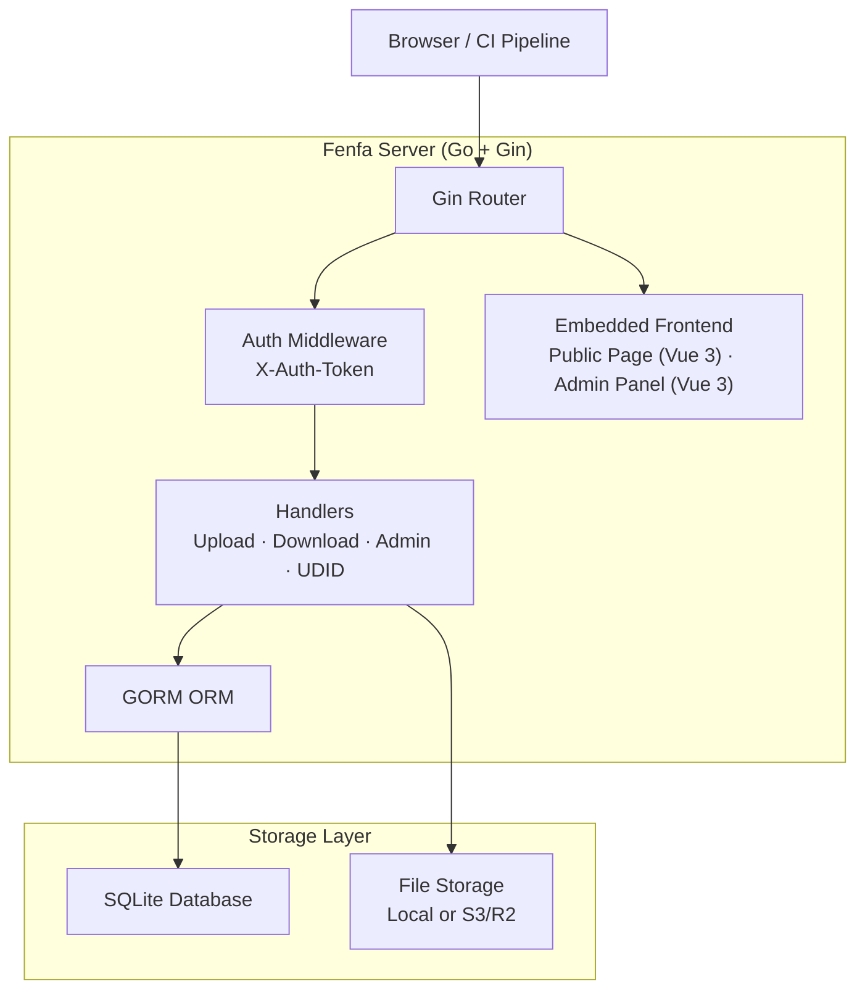
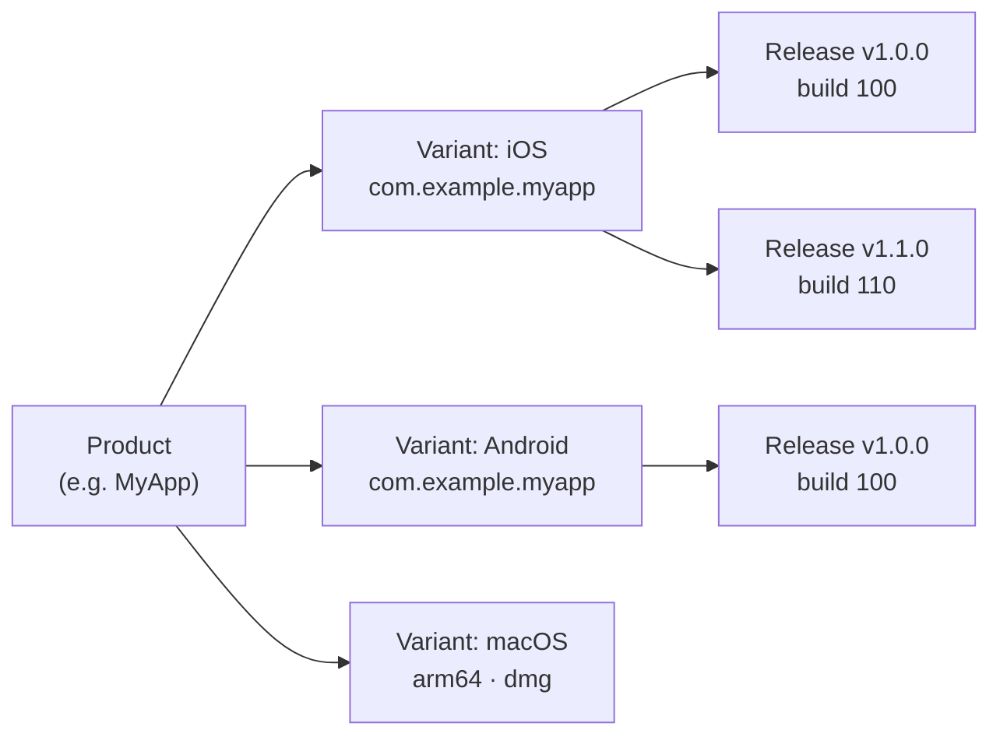

# Fenfa

**Fenfa** (分发, "განაწილება" ჩინური) iOS, Android, macOS, Windows და Linux-ისთვის self-hosted აპლიკაციის განაწილების პლატფორმაა. ატვირთეთ build-ები, მიიღეთ ინსტალაციის გვერდები QR კოდებით და მართეთ release-ები სუფთა admin panel-ის მეშვეობით -- ყველაფერი ერთი Go ბინარულიდან embedded frontend-ითა და SQLite შენახვით.

Fenfa შექმნილია განვითარების გუნდებისთვის, QA ინჟინრებისა და კორპორატიული IT განყოფილებებისთვის, რომლებს სჭირდებათ კერძო, კონტროლირებადი აპლიკაციის განაწილების არხი -- ისეთი, რომელიც iOS OTA ინსტალაციას, Android APK განაწილებასა და desktop აპლიკაციის მიწოდებას ამუშავებს საჯარო app store-ებზე ან მესამე მხარის სერვისებზე დამოკიდებულების გარეშე.

## რატომ Fenfa?

საჯარო app store-ები განხილვის დაყოვნებებს, კონტენტის შეზღუდვებსა და კონფიდენციალობის პრობლემებს ახდენს. მესამე მხარის განაწილების სერვისები ჩამოტვირთვაზე გადასახადს იღებს და თქვენ მონაცემებს აკონტროლებს. Fenfa სრულ კონტროლს გაძლევთ:

- **Self-hosted.** თქვენი build-ები, სერვერი, მონაცემები. ვენდორ lock-in-ი არ არის, ჩამოტვირთვაზე გადასახადი არ არის.
- **მრავალ-პლატფორმიანი.** ერთი პროდუქტის გვერდი iOS, Android, macOS, Windows და Linux build-ებს ავტომატური პლატფორმის გამოვლენით ემსახურება.
- **ნულოვანი დეპენდენციები.** ერთი Go ბინარული embedded SQLite-ით. Redis-ი არ არის, PostgreSQL-ი არ არის, message queue-ი არ არის.
- **iOS OTA განაწილება.** `itms-services://` manifest-ის გენერაციის, UDID მოწყობილობის binding-ისა და Apple Developer API ინტეგრაციის სრული მხარდაჭერა ad-hoc provisioning-ისთვის.

## ძირითადი ფუნქციები

<div class="vp-features">

- **Smart Upload** -- IPA და APK package-ებიდან აპლიკაციის metadata-ს (bundle ID, ვერსია, ხატი) ავტო-გამოვლენა. უბრალოდ ატვირთეთ ფაილი და Fenfa დანარჩენს ამუშავებს.

- **პროდუქტის გვერდები** -- საჯარო ჩამოტვირთვის გვერდები QR კოდებით, პლატფორმის გამოვლენით და release-ზე changelog-ებით. გაუზიარეთ ერთი URL ყველა პლატფორმისთვის.

- **iOS UDID Binding** -- მოწყობილობის რეგისტრაციის flow ad-hoc განაწილებისთვის. მომხმარებლები მოწყობილობის UDID-ს guided mobile config profile-ის მეშვეობით bind-ავენ, ადმინებს Apple Developer API-ის მეშვეობით მოწყობილობების ავტო-რეგისტრაცია შეუძლიათ.

- **S3/R2 Storage** -- სკალირებადი ფაილების hosting-ისთვის optional S3-compatible object storage-ი (Cloudflare R2, AWS S3, MinIO). ლოკალური storage-ი out of the box მუშაობს.

- **Admin Panel** -- სრულფასოვანი Vue 3 admin panel პროდუქტების, variant-ების, release-ების, მოწყობილობებისა და სისტემის პარამეტრების სამართავად. ჩინური და ინგლისური UI-ს მხარდაჭერა.

- **Token ავთენტიფიკაცია** -- ცალკე upload და admin token scopes. CI/CD pipeline-ები upload token-ებს იყენებს; ადმინები admin token-ებს სრული კონტროლისთვის.

- **Event თვალყური** -- გვერდის ვიზიტების, ჩამოტვირთვის კლიკებისა და ფაილის ჩამოტვირთვების თვალყური release-ის მიხედვით. ექსპორტი CSV-ად ანალიტიკისთვის.

</div>

## არქიტექტურა



## მონაცემთა მოდელი



- **Product**: ლოგიკური აპლიკაცია სახელით, slug-ით, ხატით და აღწერით. ერთი პროდუქტის გვერდი ყველა პლატფორმას ემსახურება.
- **Variant**: პლატფორმა-სპეციფიკური build target (iOS, Android, macOS, Windows, Linux) საკუთარი იდენტიფიკატორით, არქიტექტურით და installer ტიპით.
- **Release**: სპეციფიკური ატვირთული build ვერსიით, build ნომრით, changelog-ით და ბინარული ფაილით.

## სწრაფი ინსტალაცია

```bash
docker run -d --name fenfa -p 8000:8000 fenfa/fenfa:latest
```

ეწვიეთ `http://localhost:8000/admin` და შედით `dev-admin-token` token-ით.

სრული კონფიგურაციის ინსტრუქციებისთვის Docker Compose-ის, source build-ებისა და production კონფიგურაციის ჩათვლით იხილეთ [ინსტალაციის სახელმძღვანელო](./getting-started/installation).

## დოკუმენტაციის სექციები

| სექცია | აღწერა |
|--------|--------|
| [ინსტალაცია](./getting-started/installation) | Fenfa-ს Docker-ით ინსტალაცია ან source-დან build |
| [სწრაფი დაწყება](./getting-started/quickstart) | Fenfa-ს გაშვება და პირველი build-ის ატვირთვა 5 წუთში |
| [პროდუქტის მართვა](./products/) | მრავალ-პლატფორმიანი პროდუქტების შექმნა და მართვა |
| [პლატფორმის Variant-ები](./products/variants) | iOS, Android და desktop variant-ების კონფიგურაცია |
| [Release მართვა](./products/releases) | Release-ების ატვირთვა, ვერსიები და მართვა |
| [განაწილების მიმოხილვა](./distribution/) | Fenfa-ს მეშვეობით მომხმარებლებამდე აპლიკაციების მიწოდება |
| [iOS განაწილება](./distribution/ios) | iOS OTA ინსტალაცია, manifest გენერაცია, UDID binding |
| [Android განაწილება](./distribution/android) | Android APK განაწილება |
| [Desktop განაწილება](./distribution/desktop) | macOS, Windows და Linux განაწილება |
| [API მიმოხილვა](./api/) | REST API ცნობარი |
| [Upload API](./api/upload) | Build-ების ატვირთვა API-ს ან CI/CD-ის მეშვეობით |
| [Admin API](./api/admin) | სრული admin API ცნობარი |
| [კონფიგურაცია](./configuration/) | ყველა კონფიგურაციის პარამეტრი |
| [Docker განასახება](./deployment/docker) | Docker და Docker Compose განასახება |
| [Production განასახება](./deployment/production) | Reverse proxy, TLS, backup-ები და მონიტორინგი |
| [პრობლემების მოგვარება](./troubleshooting/) | გავრცელებული პრობლემები და გადაწყვეტები |

## პროექტის ინფო

- **ლიცენზია:** MIT
- **ენა:** Go 1.25+ (backend), Vue 3 + Vite (frontend)
- **მონაცემთა ბაზა:** SQLite (GORM-ის მეშვეობით)
- **საცავი:** [github.com/openprx/fenfa](https://github.com/openprx/fenfa)
- **ორგანიზაცია:** [OpenPRX](https://github.com/openprx)
