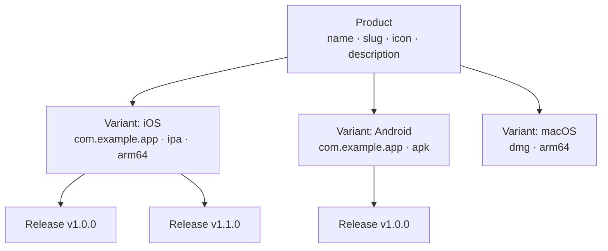

# პროდუქტის მართვა

პროდუქტები Fenfa-ში უმაღლეს დონის ორგანიზაციული ერთეულია. ყოველი პროდუქტი ერთ აპლიკაციას წარმოადგენს და შეიძლება შეიცავდეს მრავალ პლატფორმის variant-ს (iOS, Android, macOS, Windows, Linux). პროდუქტს აქვს საკუთარი საჯარო ჩამოტვირთვის გვერდი, ხატი და slug URL.

## კონცეფციები



- **Product**: ლოგიკური აპლიკაცია. უნიკალური slug-ი, რომელიც ჩამოტვირთვის გვერდის URL-ი ხდება (`/products/:slug`).
- **Variant**: პლატფორმა-სპეციფიკური build target პროდუქტის ქვეშ. იხ. [პლატფორმის Variant-ები](./variants).
- **Release**: სპეციფიკური ატვირთული build variant-ის ქვეშ. იხ. [Release მართვა](./releases).

## პროდუქტის შექმნა

### Admin Panel-ის მეშვეობით

1. Sidebar-ში **Products**-ზე გადადით.
2. დააჭირეთ **Create Product**.
3. შეავსეთ ველები:

| ველი | სავალდებულო | აღწერა |
|------|-------------|--------|
| Name | დიახ | ჩვენების სახელი (მაგ., "MyApp") |
| Slug | დიახ | URL იდენტიფიკატორი (მაგ., "myapp"). უნიკალური უნდა იყოს. |
| Description | არა | ჩამოტვირთვის გვერდზე ნაჩვენები მოკლე აპლიკაციის აღწერა |
| Icon | არა | აპლიკაციის ხატი (ატვირთული image ფაილად) |

4. დააჭირეთ **Save**.

### API-ის მეშვეობით

```bash
curl -X POST http://localhost:8000/admin/api/products \
  -H "X-Auth-Token: YOUR_ADMIN_TOKEN" \
  -H "Content-Type: application/json" \
  -d '{
    "name": "MyApp",
    "slug": "myapp",
    "description": "A cross-platform mobile app"
  }'
```

## პროდუქტების ჩამოთვლა

### Admin Panel-ის მეშვეობით

Admin panel-ის **Products** გვერდი ყველა პროდუქტს variant-ის რაოდენობითა და ჯამური ჩამოტვირთვებით ჩვენებს.

### API-ის მეშვეობით

```bash
curl http://localhost:8000/admin/api/products \
  -H "X-Auth-Token: YOUR_ADMIN_TOKEN"
```

პასუხი:

```json
{
  "ok": true,
  "data": [
    {
      "id": "prd_abc123",
      "name": "MyApp",
      "slug": "myapp",
      "description": "A cross-platform mobile app",
      "published": true,
      "created_at": "2025-01-15T10:30:00Z"
    }
  ]
}
```

## პროდუქტის განახლება

```bash
curl -X PUT http://localhost:8000/admin/api/products/prd_abc123 \
  -H "X-Auth-Token: YOUR_ADMIN_TOKEN" \
  -H "Content-Type: application/json" \
  -d '{
    "name": "MyApp Pro",
    "description": "Updated description"
  }'
```

## პროდუქტის წაშლა

::: danger Cascading წაშლა
პროდუქტის წაშლა მის ყველა variant-ს, release-სა და ატვირთულ ფაილს სამუდამოდ შლის.
:::

```bash
curl -X DELETE http://localhost:8000/admin/api/products/prd_abc123 \
  -H "X-Auth-Token: YOUR_ADMIN_TOKEN"
```

## გამოქვეყნება და გამოქვეყნების გაუქმება

პროდუქტების გამოქვეყნება ან გამოქვეყნების გაუქმება შეიძლება. გამოუქვეყნებელი პროდუქტები 404-ს აბრუნებს საჯარო ჩამოტვირთვის გვერდზე.

```bash
# Unpublish
curl -X PUT http://localhost:8000/admin/api/apps/prd_abc123/unpublish \
  -H "X-Auth-Token: YOUR_ADMIN_TOKEN"

# Publish
curl -X PUT http://localhost:8000/admin/api/apps/prd_abc123/publish \
  -H "X-Auth-Token: YOUR_ADMIN_TOKEN"
```

## საჯარო ჩამოტვირთვის გვერდი

ყოველ გამოქვეყნებულ პროდუქტს საჯარო ჩამოტვირთვის გვერდი აქვს:

```
https://your-domain.com/products/:slug
```

გვერდი მოიცავს:
- აპლიკაციის ხატს, სახელსა და აღწერას
- პლატფორმა-სპეციფიკურ ჩამოტვირთვის ღილაკებს (ავტო-გამოვლენილი ვიზიტორის მოწყობილობის მიხედვით)
- QR კოდს მობილური სკანირებისთვის
- Release ისტორიას ვერსიის ნომრებითა და changelog-ებით
- iOS `itms-services://` ბმულებს OTA ინსტალაციისთვის

## ID ფორმატი

პროდუქტის ID-ები `prd_` პრეფიქსს იყენებს რანდომული სტრინგით (მაგ., `prd_abc123`). ID-ები ავტომატურად გენერირდება და ვერ შეიცვლება.

## შემდეგი ნაბიჯები

- [პლატფორმის Variant-ები](./variants) -- iOS, Android და desktop variant-ების დამატება
- [Release მართვა](./releases) -- Build-ების ატვირთვა და მართვა
- [განაწილების მიმოხილვა](../distribution/) -- მომხმარებლებამდე Release-ების მიწოდება
