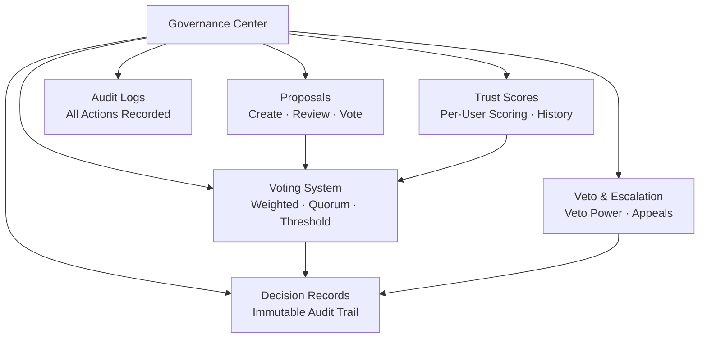

# მმართველობის ცენტრი

მმართველობის ცენტრი OpenPR-ის ძირითადი მოდულია, რომელიც პროექტ-მართვაში გამჭვირვალე, სტრუქტურირებულ გადაწყვეტილებ-მიღებას მოაქვს. ის წინადადებებს, ხმა-მიცემას, გადაწყვეტილებ-ჩანაწერებს, ნდობ-ქულებს, ვეტო-მექანიზმებს და ყოვლისმომცველ აუდიტ-კვალს გვაძლევს.

## რატომ მმართველობა?

ტრადიციული პროექტ-მართვის ინსტრუმენტები ამოცან-თვალყურზეა ორიენტირებული, მაგრამ გადაწყვეტილებ-მიღება სტრუქტურის გარეშე ტოვებს. OpenPR-ის მმართველობის ცენტრი უზრუნველყოფს, რომ:

- **გადაწყვეტილებები დოკუმენტირდება.** ყოველი წინადადება, ხმა-მიცემა და გადაწყვეტილება სრული აუდიტ-კვალით ჩაიწერება.
- **პროცესები გამჭვირვალეა.** ხმა-მიცემ-ზღვრები, კვორუმ-წეს-ები და ნდობ-ქულები ყველა წევრისთვის ხილვადია.
- **ძალა განაწილებულია.** ვეტო-მექანიზმები და ესკალაციის გზები ცალმხრივ გადაწყვეტილებებს ხელს უშლის.
- **ისტორია ინახება.** გადაწყვეტილებ-ჩანაწერები უცვლელ ლოგს ქმნის, თუ რა გადაწყდა, ვის მიერ და რატომ.

## მმართველობ-მოდულები

| მოდული | აღწერა |
|--------|-------------|
| [წინადადებები](./proposals) | წინადადებების შექმნა, მიმოხილვა და ხმა-მიცემა |
| [ხმა-მიცემა & გადაწყვეტილებები](./voting) | კვორუმ-და ზღვარ-წეს-ებიანი შეწონილი ხმა-მიცემა |
| [ნდობ-ქულები](./trust-scores) | ისტორიის მქონე თითო-მომხმარებლ-რეპუტ-ქულა |
| ვეტო & ესკალაცია | ვეტო-ძალა ესკალაციის ხმა-მიცემითა და გასაჩივრებით |
| გადაწყვეტ-სფეროები | გადაწყვეტილებების სფეროს მიხედვით კატეგორიზება |
| გავლენ-მიმოხილვები | წინადადების გავლენის შეფასება მეტრიკებით |
| აუდიტ-ლოგები | ყველა მმართველობ-ქმედების სრული ჩანაწერი |

## მონაცემ-ბაზ-სქემა

მმართველობ-მოდული 20 სპეც-ცხრილს იყენებს:

| ცხრილი | მიზანი |
|-------|---------|
| `proposals` | წინადადებ-ჩანაწერები |
| `proposal_templates` | ხელახლა-გამოყენებადი წინადადებ-შაბლონები |
| `proposal_comments` | წინადადებ-განხილვა |
| `proposal_issue_links` | წინადადებ-issue-კავშირი |
| `votes` | ცალ-ცალკე ხმ-ჩანაწერები |
| `decisions` | საბოლოო გადაწყვეტილებ-ჩანაწერები |
| `decision_domains` | გადაწყვეტილებ-კატეგ-სფეროები |
| `decision_audit_reports` | გადაწყვეტილებ-აუდიტ-ანგარიშები |
| `governance_configs` | სამუშაო სივრც-მმართველობ-პარამეტრები |
| `governance_audit_logs` | ყველა მმართველობ-ქმედებ-ლოგი |
| `vetoers` | ვეტო-ძალის მქონე მომხმარებლები |
| `veto_events` | ვეტო-ქმედებ-ჩანაწერები |
| `appeals` | გასაჩივრება გადაწყვეტილებებსა ან ვეტოებზე |
| `trust_scores` | თითო-მომხმარებლ-მიმდ-ნდობ-ქულები |
| `trust_score_logs` | ნდობ-ქულ-ცვლილებ-ისტორია |
| `impact_reviews` | წინადადებ-გავლენ-შეფასებები |
| `impact_metrics` | რაოდენობრივი გავლენ-საზომები |
| `review_participants` | მიმოხილვ-მინიჭ-ჩანაწერები |
| `feedback_loop_links` | უკუკავშირ-ციკლ-კავშირები |

## API Endpoint-ები

| კატეგორია | Base Path | ოპერაციები |
|----------|-----------|------------|
| წინადადებები | `/api/proposals/*` | შექმნა, ხმა-მიცემა, წარდგენა, არქივაცია |
| მმართველობა | `/api/governance/*` | კონფ-ი, აუდიტ-ლოგები |
| გადაწყვეტილებები | `/api/decisions/*` | გადაწყვეტილებ-ჩანაწერები |
| ნდობ-ქულები | `/api/trust-scores/*` | ქულები, ისტორია, გასაჩივრებები |
| ვეტო | `/api/veto/*` | ვეტო, ესკალაცია, ხმა-მიცემა |

## MCP ინსტრუმენტები

| ინსტრუმენტი | პარამეტრები | აღწერა |
|------|--------|-------------|
| `proposals.list` | `project_id` | სტატუს-ფილტრით სურვილისამებრ წინადადებების ჩამოთვლა |
| `proposals.get` | `proposal_id` | წინადადებ-დეტალების მიღება |
| `proposals.create` | `project_id`, `title`, `description` | მმართველობ-წინადადების შექმნა |

## შემდეგი ნაბიჯები

- [წინადადებები](./proposals) -- მმართველობ-წინადადებების შექმნა და მართვა
- [ხმა-მიცემა & გადაწყვეტილებები](./voting) -- ხმ-წეს-კონფ-და გადაწყვეტ-ნახვა
- [ნდობ-ქულები](./trust-scores) -- ნდობ-ქულ-მექანიზმის გაგება
