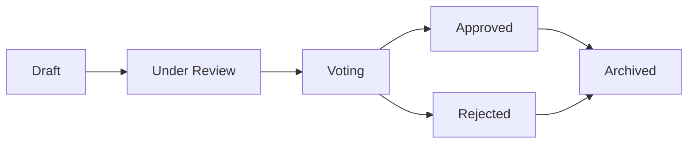

# წინადადებები

წინადადებები OpenPR-ში მმართველობ-გადაწყვეტილებებში შესვლის წამყვანი პუნქტია. წინადადება გუნდ-შეტანის საჭირო ცვლილებას, გაუმჯობესებას ან გადაწყვეტილებას აღწერს და შექმნიდან ხმა-მიცემამდე საბოლოო გადაწყვეტილებამდე სტრუქტურირებულ სიცოცხლ-ციკლს მიჰყვება.

## წინადადებ-სიცოცხლ-ციკლი



1. **Draft** -- ავტორი წინადადებას სათაურით, აღწერითა და კონტექსტით ქმნის.
2. **Under Review** -- გუნდ-წევრები კომენტარების გავლით განიხილავენ და უკუკავშირს იძლევიან.
3. **Voting** -- ხმ-მიცემ-პერიოდი იხსნება. წევრები მმართველობ-წეს-ების მიხედვით ხმა-მიცემენ.
4. **Approved/Rejected** -- ხმ-მიცემა იხურება. შედეგი ზღვრისა და კვორუმის მიხედვით განისაზღვრება.
5. **Archived** -- გადაწყვეტილება ჩაიწერება და წინადადება არქივდება.

## წინადადებ-შექმნა

### ვებ UI-ის გავლით

1. პროექტში გადასვლა.
2. **Governance** > **Proposals**-ზე გადასვლა.
3. **New Proposal**-ზე დაჭერა.
4. სათაურის, აღწერისა და დაკავშირებული issue-ების შეყვანა.
5. **Create**-ზე დაჭერა.

### API-ის გავლით

```bash
curl -X POST http://localhost:8080/api/proposals \
  -H "Content-Type: application/json" \
  -H "Authorization: Bearer <token>" \
  -d '{
    "project_id": "<project_uuid>",
    "title": "Adopt TypeScript for frontend modules",
    "description": "Proposal to migrate frontend modules from JavaScript to TypeScript for better type safety."
  }'
```

### MCP-ის გავლით

```json
{
  "method": "tools/call",
  "params": {
    "name": "proposals.create",
    "arguments": {
      "project_id": "<project_uuid>",
      "title": "Adopt TypeScript for frontend modules",
      "description": "Proposal to migrate frontend modules from JavaScript to TypeScript."
    }
  }
}
```

## წინადადებ-შაბლონები

სამუშაო სივრც-ადმინები წინადადებ-ფორმატის სტანდარტიზაციისთვის შაბლონები შეიძლება შექმნან. შაბლონები განსაზღვრავს:

- სათაურ-შაბლონს
- აღწერის სავალდებულო სექციებს
- ნაგულისხმევ ხმ-მიცემ-პარამეტრებს

შაბლონები **Workspace Settings** > **Governance** > **Templates**-ში იმართება.

## წინადადებ-issue-კავშირი

წინადადებები `proposal_issue_links` ცხრილის გავლით დაკავშირებულ issue-ებთან შეიძლება დაუკავშირდეს. ეს ორ-მხრივ მითითებას ქმნის:

- წინადადებიდან ვხედავ, რომელი issue-ები არის ზეგავლენილი.
- issue-დან ვხედავ, რომელი წინადადებები მას ახსენებს.

## წინადადებ-კომენტარები

ყოველ წინადადებას თავისი განხილვ-ნიჟი აქვს, issue-კომენტარებისგან განცალკევებული. წინადადებ-კომენტარები markdown-ფორმატირებას მხარს უჭერს და ყველა სამუშაო სივრც-წევრისთვის ხილვადია.

## MCP ინსტრუმენტები

| ინსტრუმენტი | პარამეტრები | აღწერა |
|------|--------|-------------|
| `proposals.list` | `project_id` | წინადადებების ჩამოთვლა, სურვილისამებრ `status` ფილტრი |
| `proposals.get` | `proposal_id` | სრული წინადადებ-დეტალების მიღება |
| `proposals.create` | `project_id`, `title`, `description` | ახალი წინადადების შექმნა |

## შემდეგი ნაბიჯები

- [ხმა-მიცემა & გადაწყვეტილებები](./voting) -- ხმების მიცემა და გადაწყვეტილებ-მიღება
- [ნდობ-ქულები](./trust-scores) -- ნდობ-ქულების ხმ-წონაზე გავლენა
- [მმართველობ-მიმოხილვა](./index) -- მმართველობ-მოდულის სრული ცნობარი
