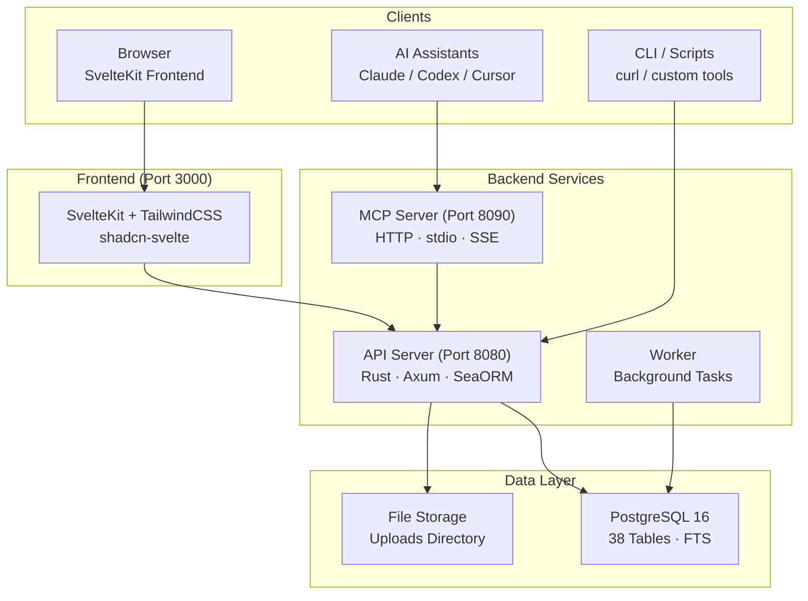

# OpenPR

**OpenPR** არის ღია კოდის პროექტ-მართვის პლატფორმა, შექმნილი გამჭვირვალე მმართველობის, AI-ასისტირებული სამუშაო ნაკადებისა და პროექტ-მონაცემებზე სრული კონტროლის მოთხოვნილი გუნდებისთვის. ის issue-თვალყური, sprint-დაგეგმვა, kanban-დაფები და სრული მმართველობის ცენტრი -- წინადადებები, ხმა-მიცემა, ნდობ-ქულები, ვეტო-მექანიზმები -- ერთ თვით-ჰოსტ-პლატფორმაში აერთიანებს.

OpenPR **Rust**-ზე (Axum + SeaORM) backend-ისა და **SvelteKit**-ის frontend-ის გამოყენებით, **PostgreSQL**-ის გამოყენებით. ის REST API-სა და ჩაშენებულ MCP სერვერს სამ სატრანსპორტო პროტოკოლზე 34 ინსტრუმენტით ამოქმედებს, AI ასისტენტებისთვის, მათ შორის Claude, Codex და სხვა MCP-თავსებადი კლიენტებისთვის, პირველ-კლასიანი ინსტრუმენტ-მომწოდებელია.

## რატომ OpenPR?

პროექტ-მართვის ინსტრუმენტების უმეტესობა ან დახურული-კოდის SaaS პლატფორმებია შეზღუდული კასტომიზაციით, ან ღია-კოდის ალტერნატივები მმართველობ-ფუნქციის გარეშე. OpenPR სხვა მიდგომას იღებს:

- **თვით-ჰოსტ და აუდიტ-საყვედური.** პროექტ-მონაცემები შენს ინფრასტრუქტურაზე რჩება. ყველა ფუნქცია, ყველა გადაწყვეტილებ-ჩანაწერი, ყველა აუდიტ-ლოგი შენი კონტროლის ქვეშ.
- **ჩაშენებული მმართველობა.** წინადადებები, ხმა-მიცემა, ნდობ-ქულები, ვეტო-ძალა და ესკალაცია არ არის შემდგომი ფიქრი -- ისინი სრული API მხარდაჭერის მქონე ძირითადი მოდულებია.
- **AI-ნეიტიური.** ჩაშენებული MCP სერვერი OpenPR-ს AI აგენტებისთვის ინსტრუმენტ-მომწოდებლად გარდაქმნის. ბოტ-ტოკენები, AI-ამოცან-მინიჭება და webhook-გამოძახება სრულად ავტომატური სამუშაო ნაკადების შესაძლებელს ხდის.
- **Rust-შესრულება.** Backend ათასობით ერთდროულ მოთხოვნას მინიმალური რესურს-მოხმარებით ამუშავებს. PostgreSQL-ის სრული-ტექსტ-ძებნა ყველა ერთეულში მყისიერ ძებნას უზრუნველყოფს.

## ძირითადი ფუნქციები

| კატეგორია | ფუნქციები |
|----------|----------|
| **პროექტ-მართვა** | სამუშაო სივრცეები, პროექტები, issue-ები, kanban-დაფა, sprint-ები, ეტიკეტები, კომენტარები, ფაილ-დანართები, საქმიანობ-feed, შეტყობინებები, სრული-ტექსტ-ძებნა |
| **მმართველობის ცენტრი** | წინადადებები, კვორუმ-ხმა-მიცემა, გადაწყვეტილებ-ჩანაწერები, ვეტო და ესკალაცია, ნდობ-ქულები ისტორიითა და გასაჩივრებით, წინადადებ-შაბლონები, გავლენ-მიმოხილვები, აუდიტ-ლოგები |
| **AI ინტეგრაცია** | ბოტ-ტოკენები (`opr_` პრეფიქსი), AI-აგენტ-რეგისტრაცია, AI-ამოცან-მინიჭება პროგრეს-თვალყურით, AI-მიმოხილვა წინადადებებზე, MCP სერვერი (34 ინსტრუმენტი, 3 სატრანსპორტო), webhook-გამოძახება |
| **ავთენტიფიკაცია** | JWT (access + refresh ტოკენები), ბოტ-ტოკენ-ავთენტიფიკაცია, როლ-დაფუძნებული წვდომა (admin/user), სამუშაო სივრც-სკოპ-ნებართვები (owner/admin/member) |
| **განასახება** | Docker Compose, Podman, Caddy/Nginx reverse proxy, PostgreSQL 15+ |

## არქიტექტურა



## ტექ-სტეკი

| ფენა | ტექნოლოგია |
|-------|-----------|
| **Backend** | Rust, Axum, SeaORM, PostgreSQL |
| **Frontend** | SvelteKit, TailwindCSS, shadcn-svelte |
| **MCP** | JSON-RPC 2.0 (HTTP + stdio + SSE) |
| **Auth** | JWT (access + refresh) + Bot Tokens (`opr_`) |
| **განასახება** | Docker Compose, Podman, Caddy, Nginx |

## სწრაფი დაწყება

```bash
git clone https://github.com/openprx/openpr.git
cd openpr
cp .env.example .env
docker-compose up -d
```

სერვისები იწყება:
- **Frontend**: http://localhost:3000
- **API**: http://localhost:8080
- **MCP სერვერი**: http://localhost:8090

პირველი დარეგისტრირებული მომხმარებელი ავტომატურად admin-ი ხდება.

სრული განასახებ-მეთოდებისთვის იხ. [ინსტალაციის სახელმძღვანელო](./getting-started/installation), ან [სწრაფი დაწყება](./getting-started/quickstart) 5 წუთში გასაშვებად.

## დოკ-სექციები

| სექცია | აღწერა |
|---------|-------------|
| [ინსტალაცია](./getting-started/installation) | Docker Compose, source-build და განასახებ-ვარიანტები |
| [სწრაფი დაწყება](./getting-started/quickstart) | OpenPR-ის 5 წუთში გაშვება |
| [სამუშაო სივრც-მართვა](./workspace/) | სამუშაო სივრცეები, პროექტები და წევრ-როლები |
| [Issues & თვალყური](./issues/) | Issue-ები, სამუშაო ნაკად-სტატუსები, sprint-ები და ეტიკეტები |
| [მმართველობის ცენტრი](./governance/) | წინადადებები, ხმა-მიცემა, გადაწყვეტილებები და ნდობ-ქულები |
| [REST API](./api/) | ავთენტიფიკაცია, endpoint-ები და პასუხ-ფორმატები |
| [MCP სერვერი](./mcp-server/) | AI ინტეგრაცია 34 ინსტრუმენტით და 3 სატრანსპორტო პროტოკოლით |
| [კონფიგურაცია](./configuration/) | გარემო-ცვლადები და პარამეტრები |
| [განასახება](./deployment/docker) | Docker და წარმოებ-განასახებ-სახელმძღვანელოები |
| [პრობლემ-მოგვარება](./troubleshooting/) | გავრცელებული პრობლემები და გადაწყვეტები |

## მასთან დაკავშირებული პროექტები

| საცავი | აღწერა |
|------------|-------------|
| [openpr](https://github.com/openprx/openpr) | ძირითადი პლატფორმა (ეს პროექტი) |
| [openpr-webhook](https://github.com/openprx/openpr-webhook) | Webhook-მიმღები გარე ინტეგრაციებისთვის |
| [prx](https://github.com/openprx/prx) | AI ასისტენტ-ფრეიმვორკი ჩაშენებული OpenPR MCP-ით |
| [prx-memory](https://github.com/openprx/prx-memory) | ლოკალ-first MCP მეხსიერება კოდ-აგენტებისთვის |

## პროექტ-ინფო

- **ლიცენზია:** MIT OR Apache-2.0
- **ენა:** Rust (2024 edition)
- **საცავი:** [github.com/openprx/openpr](https://github.com/openprx/openpr)
- **მინიმ. Rust:** 1.75.0
- **Frontend:** SvelteKit
