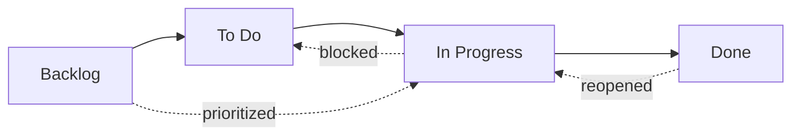
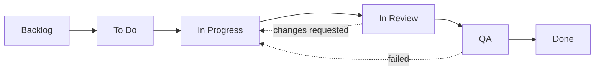

# სამუშაო ნაკად-სტატუსები

OpenPR-ში ყოველ issue-ს **სტატუსი** აქვს, რომელიც სამუშაო ნაკადში მის პოზიციას წარმოადგენს. Kanban-დაფ-სვეტები პირდაპირ ამ სტატუსებზე გადაისახება.

OpenPR ოთხ ნაგულისხმევ სტატუსს გამოაქვს, მაგრამ 3-ფენიანი გამოვლენ-სისტემის გავლით სრულად **custom სამუშაო ნაკადებს** მხარს უჭერს. თითოეულ პროექტზე, სამუშაო სივრცეზე ან სისტემ-ნაგულისხმევებზე სხვადასხვა სამუშაო ნაკადი შეიძლება განისაზღვროს.

## ნაგულისხმევი სტატუსები



| სტატუსი | მნიშვნელობა | აღწერა |
|-------|-------|-------------|
| **Backlog** | `backlog` | იდეები, მომავლის სამუშაო და დაუგეგმავი ერთეულები. ჯერ განრიგში არ შეტანილი. |
| **To Do** | `todo` | დაგეგმილი და პრიორიტეტიზებული. ასაღებად მზადაა. |
| **In Progress** | `in_progress` | პასუხისმგებლის მიერ აქტიურად მიმდინარე. |
| **Done** | `done` | დასრულებული და დადასტურებული. |

ეს ჩაშენებული სტატუსებია, საიდანაც ყოველი ახალი სამუშაო სივრცე იწყება. ქვემოთ [Custom სამუშაო ნაკადებში](#custom-სამუშაო-ნაკადები) ახსნილია მათი კასტომიზება ან დამატებითი სტატუსების დამატება.

## სტატუს-გადასვლები

OpenPR მოქნილ სტატუს-გადასვლებს იძლევა. გამარტივებული შეზღუდვები არ არსებობს -- ნებისმიერი სტატუსი ნებისმიერ სხვაზე გადავიდეს. გავრცელებული შაბლონები:

| გადასვლა | გამომწვევი | მაგალითი |
|-----------|---------|---------|
| Backlog -> To Do | Sprint-დაგეგმვა, პრიორიტეტიზება | Issue მომდევნო sprint-ში |
| To Do -> In Progress | დეველოპერი სამუშაოს ირჩევს | პასუხისმგებელი იმპლემენტაციას იწყებს |
| In Progress -> Done | სამუშაო დასრულდა | Pull request შეიზარდა |
| In Progress -> To Do | სამუშაო დაბლოკილია ან შეჩერებულია | გარე დამოკიდებულების ლოდინი |
| Done -> In Progress | Issue გაიხსნა | ბაგ-რეგრესია გამოვლინდა |
| Backlog -> In Progress | სასწრაფო hotfix | კრიტიკული წარმოებ-issue |

## Custom სამუშაო ნაკადები

OpenPR **3-ფენიანი გამოვლენ-სისტემის** გავლით custom სამუშაო ნაკად-სტატუსებს მხარს უჭერს. API work item-ისთვის სტატუსს ავლიდებს, ეფექტური სამუშაო ნაკადის განსაზღვრისას სამ დონეს ამოწმებს:

```
Project workflow  >  Workspace workflow  >  System defaults
```

პროექტს თავისი სამუშაო ნაკადის განსაზღვრისას ის პრიორიტეტი ენიჭება. სხვა შემთხვევაში სამუშაო სივრც-დონის სამუშაო ნაკადი გამოიყენება. არც ერთის არარსებობის შემთხვევაში ოთხი სისტემ-ნაგულისხმევი სტატუსი.

### მონაცემ-ბაზ-სქემა

Custom სამუშაო ნაკადები ორ ცხრილში ინახება (მიგრაციაში `0024_workflow_config.sql`):

- **`workflows`** -- პროექტს ან სამუშაო სივრცეს მიმაგრებული სახელდებული სამუშაო ნაკადის განმარტება.
- **`workflow_states`** -- სამუშაო ნაკადის ცალ-ცალკე სტატუსები.

ყოველ სტატუსს შემდეგი თვისებები აქვს:

| ველი | ტიპი | აღწერა |
|-------|------|-------------|
| `key` | string | მანქანა-წასაკითხი იდენტიფიკატორი (მაგ. `in_review`) |
| `display_name` | string | ადამიან-წასაკითხი სახელი (მაგ. "In Review") |
| `category` | string | სტატუსის დაჯგუფებ-კატეგორია |
| `position` | integer | kanban-დაფ-ჩვენ-რიგი |
| `color` | string | სტატუს-ნიშ-ჰექს-ფერ-კოდი |
| `is_initial` | boolean | ახალი issue-ების ნაგულისხმევი სტატუსია თუ არა |
| `is_terminal` | boolean | ეს სტატუსი დასრულებას წარმოადგენს თუ არა |

### API-ის გავლით Custom სამუშაო ნაკადის შექმნა

**ნაბიჯი 1 -- პროექტისთვის სამუშაო ნაკადის შექმნა:**

```bash
curl -X POST http://localhost:8080/api/workflows \
  -H "Content-Type: application/json" \
  -H "Authorization: Bearer <token>" \
  -d '{
    "name": "Engineering Flow",
    "project_id": "<project_uuid>"
  }'
```

**ნაბიჯი 2 -- სამუშაო ნაკადში სტატუსების დამატება:**

```bash
curl -X POST http://localhost:8080/api/workflows/<workflow_id>/states \
  -H "Content-Type: application/json" \
  -H "Authorization: Bearer <token>" \
  -d '{
    "key": "in_review",
    "display_name": "In Review",
    "category": "active",
    "position": 3,
    "color": "#f59e0b",
    "is_initial": false,
    "is_terminal": false
  }'
```

### მაგალითი: 6-სტატუსიანი ინჟინ-სამუშაო ნაკადი



| სტატუსი | კლუჩი | კატეგორია | Initial | Terminal |
|-------|-----|----------|---------|----------|
| Backlog | `backlog` | backlog | დიახ | არა |
| To Do | `todo` | planned | არა | არა |
| In Progress | `in_progress` | active | არა | არა |
| In Review | `in_review` | active | არა | არა |
| QA | `qa` | active | არა | არა |
| Done | `done` | completed | არა | დიახ |

### დინამიური ვალიდაცია

Work item-ის სტატუს-განახლებისას API ახალ სტატუსს ამ პროექტისთვის **ეფექტური სამუშაო ნაკადის** გავლით ავლიდებს. გამოვლენილ სამუშაო ნაკადში არარსებული სტატუს-კლუჩის დაყენებისას API `422 Unprocessable Entity` შეცდომას აბრუნებს. სტატუსები hardcoded არ არის -- ისინი მოთხოვნის დროს დინამიურად ძებნება.

## Kanban-დაფა

Board-ხედი issue-ებს სამუშაო ნაკად-სტატუსების შესაბამის სვეტებში ბარათებად ასახავს. სტატუსის შეცვლისთვის ბარათის სვეტებს შორის გადათრევა. Custom სამუშაო ნაკადების ჩართვისას Board ავტომატურად ასახავს custom სტატუსებსა და მათ კონფიგურირებულ რიგს.

ყოველ ბარათს ეჩვენება:
- Issue-იდენტიფიკატორი (მაგ., `API-42`)
- სათაური
- პრიორიტეტ-ინდიკატორი
- პასუხისმგებლ-ავატარი
- ეტიკეტ-ნიშნები

## API-ის გავლით სტატუს-განახლება

```bash
# Move issue to "in_progress"
curl -X PATCH http://localhost:8080/api/issues/<issue_id> \
  -H "Content-Type: application/json" \
  -H "Authorization: Bearer <token>" \
  -d '{"state": "in_progress"}'
```

## MCP-ის გავლით სტატუს-განახლება

```json
{
  "method": "tools/call",
  "params": {
    "name": "work_items.update",
    "arguments": {
      "work_item_id": "<issue_uuid>",
      "state": "in_progress"
    }
  }
}
```

## პრიორიტეტ-დონეები

სტატუსებთან ერთად, ყოველ issue-ს პრიორიტეტ-დონე შეიძლება ჰქონდეს:

| პრიორიტეტი | მნიშვნელობა | აღწერა |
|----------|-------|-------------|
| Low | `low` | კარგი იქნებოდა ჰქონოდა, დრო-ზეწოლა არ არის |
| Medium | `medium` | სტანდარტული პრიორიტეტი, დაგეგმილი სამუშაო |
| High | `high` | მნიშვნელოვანი, მალე განხილვა |
| Urgent | `urgent` | კრიტიკული, მყისიერი ყურადღება |

## საქმიანობ-თვალყური

ყოველი სტატუს-ცვლილება issue-ის საქმიანობ-feed-ში ჩაიწერება აქტორით, დროით და ძველი/ახალი მნიშვნელობებით. ეს სრულ აუდიტ-კვალს გვაძლევს.

## შემდეგი ნაბიჯები

- [Sprint-დაგეგმვა](./sprints) -- issue-ების დროში შეზღუდულ გამეორებებად ორგანიზება
- [ეტიკეტები](./labels) -- issue-ებზე კატეგორიზ-დამატება
- [Issues მიმოხილვა](./index) -- issue-ველის სრული ცნობარი
