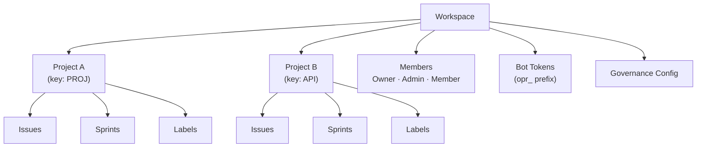

# სამუშაო სივრც-მართვა

**სამუშაო სივრცე** OpenPR-ის უმაღლეს-დონიანი ორგანიზ-ერთეულია. ის მრავალ-მოიჯარ-იზოლაციას უზრუნველყოფს -- ყოველ სამუშაო სივრცეს თავისი პროექტები, წევრები, ეტიკეტები, ბოტ-ტოკენები და მმართველობ-პარამეტრები აქვს. მომხმარებლები მრავალ სამუშაო სივრცეს შეიძლება ეკუთვნოდნენ.

## სამუშაო სივრცის შექმნა

შესვლის შემდეგ dashboard-ზე **Create Workspace**-ზე ან **Settings** > **Workspaces** > **New**-ზე დაჭერა.

მიწოდება:

| ველი | სავალდებულო | აღწერა |
|-------|----------|-------------|
| სახელი | დიახ | ჩვენ-სახელი (მაგ., "Engineering Team") |
| Slug | დიახ | URL-მოსახერხებელი იდენტიფიკატორი (მაგ., "engineering") |

შემქმნელ მომხმარებელს ავტომატურად **Owner** როლი ენიჭება.

## სამუშაო სივრც-სტრუქტურა



## სამუშაო სივრც-პარამეტრები

სამუშაო სივრც-პარამეტრებზე ხელსაწყოს ხატის ან sidebar-ში **Settings**-ის გავლით წვდომა:

- **General** -- სამუშაო სივრც-სახელის, slug-ის და აღწერის განახლება.
- **Members** -- მომხმარებლების მოწვევა, როლ-შეცვლა, წევრების ამოღება. იხ. [წევრები](./members).
- **Bot Tokens** -- MCP ბოტ-ტოკენების შექმნა და მართვა.
- **Governance** -- ხმა-მიცემ-ზღვარების, წინადადებ-შაბლონებისა და ნდობ-ქულ-წეს-კონფიგურაცია. იხ. [მმართველობა](../governance/).
- **Webhooks** -- გარე ინტეგრაციებისთვის webhook-endpoint-ების გამართვა.

## API წვდომა

```bash
# List workspaces
curl -H "Authorization: Bearer <token>" \
  http://localhost:8080/api/workspaces

# Get workspace details
curl -H "Authorization: Bearer <token>" \
  http://localhost:8080/api/workspaces/<workspace_id>
```

## MCP წვდომა

MCP სერვერის გავლით AI ასისტენტები `OPENPR_WORKSPACE_ID` გარემო-ცვლადით მითითებულ სამუშაო სივრცეში ოპერირებენ. ყველა MCP ინსტრუმენტი ამ სამუშაო სივრცით ოპერაციებს ავტომატურად ზღუდავს.

## შემდეგი ნაბიჯები

- [პროექტები](./projects) -- სამუშაო სივრცეში პროექტების შექმნა და მართვა
- [წევრები და ნებართვები](./members) -- მომხმარებლების მოწვევა და როლ-კონფიგურაცია
