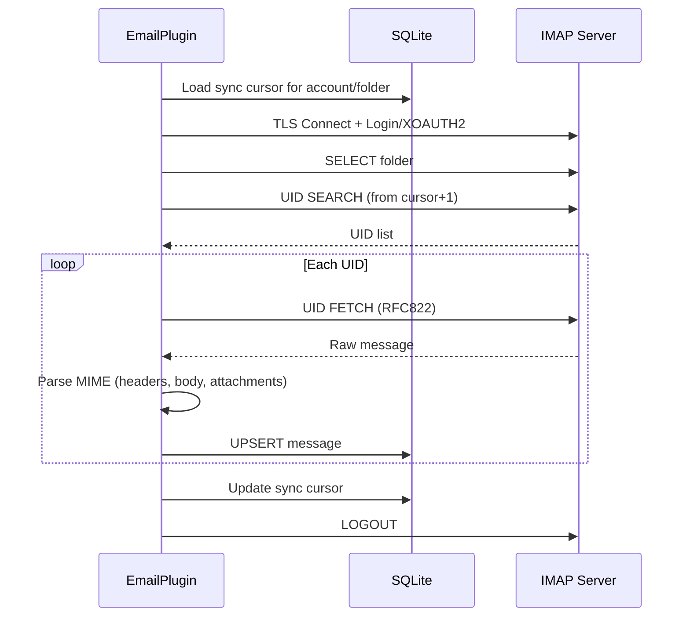

# IMAP კონფიგურაცია

PRX-Email IMAP სერვერებთან TLS-ზე `rustls` ბიბლიოთეკის გამოყენებით ერთვება. მხარს უჭერს პაროლის ავთენტიფიკაციას და XOAUTH2-ს Gmail-ისა და Outlook-ისთვის. Inbox სინქ UID-ზე დაფუძნებული და ინკრემენტულია, cursor persistence-ით SQLite მონაცემთა ბაზაში.

## IMAP-ის საბაზო კონფიგურაცია

```rust
use prx_email::plugin::{ImapConfig, AuthConfig};

let imap = ImapConfig {
    host: "imap.example.com".to_string(),
    port: 993,
    user: "you@example.com".to_string(),
    auth: AuthConfig {
        password: Some("your-app-password".to_string()),
        oauth_token: None,
    },
};
```

### კონფიგურაციის ველები

| ველი | ტიპი | სავალდებულო | აღწერა |
|------|------|-------------|--------|
| `host` | `String` | დიახ | IMAP სერვერის hostname (ცარიელი არ უნდა იყოს) |
| `port` | `u16` | დიახ | IMAP სერვერის პორტი (ჩვეულებრივ 993 TLS-ისთვის) |
| `user` | `String` | დიახ | IMAP მომხმარებელი (ჩვეულებრივ ელ.ფოსტის მისამართი) |
| `auth.password` | `Option<String>` | ერთ-ერთი | IMAP LOGIN-ისთვის App password |
| `auth.oauth_token` | `Option<String>` | ერთ-ერთი | XOAUTH2-ისთვის OAuth access token |

::: warning ავთენტიფიკაცია
`password` ან `oauth_token`-ის ზუსტად ერთი უნდა იყოს დაყენებული. ორივე ან ვერც ერთი ვალიდაციის შეცდომას გამოიწვევს.
:::

## გავრცელებული პროვაიდერის პარამეტრები

| პროვაიდერი | Host | პორტი | Auth მეთოდი |
|-----------|------|-------|-------------|
| Gmail | `imap.gmail.com` | 993 | App password ან XOAUTH2 |
| Outlook / Office 365 | `outlook.office365.com` | 993 | XOAUTH2 (სასურველია) |
| Yahoo | `imap.mail.yahoo.com` | 993 | App password |
| Fastmail | `imap.fastmail.com` | 993 | App password |
| ProtonMail Bridge | `127.0.0.1` | 1143 | Bridge password |

## Inbox-ის სინქ

`sync` მეთოდი IMAP სერვერთან ერთვება, საქაღალდეს ირჩევს, ახალ შეტყობინებებს UID-ის მიხედვით იღებს და SQLite-ში ინახავს:

```rust
use prx_email::plugin::SyncRequest;

plugin.sync(SyncRequest {
    account_id: 1,
    folder: Some("INBOX".to_string()),
    cursor: None,        // Resume from last saved cursor
    now_ts: now,
    max_messages: 100,   // Fetch at most 100 messages per sync
})?;
```

### სინქ-ის ნაკადი



### ინკრემენტული სინქ

PRX-Email UID-ზე დაფუძნებული cursor-ებს იყენებს შეტყობინებების ხელახალი მიღების თავიდან ასაცილებლად. ყოველი სინქ-ის შემდეგ:

1. ნანახი ყველაზე მაღალი UID cursor-ად ინახება
2. მომდევნო სინქ `cursor + 1`-დან იწყება
3. არსებული `(account_id, message_id)` წყვილის შეტყობინებები განახლდება (UPSERT)

Cursor `sync_state` ცხრილში ინახება `(account_id, folder_id)` კომპოზიტური გასაღებით.

## მრავალ-საქაღალდიანი სინქ

ერთი ანგარიშისთვის მრავალი საქაღალდის სინქ:

```rust
for folder in &["INBOX", "Sent", "Drafts", "Archive"] {
    plugin.sync(SyncRequest {
        account_id,
        folder: Some(folder.to_string()),
        cursor: None,
        now_ts: now,
        max_messages: 100,
    })?;
}
```

## სინქ Scheduler

პერიოდული სინქ-ისთვის გამოიყენეთ ჩაშენებული sync runner:

```rust
use prx_email::plugin::{SyncJob, SyncRunnerConfig};

let jobs = vec![
    SyncJob { account_id: 1, folder: "INBOX".into(), max_messages: 100 },
    SyncJob { account_id: 1, folder: "Sent".into(), max_messages: 50 },
    SyncJob { account_id: 2, folder: "INBOX".into(), max_messages: 100 },
];

let config = SyncRunnerConfig {
    max_concurrency: 4,         // Max jobs per runner tick
    base_backoff_seconds: 10,   // Initial backoff on failure
    max_backoff_seconds: 300,   // Maximum backoff (5 minutes)
};

let report = plugin.run_sync_runner(&jobs, now, &config);
println!(
    "Run {}: attempted={}, succeeded={}, failed={}",
    report.run_id, report.attempted, report.succeeded, report.failed
);
```

### Scheduler-ის ქცევა

- **კონკურენტობის ზღვარი**: tick-ზე მაქსიმუმ `max_concurrency` ამოცანა
- **წარუმატებლობის backoff**: ექსპონენციური backoff `base * 2^failures` ფორმულით, `max_backoff_seconds`-ით შეზღუდული
- **ვალაგირების შემოწმება**: ამოცანები გამოტოვდება, თუ backoff ფანჯარა გასული არ არის
- **სტატუსის თვალყური**: `account::folder` გასაღებ-ზე, `(next_allowed_at, failure_count)` ინახება

## შეტყობინებების Parsing

შემომავალი შეტყობინებები `mail-parser` crate-ის გამოყენებით parse-ს:

| ველი | წყარო | შენიშვნა |
|------|-------|----------|
| `message_id` | `Message-ID` header | raw bytes-ის SHA-256-ზე სარეზერვო |
| `subject` | `Subject` header | |
| `sender` | `From` header-დან პირველი მისამართი | |
| `recipients` | `To` header-დან ყველა მისამართი | მძიმით გამოყოფილი |
| `body_text` | პირველი `text/plain` ნაწილი | |
| `body_html` | პირველი `text/html` ნაწილი | სარეზერვო: raw სექციის ამოღება |
| `snippet` | body_text ან body_html-ის პირველი 120 სიმბოლო | |
| `references_header` | `References` header | threading-ისთვის |
| `attachments` | MIME-ის დანართის ნაწილები | JSON-სერიალიზებული metadata |

## TLS

ყველა IMAP კავშირი TLS-ს იყენებს `rustls`-ის მეშვეობით `webpki-roots` სერთიფიკატის bundle-ით. TLS-ის გამორთვა ან STARTTLS-ის გამოყენების პარამეტრი არ არის -- კავშირები ყოველთვის თავიდანვე დაშიფრულია.

## შემდეგი ნაბიჯები

- [SMTP კონფიგურაცია](./smtp) -- ელ.ფოსტის გაგზავნის კონფიგურაცია
- [OAuth ავთენტიფიკაცია](./oauth) -- Gmail-ისა და Outlook-ისთვის XOAUTH2-ის კონფიგურაცია
- [SQLite შენახვა](../storage/) -- მონაცემთა ბაზის სქემის გაგება
