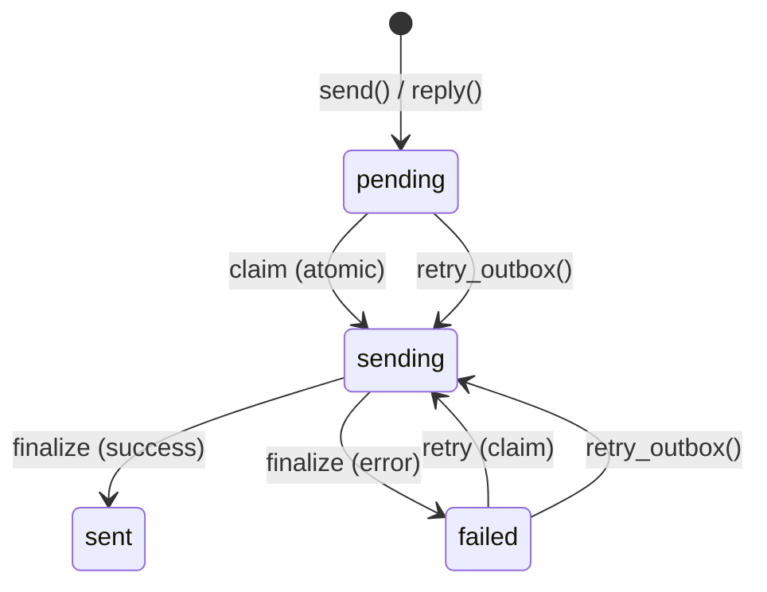

# SMTP კონფიგურაცია

PRX-Email ელ.ფოსტას SMTP-ის მეშვეობით `lettre` crate-ით და `rustls` TLS-ით აგზავნის. Outbox pipeline ატომური claim-send-finalize სამუშაო ნაკადს იყენებს დუბლიკატი გაგზავნების თავიდან ასაცილებლად, ექსპონენციური backoff retry-ით და დეტერმინირებული Message-ID idempotency გასაღებებით.

## SMTP-ის საბაზო კონფიგურაცია

```rust
use prx_email::plugin::{SmtpConfig, AuthConfig};

let smtp = SmtpConfig {
    host: "smtp.example.com".to_string(),
    port: 465,
    user: "you@example.com".to_string(),
    auth: AuthConfig {
        password: Some("your-app-password".to_string()),
        oauth_token: None,
    },
};
```

### კონფიგურაციის ველები

| ველი | ტიპი | სავალდებულო | აღწერა |
|------|------|-------------|--------|
| `host` | `String` | დიახ | SMTP სერვერის hostname (ცარიელი არ უნდა იყოს) |
| `port` | `u16` | დიახ | SMTP სერვერის პორტი (465 implicit TLS-ისთვის, 587 STARTTLS-ისთვის) |
| `user` | `String` | დიახ | SMTP მომხმარებელი (ჩვეულებრივ ელ.ფოსტის მისამართი) |
| `auth.password` | `Option<String>` | ერთ-ერთი | SMTP AUTH PLAIN/LOGIN-ისთვის პაროლი |
| `auth.oauth_token` | `Option<String>` | ერთ-ერთი | XOAUTH2-ისთვის OAuth access token |

## გავრცელებული პროვაიდერის პარამეტრები

| პროვაიდერი | Host | პორტი | Auth მეთოდი |
|-----------|------|-------|-------------|
| Gmail | `smtp.gmail.com` | 465 | App password ან XOAUTH2 |
| Outlook / Office 365 | `smtp.office365.com` | 587 | XOAUTH2 |
| Yahoo | `smtp.mail.yahoo.com` | 465 | App password |
| Fastmail | `smtp.fastmail.com` | 465 | App password |

## ელ.ფოსტის გაგზავნა

### საბაზო გაგზავნა

```rust
use prx_email::plugin::SendEmailRequest;

let response = plugin.send(SendEmailRequest {
    account_id: 1,
    to: "recipient@example.com".to_string(),
    subject: "Hello".to_string(),
    body_text: "Message body here.".to_string(),
    now_ts: now,
    attachment: None,
    failure_mode: None,
});
```

### შეტყობინებაზე პასუხი

```rust
use prx_email::plugin::ReplyEmailRequest;

let response = plugin.reply(ReplyEmailRequest {
    account_id: 1,
    in_reply_to_message_id: "<original-msg-id@example.com>".to_string(),
    body_text: "Thanks for your message!".to_string(),
    now_ts: now,
    attachment: None,
    failure_mode: None,
});
```

პასუხები ავტომატურად:
- `In-Reply-To` header-ს ადგენს
- `References` chain-ს მშობელი შეტყობინებიდან ააგებს
- მიმღებს მშობელი შეტყობინების გამგზავნისგან გამოიტანს
- subject-ს `Re:`-ის პრეფიქსით ამდიდრებს

## Outbox Pipeline

Outbox pipeline ატომური სასრული მდგომარეობის მანქანის მეშვეობით საიმედო ელ.ფოსტის მიწოდებას უზრუნველყოფს:



### სასრული მდგომარეობის მანქანის წესები

| გადასვლა | პირობა | Guard |
|---------|---------|-------|
| `pending` -> `sending` | `claim_outbox_for_send()` | `status IN ('pending','failed') AND next_attempt_at <= now` |
| `sending` -> `sent` | პროვაიდერი მიიღო | `update_outbox_status_if_current(status='sending')` |
| `sending` -> `failed` | პროვაიდერმა უარყო ან ქსელური შეცდომა | `update_outbox_status_if_current(status='sending')` |
| `failed` -> `sending` | `retry_outbox()` | `status IN ('pending','failed') AND next_attempt_at <= now` |

### Idempotency

ყოველი outbox შეტყობინება იღებს დეტერმინირებულ Message-ID-ს:

```
<outbox-{id}-{retries}@prx-email.local>
```

ეს უზრუნველყოფს, რომ retry-ები ორიგინალი გაგზავნისგან განასხვავებელია, და Message-ID-ით დუბლიკატების ამომვსებელი პროვაიდერები ყოველ retry-ს მიიღებს.

### Retry Backoff

ვერ გაგზავნილი შეტყობინებები ექსპონენციური backoff-ს იყენებს:

```
next_attempt_at = now + base_backoff * 2^retries
```

5-წამიანი base backoff-ით:

| Retry | Backoff |
|-------|---------|
| 1 | 10s |
| 2 | 20s |
| 3 | 40s |
| 4 | 80s |
| 5 | 160s |
| 6 | 320s |
| 7 | 640s |
| 10 | 5,120s (~85 წთ) |

### ხელით Retry

```rust
use prx_email::plugin::RetryOutboxRequest;

let response = plugin.retry_outbox(RetryOutboxRequest {
    outbox_id: 42,
    now_ts: now,
    failure_mode: None,
});
```

Retry-ი უარყოფილია, თუ:
- Outbox სტატუსი არის `sent` ან `sending` (retry-ს არ ექვემდებარება)
- `next_attempt_at` ჯერ არ მიღწეულა (`retry_not_due`)

## დანართები

### დანართით გაგზავნა

```rust
use prx_email::plugin::{SendEmailRequest, AttachmentInput};

let response = plugin.send(SendEmailRequest {
    account_id: 1,
    to: "recipient@example.com".to_string(),
    subject: "Report attached".to_string(),
    body_text: "Please find the report attached.".to_string(),
    now_ts: now,
    attachment: Some(AttachmentInput {
        filename: "report.pdf".to_string(),
        content_type: "application/pdf".to_string(),
        base64: Some(base64_encoded_content),
        path: None,
    }),
    failure_mode: None,
});
```

### დანართის Policy

`AttachmentPolicy` ზომისა და MIME ტიპის შეზღუდვებს ამოქმედებს:

```rust
use prx_email::plugin::AttachmentPolicy;

let policy = AttachmentPolicy {
    max_size_bytes: 25 * 1024 * 1024,  // 25 MiB
    allowed_content_types: [
        "application/pdf",
        "image/jpeg",
        "image/png",
        "text/plain",
        "application/zip",
    ].into_iter().map(String::from).collect(),
};
```

| წესი | ქცევა |
|------|-------|
| ზომა `max_size_bytes`-ს აჭარბებს | უარყოფილია `attachment exceeds size limit`-ით |
| MIME ტიპი `allowed_content_types`-ში არ არის | უარყოფილია `attachment content type is not allowed`-ით |
| Path-ზე დაფუძნებული დანართი `attachment_store`-ის გარეშე | უარყოფილია `attachment store not configured`-ით |
| Path storage root-ის გარეთ გადის (`../` traversal) | უარყოფილია `attachment path escapes storage root`-ით |

### Path-ზე დაფუძნებული დანართები

დისკზე შენახული დანართებისთვის, კონფიგურირეთ attachment store:

```rust
use prx_email::plugin::AttachmentStoreConfig;

let store = AttachmentStoreConfig {
    enabled: true,
    dir: "/var/lib/prx-email/attachments".to_string(),
};
```

Path resolution-ი directory traversal guards-ებს მოიცავს -- კონფიგურირებული storage root-ის გარეთ გადამისამართებული ნებისმიერი path, სიმლინკ-ზე დაფუძნებული escape-ების ჩათვლით, უარყოფილია.

## API პასუხის ფორმატი

ყველა გაგზავნის ოპერაცია `ApiResponse<SendResult>`-ს აბრუნებს:

```rust
pub struct SendResult {
    pub outbox_id: i64,
    pub status: String,          // "sent" or "failed"
    pub retries: i64,
    pub provider_message_id: Option<String>,
    pub next_attempt_at: i64,
}
```

## შემდეგი ნაბიჯები

- [OAuth ავთენტიფიკაცია](./oauth) -- XOAUTH2-ის კონფიგურაცია მოთხოვნილი პროვაიდერებისთვის
- [კონფიგურაციის ცნობარი](../configuration/) -- ყველა პარამეტრი და გარემოს ცვლადი
- [პრობლემების მოგვარება](../troubleshooting/) -- SMTP-ის გავრცელებული პრობლემები და გადაწყვეტები
