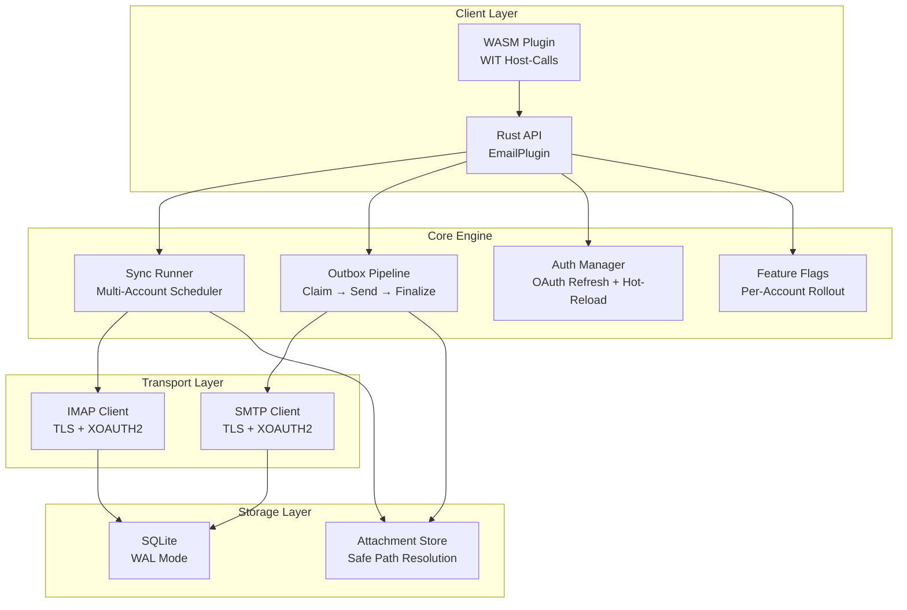

# PRX-Email

**PRX-Email** Rust-ში დაწერილი self-hosted ელ.ფოსტის კლიენტის plugin-ია SQLite persistence-ით და წარმოება-გამაგრებული primitive-ებით. ის უზრუნველყოფს IMAP inbox სინქრონიზაციას, SMTP გაგზავნას ატომური outbox pipeline-ით, OAuth 2.0 ავთენტიფიკაციას Gmail-ისა და Outlook-ისთვის, დანართების მმართველობასა და WASM plugin ინტერფეისს PRX ეკოსისტემაში ინტეგრაციისთვის.

PRX-Email შექმნილია დეველოპერებისა და გუნდებისთვის, რომლებს სჭირდებათ საიმედო, ჩასართავი ელ.ფოსტის backend -- ერთი, რომელიც ამუშავებს მრავალ-ანგარიშიანი სინქრონიზაციის განრიგს, outbox-ის უსაფრთხო მიწოდებას retry-ითა და backoff-ით, OAuth ტოკენის lifecycle მართვას და ფუნქციის ნიშნის rollout-ს -- ყველაფერი მესამე მხარის SaaS ელ.ფოსტის API-ებზე დამოკიდებულების გარეშე.

## რატომ PRX-Email?

ელ.ფოსტის ინტეგრაციების უმეტესობა vendor-სპეციფიკური API-ებზე ან მყიფე IMAP/SMTP wrapper-ებზეა დამოკიდებული. PRX-Email განსხვავებულ მიდგომას იყენებს:

- **წარმოება-გამაგრებული outbox.** ატომური claim-and-finalize state machine-ი დუბლიკატი გაგზავნების თავიდან იცილებს. ექსპონენციური backoff-ი და დეტერმინირებული Message-ID idempotency გასაღებები უსაფრთხო retry-ებს უზრუნველყოფს.
- **OAuth-პირველი ავთენტიფიკაცია.** ნეიტიური XOAUTH2 მხარდაჭერა IMAP-ისა და SMTP-ისთვის ტოკენის ვადის გასვლის თვალყურის დევნებით, pluggable refresh პროვაიდერებით და გარემოს ცვლადებიდან hot-reload-ით.
- **SQLite-ნეიტიური შენახვა.** WAL რეჟიმი, შეზღუდული checkpointing-ი და პარამეტრიზებული შეკითხვები სწრაფ, საიმედო ლოკალურ persistence-ს უზრუნველყოფს გარე მონაცემთა ბაზის დეპენდენციების გარეშე.
- **WASM-ით გაფართოებადი.** Plugin-ი WebAssembly-ში compile-დება და ელ.ფოსტის ოპერაციებს WIT host-call-ების მეშვეობით ხდის ხელმისაწვდომად, ქსელის უსაფრთხოების გადამრთველით, რომელიც ნაგულისხმევად ჭეშმარიტ IMAP/SMTP-ს გამორთავს.

## ძირითადი ფუნქციები

- **IMAP Inbox სინქრონიზაცია** -- TLS-ით ნებისმიერ IMAP სერვერთან კავშირი. მრავალი ანგარიშისა და საქაღალდის სინქრონიზაცია UID-ზე დაფუძნებული ინკრემენტული fetching-ით და cursor persistence-ით.

- **SMTP Outbox Pipeline** -- ატომური claim-send-finalize სამუშაო ნაკადი დუბლიკატი გაგზავნების თავიდან ასაცილებლად. ვერ გაგზავნილი შეტყობინებები ექსპონენციური backoff-ით retry-ს განიცდიან.

- **OAuth 2.0 ავთენტიფიკაცია** -- XOAUTH2 Gmail-ისა და Outlook-ისთვის. ტოკენის ვადის გასვლის თვალყური, pluggable refresh პროვაიდერები და გარემო-ზე დაფუძნებული hot-reload გადასაწყებიდან.

- **მრავალ-ანგარიშიანი Sync Scheduler** -- პერიოდული polling ანგარიშისა და საქაღალდის მიხედვით კონფიგურირებადი კონკურენტობით, წარუმატებლობის backoff-ით და run-ზე მყარი ზღვრებით.

- **SQLite Persistence** -- WAL რეჟიმი, NORMAL სინქრონული, 5 წ. busy timeout. სრული სქემა ანგარიშებით, საქაღალდეებით, შეტყობინებებით, outbox-ით, სინქ სტატუსითა და ფუნქციის ნიშნებით.

- **დანართების მმართველობა** -- მაქსიმალური ზომის ლიმიტები, MIME whitelist-ის შესრულება და დირექტორიის traversal guards-ები ზედმეტ ან მავნე დანართებისგან დაცვისთვის.

- **ფუნქციის ნიშნის Rollout** -- ანგარიში-ზე ფუნქციის ნიშნები პროცენტ-ზე დაფუძნებული rollout-ით. inbox წაკითხვის, ძიების, გაგზავნის, პასუხის და retry შესაძლებლობების დამოუკიდებლად კონტროლი.

- **WASM Plugin ინტერფეისი** -- WebAssembly-ში compile-ი PRX runtime-ში sandbox-ირებული შესრულებისთვის. Host-call-ები email.sync, list, get, search, send და reply ოპერაციებს უზრუნველყოფს.

- **Observability** -- მეხსიერებაში runtime მეტრიკები (sync მცდელობები/წარმატება/წარუმატებლობები, გაგზავნის წარუმატებლობები, retry რაოდენობა) და სტრუქტურირებული ლოგ payload-ები ანგარიშით, საქაღალდით, message_id-ით, run_id-ით და error_code-ით.

## არქიტექტურა



## სწრაფი ინსტალაცია

საცავის clone-ი და build:

```bash
git clone https://github.com/openprx/prx_email.git
cd prx_email
cargo build --release
```

ან დაამატეთ `Cargo.toml`-ში დამოკიდებულებად:

```toml
[dependencies]
prx_email = { git = "https://github.com/openprx/prx_email.git" }
```

იხილეთ [ინსტალაციის სახელმძღვანელო](./getting-started/installation) WASM plugin-ის კომპილაციის ჩათვლით სრული კონფიგურაციის ინსტრუქციებისთვის.

## დოკუმენტაციის სექციები

| სექცია | აღწერა |
|--------|--------|
| [ინსტალაცია](./getting-started/installation) | PRX-Email-ის ინსტალაცია, დეპენდენციების კონფიგურაცია და WASM plugin-ის build |
| [სწრაფი დაწყება](./getting-started/quickstart) | პირველი ანგარიშის კონფიგურაცია და ელ.ფოსტის გაგზავნა 5 წუთში |
| [ანგარიშის მართვა](./accounts/) | ელ.ფოსტის ანგარიშების დამატება, კონფიგურაცია და მართვა |
| [IMAP კონფიგურაცია](./accounts/imap) | IMAP სერვერის პარამეტრები, TLS და საქაღალდის სინქ |
| [SMTP კონფიგურაცია](./accounts/smtp) | SMTP სერვერის პარამეტრები, TLS და გაგზავნის pipeline |
| [OAuth ავთენტიფიკაცია](./accounts/oauth) | OAuth 2.0 კონფიგურაცია Gmail-ისა და Outlook-ისთვის |
| [SQLite შენახვა](./storage/) | მონაცემთა ბაზის სქემა, WAL რეჟიმი, შესრულების tuning და ტექნიკური მომსახურება |
| [WASM Plugins](./plugins/) | WASM plugin-ის build-ი და განასახება WIT host-call-ებით |
| [კონფიგურაციის ცნობარი](./configuration/) | ყველა გარემოს ცვლადი, runtime პარამეტრები და policy პარამეტრები |
| [პრობლემების მოგვარება](./troubleshooting/) | გავრცელებული პრობლემები და გადაწყვეტები |

## პროექტის ინფო

- **ლიცენზია:** MIT OR Apache-2.0
- **ენა:** Rust (2024 edition)
- **საცავი:** [github.com/openprx/prx_email](https://github.com/openprx/prx_email)
- **შენახვა:** SQLite (rusqlite bundled ფუნქციით)
- **IMAP:** `imap` crate rustls TLS-ით
- **SMTP:** `lettre` crate rustls TLS-ით
