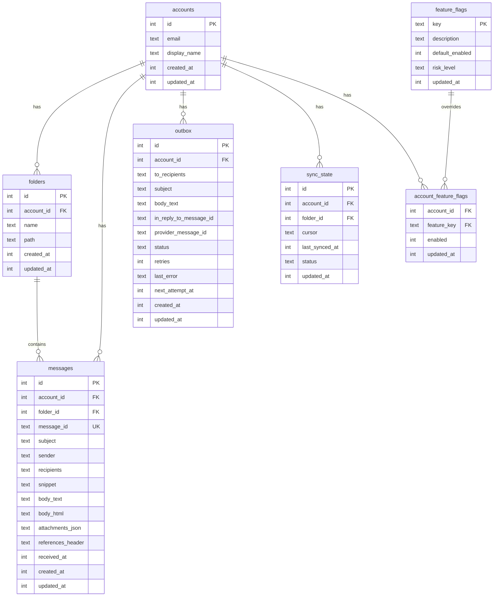

# SQLite შენახვა

PRX-Email SQLite-ს გამოიყენებს ერთადერთ storage backend-ად, `rusqlite` crate-ის მეშვეობით bundled SQLite კომპილაციით. მონაცემთა ბაზა WAL რეჟიმში გაშვებულია foreign key-ების ჩართვით, სწრაფი კონკურენტული წაკითხვებისა და საიმედო ჩაწერის იზოლაციისთვის.

## მონაცემთა ბაზის კონფიგურაცია

### ნაგულისხმევი პარამეტრები

| პარამეტრი | მნიშვნელობა | აღწერა |
|-----------|-------------|--------|
| `journal_mode` | WAL | Write-Ahead Logging კონკურენტული წაკითხვებისთვის |
| `synchronous` | NORMAL | დაბალანსებული გამძლეობა/შესრულება |
| `foreign_keys` | ON | referential integrity-ის შესრულება |
| `busy_timeout` | 5000ms | ჩაკეტილი მონაცემთა ბაზის ლოდინის დრო |
| `wal_autocheckpoint` | 1000 გვერდი | ავტომატური WAL checkpoint-ის ზღვარი |

### Custom კონფიგურაცია

```rust
use prx_email::db::{EmailStore, StoreConfig, SynchronousMode};

let config = StoreConfig {
    enable_wal: true,
    busy_timeout_ms: 5_000,
    wal_autocheckpoint_pages: 1_000,
    synchronous: SynchronousMode::Normal,
};

let store = EmailStore::open_with_config("./email.db", &config)?;
```

### სინქრონული რეჟიმები

| რეჟიმი | გამძლეობა | შესრულება | გამოყენების შემთხვევა |
|--------|-----------|-----------|----------------------|
| `Full` | მაქსიმალური | ყველაზე ნელი ჩაწერა | ფინანსური ან compliance დატვირთვები |
| `Normal` | კარგი (ნაგულისხმევი) | დაბალანსებული | ზოგადი სამუშაო გამოყენება |
| `Off` | მინიმალური | ყველაზე სწრაფი ჩაწერა | მხოლოდ განვითარება და ტესტირება |

### მეხსიერებაში მონაცემთა ბაზა

ტესტირებისთვის გამოიყენეთ მეხსიერებაში მონაცემთა ბაზა:

```rust
let store = EmailStore::open_in_memory()?;
store.migrate()?;
```

## სქემა

მონაცემთა ბაზის სქემა ინკრემენტული migration-ების მეშვეობით გამოიყენება. `store.migrate()` გაშვება ყველა მოლოდინში migration-ს გამოიყენებს.

### ცხრილები



### ინდექსები

| ცხრილი | ინდექსი | მიზანი |
|--------|---------|--------|
| `messages` | `(account_id)` | შეტყობინებების ფილტრაცია ანგარიشش-ის მიხედვით |
| `messages` | `(folder_id)` | შეტყობინებების ფილტრაცია საქაღალდის მიხედვით |
| `messages` | `(subject)` | LIKE ძიება subject-ებზე |
| `messages` | `(account_id, message_id)` | UPSERT-ისთვის unique შეზღუდვა |
| `outbox` | `(account_id)` | outbox-ის ფილტრაცია ანგარიشش-ის მიხედვით |
| `outbox` | `(status, next_attempt_at)` | შესაფერისი outbox ჩანაწერების claim |
| `sync_state` | `(account_id, folder_id)` | UPSERT-ისთვის unique შეზღუდვა |
| `account_feature_flags` | `(account_id)` | ფუნქციის ნიშნების ძიება |

## Migration-ები

Migration-ები ბინარში ჩაშენებულია და თანმიმდევრობით გამოიყენება:

| Migration | აღწერა |
|-----------|--------|
| `0001_init.sql` | Accounts, folders, messages, sync_state ცხრილები |
| `0002_outbox.sql` | Outbox ცხრილი send pipeline-ისთვის |
| `0003_rollout.sql` | Feature flags და account feature flags |
| `0005_m41.sql` | M4.1 სქემის დახვეწა |
| `0006_m42_perf.sql` | M4.2 შესრულების ინდექსები |

დამატებითი სვეტები (`body_html`, `attachments_json`, `references_header`) `ALTER TABLE`-ის მეშვეობით ემატება, თუ არ არსებობს.

## შესრულების Tuning

### წაკითხვაზე ინტენსიური დატვირთვები

ბევრად მეტი წაკითხვა ვიდრე ჩაწერა მქონე აპლიკაციებისთვის (ტიპიური ელ.ფოსტის კლიენტები):

```rust
let config = StoreConfig {
    enable_wal: true,              // Concurrent reads
    busy_timeout_ms: 10_000,       // Higher timeout for contention
    wal_autocheckpoint_pages: 2_000, // Less frequent checkpoints
    synchronous: SynchronousMode::Normal,
};
```

### ჩაწერაზე ინტენსიური დატვირთვები

მაღალი მოცულობის სინქ ოპერაციებისთვის:

```rust
let config = StoreConfig {
    enable_wal: true,
    busy_timeout_ms: 5_000,
    wal_autocheckpoint_pages: 500, // More frequent checkpoints
    synchronous: SynchronousMode::Normal,
};
```

### მოთხოვნის გეგმის ანალიზი

ნელი შეკითხვების შემოწმება `EXPLAIN QUERY PLAN`-ით:

```sql
EXPLAIN QUERY PLAN
SELECT * FROM messages
WHERE account_id = 1 AND subject LIKE '%invoice%'
ORDER BY received_at DESC LIMIT 50;
```

## მოცულობის დაგეგმვა

### ზრდის მამოძრავებლები

| ცხრილი | ზრდის ნიმუში | შენარჩუნების სტრატეგია |
|--------|-------------|----------------------|
| `messages` | დომინანტური ცხრილი; ყოველ სინქ-თან ერთად იზრდება | ძველი შეტყობინებების პერიოდული გაწმენდა |
| `outbox` | გაგზავნილი + ვერ გაგზავნილი ისტორია გროვდება | ძველი გაგზავნილი ჩანაწერების წაშლა |
| WAL ფაილი | ჩაწერის სიჭარბის დროს სპაიკი | ავტომატური checkpoint |

### მონიტორინგის ზღვრები

- DB ფაილის ზომისა და WAL ზომის დამოუკიდებლად თვალყური
- გაფრთხილება, თუ WAL რამდენიმე checkpoint-ის შემდეგ დიდი რჩება
- გაფრთხილება, თუ outbox-ის ვერ გაგზავნილი backlog ოპერაციულ SLO-ს აჭარბებს

## მონაცემების ტექნიკური მომსახურება

### გასუფთავების დამხმარეები

```rust
// Delete sent outbox records older than 30 days
let cutoff = now - 30 * 86400;
let deleted = repo.delete_sent_outbox_before(cutoff)?;
println!("Deleted {} old sent records", deleted);

// Delete messages older than 90 days
let cutoff = now - 90 * 86400;
let deleted = repo.delete_old_messages_before(cutoff)?;
println!("Deleted {} old messages", deleted);
```

### ტექნიკური მომსახურების SQL

Outbox სტატუსის განაწილების შემოწმება:

```sql
SELECT status, COUNT(*) FROM outbox GROUP BY status;
```

შეტყობინებების ასაკის განაწილება:

```sql
SELECT
  CASE
    WHEN received_at >= strftime('%s','now') - 86400 THEN 'lt_1d'
    WHEN received_at >= strftime('%s','now') - 604800 THEN 'lt_7d'
    ELSE 'ge_7d'
  END AS age_bucket,
  COUNT(*)
FROM messages
GROUP BY age_bucket;
```

WAL checkpoint და კომპაქცია:

```sql
PRAGMA wal_checkpoint(TRUNCATE);
VACUUM;
```

::: warning VACUUM
`VACUUM` მთლიანი მონაცემთა ბაზის ფაილს ახალ-ახალ ააგებს და მონაცემთა ბაზის ზომის ტოლი თავისუფალი სადისკო სივრცე სჭირდება. გაუშვით ტექნიკური მომსახურების ფანჯარაში დიდი წაშლების შემდეგ.
:::

## SQL უსაფრთხოება

ყველა მონაცემთა ბაზის შეკითხვა SQL injection-ის თავიდან ასაცილებლად პარამეტრიზებულ განცხადებებს იყენებს:

```rust
// Safe: parameterized query
conn.execute(
    "SELECT * FROM messages WHERE account_id = ?1 AND message_id = ?2",
    params![account_id, message_id],
)?;
```

დინამიური იდენტიფიკატორები (ცხრილის სახელები, სვეტის სახელები) SQL სტრინგებში გამოყენებამდე `^[a-zA-Z_][a-zA-Z0-9_]{0,62}$`-ის მიმართ ვალიდაციას გადიან.

## შემდეგი ნაბიჯები

- [კონფიგურაციის ცნობარი](../configuration/) -- ყველა runtime პარამეტრი
- [პრობლემების მოგვარება](../troubleshooting/) -- მონაცემთა ბაზასთან დაკავშირებული პრობლემები
- [IMAP კონფიგურაცია](../accounts/imap) -- სინქ-ის მონაცემთა ნაკადის გაგება
