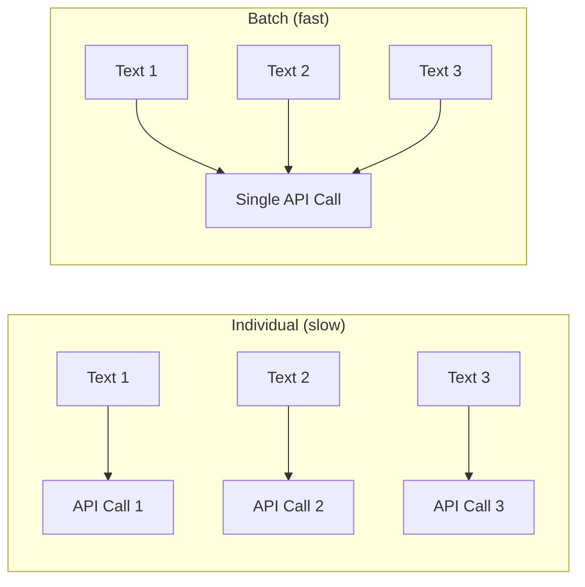

# Batch დამუშავება

დიდ მეხსიერების ნაკრებებთან მუშაობისას ერთ-ერთი ტექსტის ერთდროულად embedding-ი არაეფექტურია. PRX-Memory მხარს უჭერს batch embedding-ს API round trip-ების შესამცირებლად და throughput-ის გასაუმჯობესებლად.

## Batch Embedding-ის მუშაობის პრინციპი

ყოველი მეხსიერებისთვის ცალკეული API გამოძახებების ნაცვლად, batch დამუშავება მრავალ ტექსტს ერთ მოთხოვნაში აჯგუფებს. Embedding პროვაიდერების უმეტესობა მხარს უჭერს 100--2048 ტექსტის batch ზომებს გამოძახებაზე.



## გამოყენების შემთხვევები

### საწყისი იმპორტი

არსებული ცოდნის დიდი ნაკრების იმპორტისას გამოიყენეთ `memory_import` მეხსიერებების ჩასატვირთავად და batch embedding-ის გასაშვებად:

```json
{
  "jsonrpc": "2.0",
  "id": 1,
  "method": "tools/call",
  "params": {
    "name": "memory_import",
    "arguments": {
      "data": "... exported memory JSON ..."
    }
  }
}
```

### ახლად Embedding მოდელის შეცვლის შემდეგ

ახალ embedding მოდელზე გადართვისას `memory_reembed` ინსტრუმენტი ყველა შენახულ მეხსიერებას batch-ებში ამუშავებს:

```json
{
  "jsonrpc": "2.0",
  "id": 1,
  "method": "tools/call",
  "params": {
    "name": "memory_reembed",
    "arguments": {}
  }
}
```

### შენახვის კომპაქტიზება

`memory_compact` ინსტრუმენტი ოპტიმიზებს შენახვას და შეიძლება გამოიწვიოს ახლად embedding-ი მოძველებული ან დაკარგული ვექტორების ჩანაწერებისთვის:

```json
{
  "jsonrpc": "2.0",
  "id": 1,
  "method": "tools/call",
  "params": {
    "name": "memory_compact",
    "arguments": {}
  }
}
```

## შესრულების რჩევები

| რჩევა | აღწერა |
|-------|--------|
| გამოიყენეთ batch-ს-მეგობრული პროვაიდერები | Jina და OpenAI-თავსებადი endpoint-ები დიდ batch ზომებს უჭერენ მხარს |
| დაგეგმეთ დაბალი გამოყენების დროს | Batch ოპერაციები იყენებს ერთსა და იმავე API კვოტას, როგორც real-time შეკითხვები |
| მეტრიკების გამოყენება monitoring-ისთვის | `/metrics` endpoint-ის გამოყენება embedding გამოძახების რაოდენობებისა და latency-ის საკონტროლოდ |
| ეფექტური მოდელების არჩევა | პატარა მოდელები (768 განზომილება) უფრო სწრაფი embedding-ი, ვიდრე დიდი (3072 განზომილება) |

## Rate Limiting

Embedding პროვაიდერების უმეტესობა rate limit-ებს ახდენს. PRX-Memory ამუშავებს rate limit-ის პასუხებს (HTTP 429) ავტომატური backoff-ით. მუდმივი rate limiting-ის შემთხვევაში:

- შეამცირეთ batch ზომა ნაკლები მეხსიერებების ერთდროულად დამუშავებით.
- გამოიყენეთ პროვაიდერი უფრო მაღალი rate limit-ებით.
- გაანაწილეთ batch ოპერაციები უფრო გრძელ დროის ფანჯარაზე.

::: tip
დიდ-მასშტაბიანი ახლად embedding-ის ოპერაციებისთვის განიხილეთ ლოკალური inference სერვერის გამოყენება rate limit-ების მთლიანად თავიდან ასაცილებლად. დააყენეთ `PRX_EMBED_PROVIDER=openai-compatible` და მიუთითეთ `PRX_EMBED_BASE_URL` თქვენს ლოკალურ სერვერზე.
:::

## შემდეგი ნაბიჯები

- [მხარდაჭერილი მოდელები](./models) -- სწორი embedding მოდელის არჩევა
- [შენახვის backend-ები](../storage/) -- სადაც ვექტორები ინახება
- [კონფიგურაციის ცნობარი](../configuration/) -- ყველა გარემოს ცვლადი
