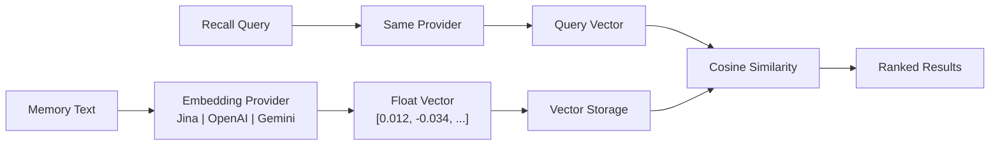

# Embedding ძრავა

Embedding ძრავა PRX-Memory-ის სემანტიკური მოძიების შესაძლებლობის საფუძველია. ის ტექსტური მეხსიერებები მაღალ-განზომილებიან ვექტორებად გარდაქმნის, რომლებიც მნიშვნელობას ატარებენ, რაც საშუალებას იძლევა მსგავსება-ზე დაფუძნებული ძიება, რომელიც საკვანძო სიტყვების შეწყობას სცდება.

## მუშაობის პრინციპი

embedding-ის ჩართვით მეხსიერების შენახვისას PRX-Memory:

1. მეხსიერების ტექსტს კონფიგურირებულ embedding პროვაიდერს უგზავნის.
2. ვექტორულ წარმოდგენას იღებს (ჩვეულებრივ 768--3072 განზომილება).
3. ვექტორს მეხსიერების metadata-სთან ერთად ინახავს.
4. გამოძახებისას კოსინუს მსგავსების ძიებისთვის ვექტორს იყენებს.



## პროვაიდერის არქიტექტურა

`prx-memory-embed` crate განსაზღვრავს პროვაიდერის trait-ს, რომელსაც ყველა embedding backend-ი ახორციელებს. ეს დიზაინი პროვაიდერების გადართვის საშუალებას იძლევა აპლიკაციის კოდის შეცვლის გარეშე.

მხარდაჭერილი პროვაიდერები:

| პროვაიდერი | გარემოს გასაღები | აღწერა |
|-----------|----------------|--------|
| OpenAI-თავსებადი | `PRX_EMBED_PROVIDER=openai-compatible` | ნებისმიერი OpenAI-თავსებადი API (OpenAI, Azure, ლოკალური სერვერები) |
| Jina | `PRX_EMBED_PROVIDER=jina` | Jina AI embedding მოდელები |
| Gemini | `PRX_EMBED_PROVIDER=gemini` | Google Gemini embedding მოდელები |

## კონფიგურაცია

დააყენეთ პროვაიდერი და სერთიფიკატები გარემოს ცვლადებით:

```bash
PRX_EMBED_PROVIDER=jina
PRX_EMBED_API_KEY=your_api_key
PRX_EMBED_MODEL=jina-embeddings-v3
PRX_EMBED_BASE_URL=https://api.jina.ai  # optional, for custom endpoints
```

::: tip პროვაიდერის სარეზერვო გასაღებები
`PRX_EMBED_API_KEY`-ის დაუყენებლობისას სისტემა პროვაიდერ-სპეციფიკური გასაღებებზე გადადის:
- Jina: `JINA_API_KEY`
- Gemini: `GEMINI_API_KEY`
:::

## როდის ჩართოთ Embedding

| სცენარი | Embedding სჭირდება? |
|---------|---------------------|
| მცირე მეხსიერების ნაკრები (<100 ჩანაწერი) | სურვილისამებრ -- ლექსიკური ძიება საკმარისი შეიძლება იყოს |
| დიდი მეხსიერების ნაკრები (1000+ ჩანაწერი) | სასურველია -- ვექტორული მსგავსება მნიშვნელოვნად აუმჯობესებს გამოძახებას |
| ბუნებრივი ენის შეკითხვები | სასურველია -- სემანტიკური მნიშვნელობა |
| ზუსტი tag/scope ფილტრაცია | არ სჭირდება -- ლექსიკური ძიება ამ შემთხვევას ამუშავებს |
| ენათაშორისი გამოძახება | სასურველია -- მრავალენოვანი მოდელები ენებს შორის მუშაობს |

## შესრულების მახასიათებლები

- **Latency:** 50--200ms embedding გამოძახებაზე პროვაიდერისა და მოდელის მიხედვით.
- **Batch რეჟიმი:** მრავალი ტექსტის ერთ API გამოძახებაში დაჯგუფება round trip-ების შესამცირებლად.
- **ლოკალური caching:** ვექტორები ლოკალურად ინახება და გამოიყენება; მხოლოდ ახალ ან შეცვლილ მეხსიერებებს სჭირდება embedding გამოძახება.
- **100k benchmark:** p95 მოძიება 123ms-ის ქვეშ ლექსიკური+მნიშვნელობის+სიახლის გამოძახებაზე 100,000 ჩანაწერისთვის (ქსელის გამოძახებების გარეშე).

## შემდეგი ნაბიჯები

- [მხარდაჭერილი მოდელები](./models) -- მოდელის დეტალური შედარება
- [Batch დამუშავება](./batch-processing) -- ეფექტური bulk embedding
- [Reranking](../reranking/) -- მეორე-საფეხურიანი reranking უკეთესი სიზუსტისთვის
