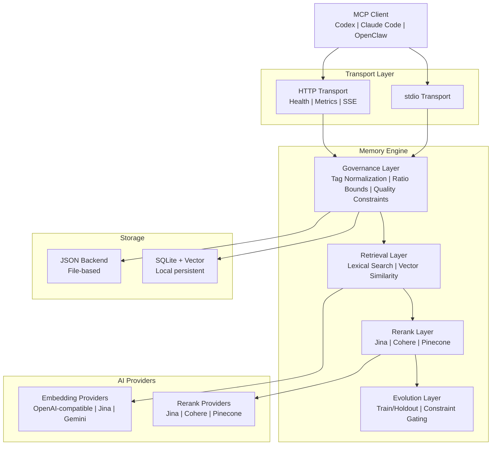

# PRX-Memory

**PRX-Memory** კოდირების agent-ებისთვის შექმნილი ლოკალ-პირველი სემანტიკური მეხსიერების ძრავაა. ის embedding-ზე დაფუძნებულ მოძიებას, reranking-ს, მმართველობის კონტროლებს და გაზომვადი evolution-ს აერთიანებს ერთ MCP-თავსებად კომპონენტში. PRX-Memory ავტონომიური daemon-ის (`prx-memoryd`) სახით გამოდის, რომელიც stdio ან HTTP-ზე ახდენს კომუნიკაციას, რაც მას Codex-თან, Claude Code-თან, OpenClaw-თან, OpenPRX-თან და ნებისმიერ სხვა MCP კლიენტთან თავსებადს ხდის.

PRX-Memory ყურადღებას ამახვილებს **გამოყენებად ინჟინერიულ ცოდნაზე**, ნედლ ლოგებზე არა. სისტემა ინახავს სტრუქტურირებულ მეხსიერებებს tag-ებით, scope-ებითა და მნიშვნელობის ქულებით, შემდეგ კი მათ იძიებს ლექსიკური ძიების, ვექტორული მსგავსებისა და სურვილისამებრ reranking-ის კომბინაციით -- ყველაფერი ხარისხისა და უსაფრთხოების შეზღუდვებით მართული.

## რატომ PRX-Memory?

კოდირების agent-ების უმეტესობა მეხსიერებას მეორეხარისხოვნად ეპყრობა -- ბრტყელი ფაილები, არასტრუქტურირებული ლოგები ან vendor-ზე დამოკიდებული cloud სერვისები. PRX-Memory განსხვავებულ მიდგომას იყენებს:

- **ლოკალ-პირველი.** ყველა მონაცემი თქვენს მანქანაზე რჩება. cloud-ზე დამოკიდებულება, telemetry, ან ქსელის გარეთ მონაცემების გაჟონვა არ არის.
- **სტრუქტურირებული და მართული.** ყოველი მეხსიერების ჩანაწერი მიჰყვება სტანდარტიზებულ ფორმატს tag-ებით, scope-ებით, კატეგორიებითა და ხარისხის შეზღუდვებით. Tag-ების ნორმალიზება და ratio bounds-ი ხვედრს ხელს უშლის.
- **სემანტიკური მოძიება.** ლექსიკური შეწყობა ვექტორული მსგავსებასთან და სურვილისამებრ reranking-ს უახლესი კონტექსტისთვის ყველაზე შესაბამისი მეხსიერებების მოსაძებნად.
- **გაზომვადი evolution.** `memory_evolve` ინსტრუმენტი train/holdout გაყოფებს და constraint gating-ს იყენებს კანდიდატი გაუმჯობესებების მისაღებად ან უარსაყოფად -- გამოცნობა არ არის.
- **MCP ნეიტიური.** Model Context Protocol-ის პირველი კლასის მხარდაჭერა stdio და HTTP ტრანსპორტებზე, resource template-ებით, skill manifest-ებითა და streaming სესიებით.

## ძირითადი ფუნქციები

- **მრავალ-პროვაიდერული Embedding** -- მხარს უჭერს OpenAI-თავსებად, Jina და Gemini embedding პროვაიდერებს ერთიანი adapter ინტერფეისის მეშვეობით. პროვაიდერების გადართვა გარემოს ცვლადის შეცვლით.

- **Reranking Pipeline** -- სურვილისამებრ მეორე-საფეხურიანი reranking Jina, Cohere ან Pinecone reranker-ების გამოყენებით, მოძიების სიზუსტის გასაუმჯობესებლად უბრალო ვექტორული მსგავსების გარეშე.

- **მმართველობის კონტროლები** -- სტრუქტურირებული მეხსიერების ფორმატი tag-ების ნორმალიზებით, ratio bounds-ით, პერიოდული ტექნიკური მომსახურებით და ხარისხის შეზღუდვებით, მეხსიერების ხარისხი დროთა განმავლობაში მაღლა სამართავად.

- **მეხსიერების Evolution** -- `memory_evolve` ინსტრუმენტი კანდიდატ ცვლილებებს train/holdout მიღების ტესტირებითა და constraint gating-ით აფასებს, გაზომვადი გაუმჯობესების გარანტიებით.

- **ორმაგი ტრანსპორტი MCP სერვერი** -- მუშაობს stdio სერვერად პირდაპირი ინტეგრაციისთვის ან HTTP სერვერად ჯანმრთელობის შემოწმებებით, Prometheus მეტრიკებით და streaming სესიებით.

- **Skill განაწილება** -- ჩაშენებული მმართველობის skill პაკეტები, MCP resource და tool პროტოკოლებით აღმოჩენადი, სტანდარტიზებული მეხსიერების ოპერაციებისთვის payload template-ებით.

- **Observability** -- Prometheus მეტრიკების endpoint, Grafana dashboard-ის template-ები, კონფიგურირებადი alert ზღვრები და კარდინალობის კონტროლები საწარმოო განასახებებისთვის.

## არქიტექტურა



## სწრაფი დაწყება

მეხსიერების daemon-ის build-ი და გაშვება:

```bash
cargo build -p prx-memory-mcp --bin prx-memoryd

PRX_MEMORYD_TRANSPORT=stdio \
PRX_MEMORY_DB=./data/memory-db.json \
./target/debug/prx-memoryd
```

ან Cargo-ს მეშვეობით ინსტალაცია:

```bash
cargo install prx-memory-mcp
```

იხილეთ [ინსტალაციის სახელმძღვანელო](./getting-started/installation) ყველა მეთოდისა და კონფიგურაციის პარამეტრებისთვის.

## სამუშაო სივრცის Crate-ები

| Crate | აღწერა |
|-------|--------|
| `prx-memory-core` | ძირითადი შეფასებისა და evolution-ის დომენის primitive-ები |
| `prx-memory-embed` | Embedding პროვაიდერის abstraction და adapter-ები |
| `prx-memory-rerank` | Rerank პროვაიდერის abstraction და adapter-ები |
| `prx-memory-ai` | Embedding-ისა და rerank-ის ერთიანი პროვაიდერის abstraction |
| `prx-memory-skill` | ჩაშენებული მმართველობის skill payload-ები |
| `prx-memory-storage` | ლოკალური მდგრადი შენახვის ძრავა (JSON, SQLite, LanceDB) |
| `prx-memory-mcp` | MCP სერვერის ზედაპირი stdio და HTTP ტრანსპორტებით |

## დოკუმენტაციის სექციები

| სექცია | აღწერა |
|--------|--------|
| [ინსტალაცია](./getting-started/installation) | Source-დან build ან Cargo-ს მეშვეობით ინსტალაცია |
| [სწრაფი დაწყება](./getting-started/quickstart) | PRX-Memory 5 წუთში |
| [Embedding ძრავა](./embedding/) | Embedding პროვაიდერები და batch დამუშავება |
| [მხარდაჭერილი მოდელები](./embedding/models) | OpenAI-თავსებადი, Jina, Gemini მოდელები |
| [Reranking ძრავა](./reranking/) | მეორე-საფეხურიანი reranking pipeline |
| [შენახვის backend-ები](./storage/) | JSON, SQLite და ვექტორული ძიება |
| [MCP ინტეგრაცია](./mcp/) | MCP პროტოკოლი, ინსტრუმენტები, resource-ები და template-ები |
| [Rust API ცნობარი](./api/) | ბიბლიოთეკის API PRX-Memory-ის Rust პროექტებში ჩასასმელად |
| [კონფიგურაცია](./configuration/) | ყველა გარემოს ცვლადი და პროფილი |
| [პრობლემების მოგვარება](./troubleshooting/) | გავრცელებული პრობლემები და გადაწყვეტები |

## პროექტის ინფო

- **ლიცენზია:** MIT OR Apache-2.0
- **ენა:** Rust (2024 edition)
- **საცავი:** [github.com/openprx/prx-memory](https://github.com/openprx/prx-memory)
- **მინიმალური Rust:** stable toolchain
- **ტრანსპორტები:** stdio, HTTP
