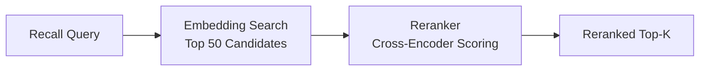

# Reranking ძრავა

Reranking სურვილისამებრ მეორე-საფეხურიანი მოძიების ეტაპია, რომელიც კანდიდატ შედეგებს გადააწყობს სპეციალიზებული cross-encoder მოდელის გამოყენებით. Embedding-ზე დაფუძნებული მოძიება სწრაფია, მაგრამ ის წინასწარ გამოთვლილ ვექტორებზე მუშაობს, რომლებმა შეიძლება ვერ ასახონ დეტალური შესაბამისობა. Reranking უფრო ძლიერ მოდელს კანდიდატების მცირე ნაკრებზე იყენებს, მნიშვნელოვნად სიზუსტეს აუმჯობესებს.

## მუშაობის პრინციპი

1. **პირველი საფეხური (მოძიება):** ვექტორული მსგავსების ძიება აბრუნებს კანდიდატების ფართო ნაკრებს (მაგ., top 50).
2. **მეორე საფეხური (reranking):** cross-encoder მოდელი ყოველ კანდიდატს შეკითხვის მიმართ ასწორებს, რეფინირებული რანჟირების მისაღებად.
3. **საბოლოო შედეგი:** rerank-ული top-k შედეგები მომხმარებელს ეძლევა.



## რატომ არის Reranking მნიშვნელოვანი

| მეტრიკა | Reranking-ის გარეშე | Reranking-ით |
|---------|---------------------|--------------|
| Recall coverage | მაღალი (ფართო მოძიება) | იგივე (უცვლელი) |
| Precision top-5-ზე | ზომიერი | მნიშვნელოვნად გაუმჯობესებული |
| Latency | დაბალი (~50ms) | უფრო მაღალი (~150ms დამატებით) |
| API ხარჯი | მხოლოდ embedding | Embedding + reranking |

Reranking ყველაზე ღირებულია, როდესაც:

- მეხსიერების მონაცემთა ბაზა დიდია (1000+ ჩანაწერი).
- შეკითხვები ორაზროვანი ან ბუნებრივი ენის.
- შედეგების სიაში სიზუსტე latency-ზე მნიშვნელოვანია.

## მხარდაჭერილი პროვაიდერები

| პროვაიდერი | კონფიგ. მნიშვნელობა | აღწერა |
|-----------|---------------------|--------|
| Jina | `PRX_RERANK_PROVIDER=jina` | Jina AI reranker მოდელები |
| Cohere | `PRX_RERANK_PROVIDER=cohere` | Cohere rerank API |
| Pinecone | `PRX_RERANK_PROVIDER=pinecone` | Pinecone rerank სერვისი |
| Pinecone-თავსებადი | `PRX_RERANK_PROVIDER=pinecone-compatible` | სპეციალური Pinecone-თავსებადი endpoint-ები |
| None | `PRX_RERANK_PROVIDER=none` | Reranking-ის გამორთვა |

## კონფიგურაცია

```bash
PRX_RERANK_PROVIDER=cohere
PRX_RERANK_API_KEY=your_cohere_key
PRX_RERANK_MODEL=rerank-v3.5
```

::: tip პროვაიდერის სარეზერვო გასაღებები
`PRX_RERANK_API_KEY`-ის დაუყენებლობისას სისტემა პროვაიდერ-სპეციფიკური გასაღებებზე გადადის:
- Jina: `JINA_API_KEY`
- Cohere: `COHERE_API_KEY`
- Pinecone: `PINECONE_API_KEY`
:::

## Reranking-ის გამორთვა

Reranking-ის გარეშე გასაშვებად ან გამოტოვეთ `PRX_RERANK_PROVIDER` ცვლადი ან მკაფიოდ დააყენეთ:

```bash
PRX_RERANK_PROVIDER=none
```

გამოძახება კვლავ ფუნქციონირებს ლექსიკური შეწყობისა და ვექტორული მსგავსების გამოყენებით reranking-ის ეტაპის გარეშე.

## შემდეგი ნაბიჯები

- [Reranking მოდელები](./models) -- მოდელის დეტალური შედარება
- [Embedding ძრავა](../embedding/) -- პირველი-საფეხურიანი მოძიება
- [კონფიგურაციის ცნობარი](../configuration/) -- ყველა გარემოს ცვლადი
