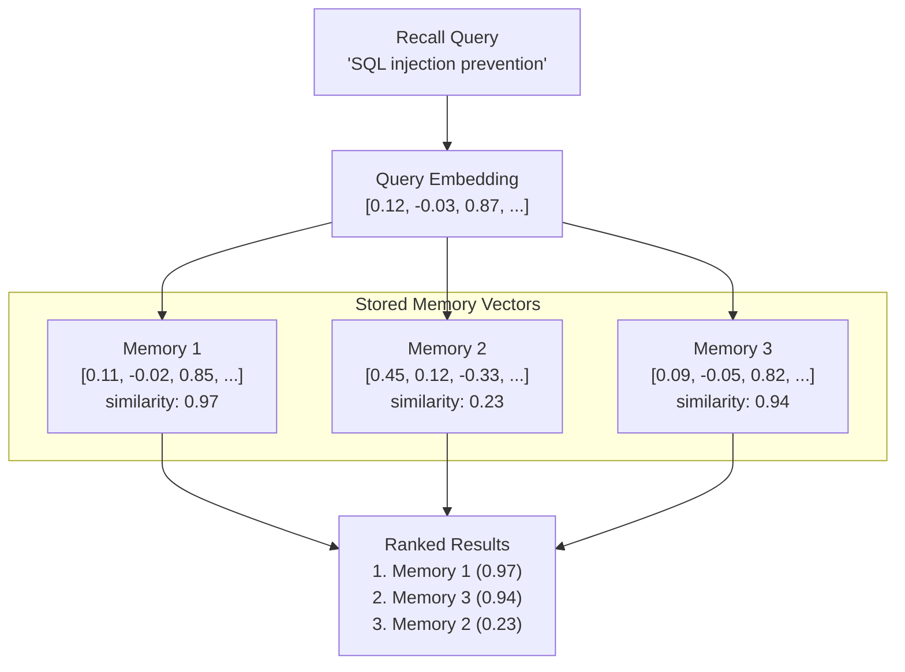

# ვექტორული ძიება

ვექტორული ძიება PRX-Memory-ში სემანტიკური მეხსიერების მოძიების ძირითადი მექანიზმია. საკვანძო სიტყვების შეწყობის ნაცვლად, ვექტორული ძიება ადარებს შეკითხვასა და მეხსიერების embedding-ებს შორის მათემატიკურ მსგავსებას კონცეპტუალურად დაკავშირებული შედეგების მოსაძებნად.

## მუშაობის პრინციპი

1. **შეკითხვის embedding:** გამოძახების შეკითხვა კონფიგურირებულ embedding პროვაიდერს ეგზავნება, ვექტორის წარმოებით.
2. **მსგავსების გამოთვლა:** შეკითხვის ვექტორი ყველა შენახულ მეხსიერების ვექტორს ადარება კოსინუს მსგავსების გამოყენებით.
3. **შეფასება:** ყოველი მეხსიერება მსგავსების ქულას იღებს -1.0-დან 1.0-მდე (მეტი ნიშნავს უფრო მსგავსს).
4. **რანჟირება:** შედეგები ქულის მიხედვით სორტდება და სხვა სიგნალებთან ერთდება (ლექსიკური შეწყობა, მნიშვნელობა, სიახლე).



## კოსინუს მსგავსება

PRX-Memory კოსინუს მსგავსებას იყენებს მანძილის მეტრიკად. კოსინუს მსგავსება ზომავს კუთხეს ორ ვექტორს შორის, სიდიდეს იგნორირებით:

```
similarity(A, B) = (A . B) / (|A| * |B|)
```

| ქულა | მნიშვნელობა |
|------|------------|
| 0.95--1.0 | თითქმის იდენტური მნიშვნელობა |
| 0.80--0.95 | მაღალ-დაკავშირებული |
| 0.60--0.80 | გარკვეულ-დაკავშირებული |
| < 0.60 | სავარაუდოდ დაუკავშირებელი |

## კომბინირებული რანჟირება

ვექტორული მსგავსება PRX-Memory-ის მრავალ-სიგნალური რანჟირების ერთ-ერთი სიგნალია. საბოლოო ქულა აერთიანებს:

| სიგნალი | წონა | აღწერა |
|---------|------|--------|
| ვექტორული მსგავსება | მაღალი | სემანტიკური შესაბამისობა embedding-ის შედარებიდან |
| ლექსიკური შეწყობა | საშუალო | საკვანძო სიტყვების გადაფარვა შეკითხვასა და მეხსიერების ტექსტს შორის |
| მნიშვნელობის ქულა | საშუალო | მომხმარებლის მიერ მინიჭებული ან სისტემის მიერ გამოთვლილი მნიშვნელობა |
| სიახლე | დაბალი | უახლეს მეხსიერებებს მცირე boost |

ზუსტი წონა გამოძახების კონფიგურაციასა და embedding-ისა და reranking-ის ჩართვაზეა დამოკიდებული.

## შესრულება

100k-ჩანაწერიანი benchmark გვიჩვენებს:

| მეტრიკა | მნიშვნელობა |
|---------|------------|
| ნაკრების ზომა | 100,000 ჩანაწერი |
| p95 latency | 122.683ms |
| ზღვარი | < 300ms |
| მეთოდი | ლექსიკური + მნიშვნელობა + სიახლე (ქსელის გამოძახებების გარეშე) |

::: info
ეს benchmark ზომავს მხოლოდ მოძიების რანჟირების გზას, ქსელური embedding ან rerank გამოძახებების გარეშე. end-to-end latency პროვაიდერის პასუხის დროებზეა დამოკიდებული.
:::

## მასშტაბირების მოსაზრებები

| ნაკრების ზომა | სასურველი მიდგომა |
|-------------|-----------------|
| < 10,000 | Brute-force cosine მსგავსება (JSON ან SQLite backend) |
| 10,000--100,000 | SQLite მეხსიერებაში ვექტორული სკანით |
| > 100,000 | LanceDB ANN ინდექსირებით |

100,000 ჩანაწერს გადამეტებული ნაკრებებისთვის ჩართეთ LanceDB backend approximate nearest neighbor (ANN) ძიებისთვის, რომელიც sub-linear შეკითხვის დროს უზრუნველყოფს.

## შემდეგი ნაბიჯები

- [Embedding ძრავა](../embedding/) -- ვექტორების გენერირების მეთოდი
- [Reranking](../reranking/) -- მეორე-საფეხურიანი სიზუსტის გაუმჯობესება
- [შენახვის backend-ები](./index) -- სწორი შენახვის backend-ის არჩევა
