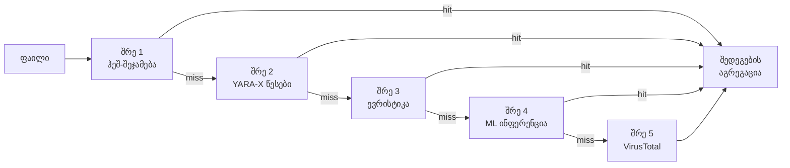

# გამოვლენის ძრავა

PRX-SD მავნე პროგრამების გამოსავლენად მრავალ შრეიანი გამოვლენის კონვეიერს იყენებს. ყოველი შრე განსხვავებულ ტექნიკას იყენებს და ისინი სწრაფიდან ყველაზე სრულყოფილამდე თანმიმდევრობით სრულდება. ეს "სიღრმისეული დაცვის" მიდგომა უზრუნველყოფს, რომ თუ ერთი შრე საფრთხეს გამოტოვებს, შემდეგი შრეები მას გამოავლენს.

## კონვეიერის მიმოხილვა

გამოვლენის კონვეიერი თითოეულ ფაილს ხუთ შრემდე ამუშავებს:



## შრეების შეჯამება

| შრე | ძრავა | სიჩქარე | გამოყენება | საჭიროა |
|-------|--------|-------|----------|----------|
| **შრე 1** | LMDB ჰეშ-შეჯამება | ~1 მიკროწამი/ფაილი | ცნობილი მავნე პროგრამა (ზუსტი შეჯამება) | კი (ნაგულისხმევი) |
| **შრე 2** | YARA-X წესების სკანი | ~0.3 მწმ/ფაილი | შაბლონ-ზე დაფუძნებული (38,800+ წესი) | კი (ნაგულისხმევი) |
| **შრე 3** | ევრისტიკული ანალიზი | ~1-5 მწმ/ფაილი | ფაილის ტიპის მიხედვით ქცევის ინდიკატორები | კი (ნაგულისხმევი) |
| **შრე 4** | ONNX ML ინფერენცია | ~10-50 მწმ/ფაილი | ახალი/პოლიმორფული მავნე პროგრამა | სურვილისამებრ (`--features ml`) |
| **შრე 5** | VirusTotal API | ~200-500 მწმ/ფაილი | 70+ მოვაჭრის კონსენსუსი | სურვილისამებრ (`--features virustotal`) |

## შრე 1: ჰეშ-შეჯამება

ყველაზე სწრაფი შრე. PRX-SD თითოეული ფაილის SHA-256 ჰეშს ითვლის და ცნობილ-მავნე ჰეშების შემცველ LMDB მონაცემთა ბაზაში ამოწმებს. LMDB memory-mapped I/O-თი O(1) საშუალო ძებნის დროს უზრუნველყოფს, რაც ამ შრეს პრაქტიკულად ხარჯებიდან ამოღებულს ხდის.

**მონაცემთა წყაროები:**
- abuse.ch MalwareBazaar (ბოლო 48 საათი, ყოველ 5 წუთში განახლება)
- abuse.ch URLhaus (ყოველსაათური განახლება)
- abuse.ch Feodo Tracker (Emotet/Dridex/TrickBot, ყოველ 5 წუთში)
- abuse.ch ThreatFox (IOC გაზიარების პლატფორმა)
- VirusShare (20M+ MD5 ჰეში, სურვილისამებრ `--full` განახლება)
- ჩაშენებული blocklist (EICAR, WannaCry, NotPetya, Emotet და სხვ.)

ჰეშ-შეჯამება მყისიერ `MALICIOUS` განაჩენს იძლევა. იმ ფაილისთვის დარჩენილი შრეები გამოტოვდება.

დეტალებისთვის იხილეთ [ჰეშ-შეჯამება](./hash-matching).

## შრე 2: YARA-X წესები

თუ ჰეშ-შეჯამება არ მოიძებნა, ფაილი 38,800+ YARA წესის გამოყენებით YARA-X ძრავით (YARA-ს Rust-ზე გადაწერილი შემდეგი თაობა) სკანირდება. წესები ბაიტ-შაბლონების, სტრინგების და ფაილის შინაარსის სტრუქტურული პირობების შეჯამებით მავნე პროგრამებს ავლენს.

**წესების წყაროები:**
- 64 ჩაშენებული წესი (გამოსასყიდი პროგრამა, ტროიანები, backdoor-ები, rootkit-ები, miner-ები, webshell-ები)
- Yara-Rules/rules (საზოგადოების შენახული, GitHub)
- Neo23x0/signature-base (მაღალი ხარისხის APT და commodity malware წესები)
- ReversingLabs YARA (კომერციული კლასის ღია კოდის წესები)
- ESET IOC (APT-ის თვალთვალი)
- InQuest (დოკუმენტის მავნე პროგრამა: OLE, DDE, მავნე macro-ები)

YARA წესის შეჯამება `MALICIOUS` განაჩენს იძლევა, ანგარიშში კი წესის სახელი შედის.

დეტალებისთვის იხილეთ [YARA წესები](./yara-rules).

## შრე 3: ევრისტიკული ანალიზი

ჰეშ-სა და YARA შემოწმებებს გავლილი ფაილები ფაილის ტიპის მიხედვით ევრისტიკის გამოყენებით ანალიზდება. PRX-SD ფაილის ტიპს მაგიური ნომრის გამოვლენის გამოყენებით ადგენს და სამიზნე შემოწმებებს ახორციელებს:

| ფაილის ტიპი | ევრისტიკური შემოწმებები |
|-----------|-----------------|
| PE (Windows) | განყოფილების ენტროპია, საეჭვო API import-ები, შეფუთვის გამოვლენა, timestamp-ის ანომალიები |
| ELF (Linux) | განყოფილების ენტროპია, LD_PRELOAD მინიშნებები, cron/systemd persistence, SSH backdoor შაბლონები |
| Mach-O (macOS) | განყოფილების ენტროპია, dylib ინექცია, LaunchAgent persistence, Keychain წვდომა |
| Office (docx/xlsx) | VBA macro-ები, DDE ველები, გარე შაბლონის ბმულები, ავტო-შესრულების ტრიგერები |
| PDF | ჩაშენებული JavaScript, Launch ქმედებები, URI ქმედებები, ობფუსცირებული ნაკადები |

ყოველი შემოწმება კუმულატიური ქულისთვის ქულებს ამატებს:

| ქულა | განაჩენი |
|-------|---------|
| 0 - 29 | **სუფთა** |
| 30 - 59 | **საეჭვო** -- ხელით გადამოწმება რეკომენდებულია |
| 60 - 100 | **მავნე** -- მაღალი სიზუსტის საფრთხე |

დეტალებისთვის იხილეთ [ევრისტიკული ანალიზი](./heuristics).

## შრე 4: ML ინფერენცია (სურვილისამებრ)

`ml` feature-ით კომპილებისას PRX-SD ფაილებს მილიონობით მავნე პროგრამის ნიმუშზე გაწვრთნილ ONNX მანქანური სწავლების მოდელში გაატარებს. ეს შრე განსაკუთრებით ეფექტურია ახალი და პოლიმორფული მავნე პროგრამის გამოვლენისთვის, რომელიც სიგნატურა-ზე დაფუძნებულ გამოვლენას თავს არიდებს.

```bash
# ML მხარდაჭერით build
cargo build --release --features ml
```

ML მოდელი ლოკალურად ONNX Runtime-ის გამოყენებით მუშაობს. ღრუბლოვანი კავშირი არ არის საჭირო.

::: tip როდის გამოვიყენოთ ML
ML ინფერენცია latency-ს ამატებს (~10-50 მწმ ფაილზე). ჩართეთ იგი საეჭვო ფაილების ან დირექტორიების სამიზნე სკანირებისთვის, ვიდრე სრული disk-ის სკანირებისთვის, სადაც პირველი სამი შრე საკმარის გამოყენებას იძლევა.
:::

## შრე 5: VirusTotal (სურვილისამებრ)

`virustotal` feature-ით კომპილებისა და API გასაღებით კონფიგურირებისას PRX-SD ფაილის ჰეშებს VirusTotal-ს გაუგზავნის 70+ ანტივირუსული მოვაჭრის კონსენსუსისთვის.

```bash
# VirusTotal მხარდაჭერით build
cargo build --release --features virustotal

# API გასაღების კონფიგურაცია
sd config set virustotal.api_key "YOUR_API_KEY"
```

::: warning სიჩქარის შეზღუდვები
უფასო VirusTotal API-ი წუთში 4 მოთხოვნასა და დღეში 500 მოთხოვნას იძლევა. PRX-SD ამ ლიმიტებს ავტომატურად პატივს სცემს. ეს შრე ყველაზე კარგად საბოლოო დადასტურების ნაბიჯად გამოიყენება, არა ბოლქვური სკანირებისთვის.
:::

## შედეგების აგრეგაცია

ფაილის მრავალ შრეში სკანირებისას საბოლოო განაჩენი ყველა შრის გამოვლენათა შორის **ყველაზე მაღალი სიმძიმით** განისაზღვრება:

```
MALICIOUS > SUSPICIOUS > CLEAN
```

თუ შრე 1 `MALICIOUS`-ს დააბრუნებს, ფაილი მავნედ ირეპორტება, სხვა შრეების განაჩენისგან დამოუკიდებლად. თუ შრე 3 `SUSPICIOUS`-ს დააბრუნებს და სხვა შრე `MALICIOUS`-ს არ დააბრუნებს, ფაილი საეჭვოდ ირეპორტება.

სკანირების ანგარიში ყველა შრის დეტალებს, რომლებიც შედეგს გამოჰყვა, შეიცავს, ანალიტიკოსისთვის სრული კონტექსტის მიწოდებით.

## შრეების გამორთვა

სპეციალიზებული გამოყენების შემთხვევებისთვის ცალკეული შრეების გამორთვა შეიძლება:

```bash
# მხოლოდ ჰეშ-სკანი (ყველაზე სწრაფი, მხოლოდ ცნობილი საფრთხეები)
sd scan /path --no-yara --no-heuristics

# ევრისტიკის გამოტოვება (ჰეში + YARA მხოლოდ)
sd scan /path --no-heuristics
```

## შემდეგი ნაბიჯები

- [ჰეშ-შეჯამება](./hash-matching) -- LMDB ჰეშ-მონაცემთა ბაზის ღრმა განხილვა
- [YARA წესები](./yara-rules) -- წესების წყაროები და მომხმარებლის წესების მართვა
- [ევრისტიკული ანალიზი](./heuristics) -- ფაილის ტიპის მიხედვით ქცევის შემოწმებები
- [მხარდაჭერილი ფაილის ტიპები](./file-types) -- ფაილის ფორმატის მატრიცა და მაგიური გამოვლენა
