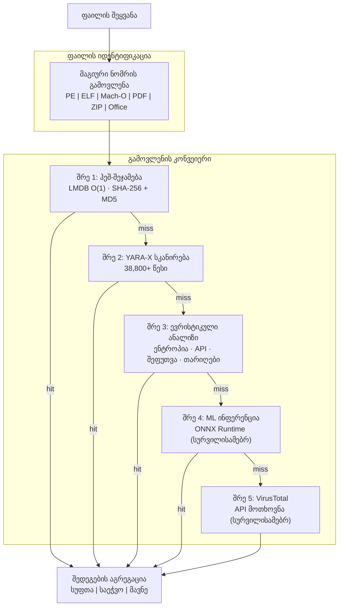

# PRX-SD

**PRX-SD** არის მაღალი წარმადობის, ღია კოდის ანტივირუსული ძრავა, დაწერილი Rust-ზე. ის აერთიანებს ჰეშ-ზე დაფუძნებულ სიგნატურების შეჯამებას, 38,800+ YARA წესს, ფაილის ტიპის მიხედვით ევრისტიკულ ანალიზს და სურვილისამებრ ML ინფერენციას ერთ მრავალ შრეიანი გამოვლენის კონვეიერში. PRX-SD მოყვება ბრძანებათა სტრიქონის ხელსაწყოს (`sd`), სისტემური დემონის სახით რეალურ დროში დასაცავად და Tauri + Vue 3 სამაგიდო GUI-ს.

PRX-SD შექმნილია უსაფრთხოების ინჟინრებისთვის, სისტემის ადმინისტრატორებისთვის და ინციდენტებზე მპასუხე სპეციალისტებისთვის, ვისაც სჭირდება სწრაფი, გამჭვირვალე და გაფართოებადი მავნე პროგრამების გამოვლენის ძრავა -- ისეთი, რომელსაც შეუძლია მილიონობით ფაილის სკანირება, დირექტორიების რეალურ დროში მონიტორინგი, rootkit-ების გამოვლენა და გარე საფრთხეთა ინტელექტის წყაროებთან ინტეგრაცია -- ყოველივე ეს გაუმჭვირვალე კომერციულ "შავ ყუთებზე" დაყრდნობის გარეშე.

## რატომ PRX-SD?

ტრადიციული ანტივირუსული პროდუქტები დახურული კოდის, რესურს-ინტენსიური და კონფიგურირების ძნელია. PRX-SD სხვა მიდგომას იყენებს:

- **ღია და შემოწმებადი.** ყველა გამოვლენის წესი, ევრისტიკული შემოწმება და ქულათა ბარიერი ხილულია საწყის კოდში. ფარული თელემეტრია არ არის, ღრუბლოვანი დამოკიდებულება სავალდებულო არ არის.
- **მრავალ შრეიანი დაცვა.** ხუთი დამოუკიდებელი გამოვლენის შრე უზრუნველყოფს, რომ თუ ერთი მეთოდი საფრთხეს გამოტოვებს, შემდეგი მას გამოავლენს.
- **Rust-ზე ორიენტირებული წარმადობა.** ნულოვანი კოპირების I/O, LMDB O(1) ჰეშ-ძებნა და პარალელური სკანირება საშუალო აპარატურაზე კომერციულ ძრავებთან შედარებადი გამტარუნარიანობის მიღწევის საშუალებას იძლევა.
- **გაფართოება დიზაინით.** WASM დანამატები, მომხმარებლის YARA წესები და მოდულური არქიტექტურა PRX-SD-ს სპეციალიზებულ გარემოებთან ადაპტირებას ამარტივებს.

## ძირითადი ფუნქციები

<div class="vp-features">

- **მრავალ შრეიანი გამოვლენის კონვეიერი** -- ჰეშ-შეჯამება, YARA-X წესები, ევრისტიკული ანალიზი, სურვილისამებრ ML ინფერენცია და სურვილისამებრ VirusTotal ინტეგრაცია თანმიმდევრობით მუშაობს გამოვლენის კოეფიციენტების მაქსიმიზებისთვის.

- **რეალურ დროში დაცვა** -- `sd monitor` დემონი დირექტორიებს inotify-ის (Linux) / FSEvents-ის (macOS) გამოყენებით აკვირდება და ახალ ან შეცვლილ ფაილებს მყისიერად ასკანირებს.

- **გამოსასყიდი პროგრამებისგან დაცვა** -- დედიკირებული YARA წესები და ევრისტიკა გამოსასყიდი პროგრამების ოჯახებს, მათ შორის WannaCry, LockBit, Conti, REvil, BlackCat და სხვებს, გამოავლენს.

- **38,800+ YARA წესი** -- 8 საზოგადოებრივი და კომერციული კლასის წყაროდან შეგროვილია: Yara-Rules, Neo23x0 signature-base, ReversingLabs, ESET IOC, InQuest და 64 ჩაშენებული წესი.

- **LMDB ჰეშ-მონაცემთა ბაზა** -- SHA-256 და MD5 ჰეში abuse.ch MalwareBazaar-იდან, URLhaus-იდან, Feodo Tracker-იდან, ThreatFox-იდან, VirusShare-იდან (20M+) და ჩაშენებული blocklist-იდან LMDB-ში ინახება O(1) ძებნისთვის.

- **ჯვარ-პლატფორმული** -- Linux (x86_64, aarch64), macOS (Apple Silicon, Intel) და Windows (WSL2). PE, ELF, Mach-O, PDF, Office და არქივის ფორმატების ნატიური ფაილის ტიპის გამოვლენა.

- **WASM დანამატების სისტემა** -- გაფართოებული გამოვლენის ლოგიკა, მომხმარებლის სკანერების დამატება ან საკუთრებრივ საფრთხეთა წყაროებთან ინტეგრაცია WebAssembly დანამატების საშუალებით.

</div>

## არქიტექტურა



## სწრაფი ინსტალაცია

```bash
curl -fsSL https://raw.githubusercontent.com/openprx/prx-sd/main/install.sh | bash
```

ან Cargo-ს საშუალებით ინსტალაცია:

```bash
cargo install prx-sd
```

შემდეგ სიგნატურების მონაცემთა ბაზის განახლება:

```bash
sd update
```

ინსტალაციის ყველა მეთოდის, Docker-ისა და საწყისი კოდიდან აწყობის ჩათვლით, იხილეთ [ინსტალაციის სახელმძღვანელო](./getting-started/installation).

## დოკუმენტაციის განყოფილებები

| განყოფილება | აღწერა |
|---------|-------------|
| [ინსტალაცია](./getting-started/installation) | PRX-SD-ის ინსტალაცია Linux-ზე, macOS-ზე ან Windows WSL2-ზე |
| [სწრაფი დაწყება](./getting-started/quickstart) | PRX-SD-ის სკანირება 5 წუთში |
| [ფაილებისა და დირექტორიების სკანირება](./scanning/file-scan) | `sd scan` ბრძანების სრული ცნობარი |
| [მეხსიერების სკანირება](./scanning/memory-scan) | გაშვებული პროცესების მეხსიერების სკანირება საფრთხეებისთვის |
| [Rootkit-ის გამოვლენა](./scanning/rootkit) | ბირთვული და user-space rootkit-ების გამოვლენა |
| [USB სკანირება](./scanning/usb-scan) | მოხსნადი მედიის ავტომატური სკანირება |
| [გამოვლენის ძრავა](./detection/) | მრავალ შრეიანი კონვეიერის მუშაობის პრინციპი |
| [ჰეშ-შეჯამება](./detection/hash-matching) | LMDB ჰეშ-მონაცემთა ბაზა და მონაცემთა წყაროები |
| [YARA წესები](./detection/yara-rules) | 38,800+ წესი 8 წყაროდან |
| [ევრისტიკული ანალიზი](./detection/heuristics) | ფაილის ტიპის მიხედვით ქცევის ანალიზი |
| [მხარდაჭერილი ფაილის ტიპები](./detection/file-types) | ფაილის ფორმატის მატრიცა და მაგიური გამოვლენა |

## პროექტის ინფორმაცია

- **ლიცენზია:** MIT OR Apache-2.0
- **ენა:** Rust (2024 edition)
- **რეპოზიტორი:** [github.com/openprx/prx-sd](https://github.com/openprx/prx-sd)
- **მინიმალური Rust:** 1.85.0
- **GUI:** Tauri 2 + Vue 3
