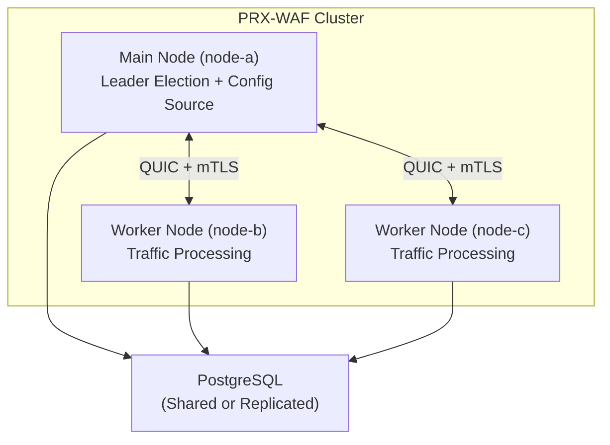

# Cluster-ის რეჟიმი

PRX-WAF ჰორიზონტალური გაშლისა და მაღალ-ხელმისაწვდომობისთვის მრავალ-კვანძი cluster-ის განასახებებს მხარს უჭერს. Cluster-ის რეჟიმი QUIC-ზე დაფუძნებულ კვანძ-კვანძ კომუნიკაციას, Raft-შთაგონებულ leader election-ს და ყველა კვანძზე წესების, კონფიგურაციის და უსაფრთხოების მოვლენების ავტომატურ სინქრონიზებას იყენებს.

::: info
Cluster-ის რეჟიმი სრულად opt-in-ია. ნაგულისხმევად PRX-WAF standalone რეჟიმში მუშაობს ნულოვანი cluster overhead-ით. კონფიგურაციაში `[cluster]` სექციის დამატებით ჩარ?თვა.
:::

## არქიტექტურა

PRX-WAF cluster ერთი **main** კვანძისა და ერთი ან მეტი **worker** კვანძისგან შედგება:



### კვანძ-როლები

| როლი | აღწერა |
|------|-------------|
| `main` | ავტორიტეტულ კონფიგურაციასა და წეს-ნაკრებს ინახავს. განახლებებს worker-ებს უგზავნის. Leader election-ში მონაწილეობს. |
| `worker` | ტრაფიკს ამუშავებს და WAF-ის პაიფლაინს იყენებს. main კვანძიდან კონფიგ-ისა და წეს-განახლებებს იღებს. უსაფრთხოების მოვლენებს main-ს უბრუნებს. |
| `auto` | Raft-შთაგონებულ leader election-ში მონაწილეობს. ნებისმიერი კვანძი შეიძლება main გახდეს. |

## რა სინქრონიზდება

| მონაცემი | მიმართულება | ინტერვალი |
|------|-----------|----------|
| წესები | Main-დან Worker-ებზე | ყოველ 10 წამში (კონფიგურირებადი) |
| კონფიგურაცია | Main-დან Worker-ებზე | ყოველ 30 წამში (კონფიგურირებადი) |
| უსაფრთხოების მოვლენები | Worker-ებიდან Main-ზე | ყოველ 5 წამში ან 100 მოვლენაში (რომელიც ადრე) |
| სტატისტიკა | Worker-ებიდან Main-ზე | ყოველ 10 წამში |

## კვანძ-კვანძ კომუნიკაცია

ყველა cluster კომუნიკაცია UDP-ის გავლით mutual TLS-ით (mTLS) QUIC-ს (Quinn-ის გავლით) იყენებს:

- **პორტი:** `16851` (ნაგულისხმევი)
- **დაშიფვრა:** ავტო-გენერირებული ან წინასწარ-გამზადებული სერთიფიკატებიანი mTLS
- **პროტოკოლი:** მომხმარებლის ბინარ-პროტოკოლი QUIC სტრიმებზე
- **კავშირი:** ავტო-ხელახლა-კავშირიანი მუდმივი

## Leader Election

`role = "auto"`-ის კონფიგურაციისას კვანძები Raft-შთაგონებულ election პროტოკოლს იყენებს:

| პარამეტრი | ნაგულისხმევი | აღწერა |
|-----------|---------|-------------|
| `timeout_min_ms` | `150` | მინიმალური election timeout (შემთხვევითი დიაპაზონი) |
| `timeout_max_ms` | `300` | მაქსიმალური election timeout (შემთხვევითი დიაპაზონი) |
| `heartbeat_interval_ms` | `50` | Main-დან worker-ზე heartbeat ინტერვალი |
| `phi_suspect` | `8.0` | Phi accrual failure detector-ის საეჭვო ბარიერი |
| `phi_dead` | `12.0` | Phi accrual failure detector-ის მკვდარი ბარიერი |

main კვანძის მიუწვდომლობისას worker-ები election-ის ინიციებამდე კონფიგურირებულ დიაპაზონში შემთხვევით timeout-ს ელოდება. ხმების უმრავლესობის პირველი მიმღები კვანძი ახალ main-ად ხდება.

## Health მონიტორინგი

Cluster-ის health შემოწმება ყოველ კვანძზე სრულდება და peer-კავშირს აკვირდება:

```toml
[cluster.health]
check_interval_secs   = 5    # Health check frequency
max_missed_heartbeats = 3    # Mark peer as unhealthy after N misses
```

არაჯანსაღი კვანძები cluster-იდან გამოირიცხება სიჯანსაღის აღდგენამდე და ხელახლა-სინქრონიზებამდე.

## სერთიფიკატ-მართვა

Cluster-ის კვანძები mTLS სერთიფიკატებით ამოიცნობენ ერთმანეთს:

- **ავტო-გენერირების რეჟიმი:** main კვანძი CA სერთიფიკატს გენერირებს და კვანძ-სერთიფიკატებს ავტომატურად პირველი სტარტისას ხელს მოაწერებს. Worker კვანძები სერთიფიკატებს join-ის პროცესში იღებს.
- **წინასწარ-გამზადებული რეჟიმი:** სერთიფიკატები ოფლაინ-რეჟიმში გენერირდება და სტარტამდე ყოველ კვანძზე ნაწილდება.

```toml
[cluster.crypto]
ca_cert        = "/certs/cluster-ca.pem"
node_cert      = "/certs/node-a.pem"
node_key       = "/certs/node-a.key"
auto_generate  = true
ca_validity_days    = 3650   # 10 years
node_validity_days  = 365    # 1 year
renewal_before_days = 7      # Auto-renew 7 days before expiry
```

## შემდეგი ნაბიჯები

- [Cluster-ის განასახება](./deployment) -- მრავალ-კვანძი გამართვის ნაბიჯ-ნაბიჯ სახელმძღვანელო
- [კონფიგურაციის ცნობარი](../configuration/reference) -- ყველა cluster კონფ-გასაღები
- [პრობლემების მოგვარება](../troubleshooting/) -- გავრცელებული cluster-ის პრობლემები
