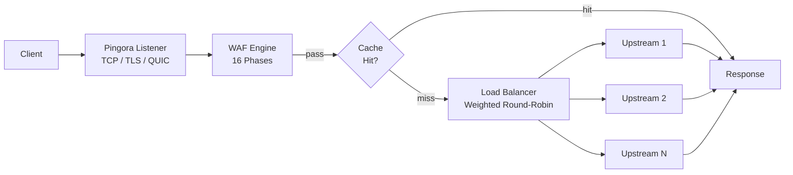

# Gateway

PRX-WAF [Pingora](https://github.com/cloudflare/pingora)-ზეა შემუშავებული, Cloudflare-ის Rust HTTP proxy ბიბლიოთეკაზე. Gateway ყველა შემოსულ ტრაფიკს ამუშავებს, მოთხოვნებს upstream backend-ებზე გადამისამართებს და გადამისამართებამდე WAF-ის გამოვლენის პაიფლაინს გამოიყენებს.

## პროტოკოლ-მხარდაჭერა

| პროტოკოლი | სტატუსი | შენიშვნები |
|----------|--------|-------|
| HTTP/1.1 | მხარდაჭერილი | ნაგულისხმევი |
| HTTP/2 | მხარდაჭერილი | ავტომატური ALPN upgrade |
| HTTP/3 (QUIC) | სურვილისამებრ | Quinn ბიბლიოთეკის გავლით, `[http3]` კონფიგ საჭიროა |
| WebSocket | მხარდაჭერილი | სრული duplex proxy |

## ძირითადი ფუნქციები

### დატვირთვის განაწილება

PRX-WAF ტრაფიკს upstream backend-ებზე წონიანი round-robin-ის დატვირთვ-განაწილებით ანაწილებს. ყოველ ჰოსტ-ჩანაწერს შეიძლება ჰქონდეს მრავალი upstream სერვერი შეფარდებითი წონებით:

```toml
[[hosts]]
host        = "example.com"
port        = 80
remote_host = "10.0.0.1"
remote_port = 8080
guard_status = true
```

ჰოსტების ადმინ UI-ის ან REST API-ის `/api/hosts`-ის გავლით მართვაც შეიძლება.

### პასუხ-ქეშირება

Gateway moka-ზე დაფუძნებულ LRU in-memory ქეშს შეიცავს upstream სერვერებზე დატვირთვის შესამცირებლად:

```toml
[cache]
enabled          = true
max_size_mb      = 256       # Maximum cache size
default_ttl_secs = 60        # Default TTL for cached responses
max_ttl_secs     = 3600      # Maximum TTL cap
```

ქეში სტანდარტული HTTP ქეშ-header-ებს (`Cache-Control`, `Expires`, `ETag`, `Last-Modified`) პატივს სცემს და ადმინ API-ის გავლით ქეშ-ინვალიდაციას მხარს უჭერს.

### Reverse Tunnels

PRX-WAF-ს შეუძლია WebSocket-ზე დაფუძნებული reverse tunnels შექმნას (Cloudflare Tunnels-ის მსგავსი) შიდა სერვისების გამავალ firewall-პორტების გახსნის გარეშე გასავლელად:

```bash
# List active tunnels
curl -H "Authorization: Bearer $TOKEN" http://localhost:9527/api/tunnels

# Create a tunnel
curl -X POST -H "Authorization: Bearer $TOKEN" \
  -H "Content-Type: application/json" \
  -d '{"name":"internal-api","target":"http://192.168.1.10:3000"}' \
  http://localhost:9527/api/tunnels
```

### ანტი-Hotlinking

Gateway ჰოსტ-მიხედვით Referer-ზე დაფუძნებულ hotlink-დაცვას მხარს უჭერს. ჩართვისას კონფიგურირებული დომენის სწორი Referer header-ის გარეშე მოთხოვნები ბლოკდება. ეს ადმინ UI-ის ან API-ის გავლით ჰოსტ-მიხედვით კონფიგურირდება.

## არქიტექტურა



## შემდეგი ნაბიჯები

- [Reverse Proxy](./reverse-proxy) -- backend-ის მარშრუტიზებისა და დატვირთვ-განაწილების დეტალური კონფიგურაცია
- [SSL/TLS](./ssl-tls) -- HTTPS, Let's Encrypt და HTTP/3-ის გამართვა
- [კონფიგურაციის ცნობარი](../configuration/reference) -- ყველა gateway კონფიგ-გასაღები
