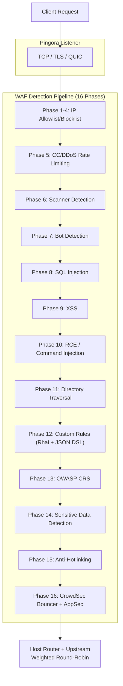

# PRX-WAF

**PRX-WAF** არის წარმოება-მზად Web Application Firewall proxy, შემუშავებული [Pingora](https://github.com/cloudflare/pingora)-ზე (Cloudflare-ის Rust HTTP proxy ბიბლიოთეკა). იგი ერთ განასახებად ბინარაში გამოუდის 16-ფაზიან შეტევა-გამოვლენის პაიფლაინს, Rhai სკრიპტინგის ძრავას, OWASP CRS მხარდაჭერას, ModSecurity წესების იმპორტს, CrowdSec ინტეგრაციას, WASM plugin-ებს და Vue 3 ადმინ UI-ს.

PRX-WAF შემუშავებულია DevOps ინჟინრებისთვის, უსაფრთხოების გუნდებისა და პლატფორმის ოპერატორებისთვის, ვისაც სჭირდება სწრაფი, გამჭვირვალე და გაფართოებადი WAF -- ისეთი, რომელიც მილიონობით მოთხოვნის proxy-ს გახდება, OWASP Top 10 შეტევებს ამოიცნობს, TLS სერთიფიკატებს ავტომატურად განაახლებს, cluster-ის რეჟიმით ჰორიზონტალურად გაშლის და გარე საფრთხის ინტელექტის feed-ებთან ინტეგრირდება -- ყოველივე ეს საკუთრებრივ cloud WAF სერვისებზე დამოუკიდებლად.

## რატომ PRX-WAF?

ტრადიციული WAF პროდუქტები საკუთრებრივი, ძვირი და მოსარგებად რთულია. PRX-WAF განსხვავებულ მიდგომას იღებს:

- **ღია და შემოწმებადი.** ყოველი გამოვლენის წესი, ბარიერი და სქოლის მექანიზმი საწყის კოდში ჩანს. დამალული მონაცემ-შეგროვება არ არის, გამყიდველ-ჩაკეტვა არ არის.
- **მრავალ-ფაზიანი დაცვა.** 16 თანმიმდევრული გამოვლენის ფაზა უზრუნველყოფს, რომ ერთი შემოწმება შეტევას გამოტოვებს, შემდეგი ფაზები მას გამოვლენს.
- **Rust-პირველი შესრულება.** Pingora-ზე შემუშავებული PRX-WAF საქონელ-ტექნიკაზე მინიმალური latency overhead-ით ახლო-ხაზური throughput-ს აღწევს.
- **დიზაინით გაფართოებადი.** YAML წესები, Rhai სკრიპტები, WASM plugin-ები და ModSecurity წესების იმპორტი PRX-WAF-ს ნებისმიერ პროგრამულ სტეკზე ადაპტირებას ამარტივებს.

## ძირითადი ფუნქციები

<div class="vp-features">

- **Pingora Reverse Proxy** -- HTTP/1.1, HTTP/2 და HTTP/3 QUIC-ის (Quinn) გავლით. დატვირთვის განაწილება upstream backend-ებზე წონიანი round-robin-ით.

- **16-ფაზიანი გამოვლენის პაიფლაინი** -- IP allowlist/blocklist, CC/DDoS rate limiting, სკანერ-გამოვლენა, ბოტ-გამოვლენა, SQLi, XSS, RCE, დირექტორია-გადაკვეთა, მომხმარებლის წესები, OWASP CRS, სენსიტიური მონაცემ-გამოვლენა, ანტი-hotlinking და CrowdSec ინტეგრაცია.

- **YAML წესების ძრავა** -- დეკლარაციული YAML წესები 11 ოპერატორით, 12 მოთხოვნის ველით, paranoia დონეებით 1-4 და hot-reload downtime-ის გარეშე.

- **OWASP CRS მხარდაჭერა** -- 310+ წესი, OWASP ModSecurity Core Rule Set v4-დან გადაყვანილი, SQLi, XSS, RCE, LFI, RFI, სკანერ-გამოვლენასა და მეტს მოიცავს.

- **CrowdSec ინტეგრაცია** -- Bouncer რეჟიმი (LAPI-ის გადაწყვეტილებ-ქეში), AppSec რეჟიმი (დისტანციური HTTP ინსპექტირება) და log pusher საზოგადოებრივი საფრთხის ინტელექტისთვის.

- **Cluster-ის რეჟიმი** -- QUIC-ზე დაფუძნებული კვანძ-კვანძ კომუნიკაცია, Raft-შთაგონებული leader election, წესების/კონფიგ/მოვლენის ავტომატური სინქრონიზება და mTLS სერთიფიკატ-მართვა.

- **Vue 3 ადმინ UI** -- JWT + TOTP ავთენტიფიკაცია, WebSocket-ის რეალურ დროში მონიტორინგი, ჰოსტ-მართვა, წეს-მართვა და უსაფრთხოების მოვლენების dashboard-ები.

- **SSL/TLS ავტომატიზაცია** -- Let's Encrypt ACME v2-ის (instant-acme) გავლით, ავტომატური სერთიფიკატ-განახლება და HTTP/3 QUIC მხარდაჭერა.

</div>

## არქიტექტურა

PRX-WAF 7-crate Cargo workspace-ად არის ორგანიზებული:

| Crate | როლი |
|-------|------|
| `prx-waf` | ბინარა: CLI შესასვლელი წერტილი, სერვერ-bootstrap |
| `gateway` | Pingora proxy, HTTP/3, SSL ავტომატიზაცია, ქეშირება, tunnels |
| `waf-engine` | გამოვლენის პაიფლაინი, წეს-ძრავა, შემოწმებები, plugin-ები, CrowdSec |
| `waf-storage` | PostgreSQL ფენა (sqlx), მიგრაციები, მოდელები |
| `waf-api` | Axum REST API, JWT/TOTP auth, WebSocket, სტატიკური UI |
| `waf-common` | გაზიარებული ტიპები: RequestCtx, WafDecision, HostConfig, config |
| `waf-cluster` | Cluster კონსენსუსი, QUIC ტრანსპორტი, წეს-სინქრი, სერთიფიკატ-მართვა |

### მოთხოვნის ნაკადი



## სწრაფი ინსტალაცია

```bash
git clone https://github.com/openprx/prx-waf
cd prx-waf
docker compose up -d
```

ადმინ UI: `http://localhost:9527` (ნაგულისხმევი სერთიფიკატები: `admin` / `admin`)

ყველა მეთოდის, Cargo-ის ინსტალაციისა და წყაროდან აშენების ჩათვლით, სანახავად [ინსტალაციის სახელმძღვანელოს](./getting-started/installation) შეხედე.

## დოკუმენტაციის სექციები

| სექცია | აღწერა |
|---------|-------------|
| [ინსტალაცია](./getting-started/installation) | PRX-WAF-ის ინსტალაცია Docker-ის, Cargo-ის ან წყაროს აშენების გავლით |
| [სწრაფი დაწყება](./getting-started/quickstart) | PRX-WAF-ის თქვენი პროგრამის დასაცავად 5 წუთში გაშვება |
| [წეს-ძრავა](./rules/) | YAML წეს-ძრავის მუშაობა |
| [YAML სინტაქსი](./rules/yaml-syntax) | YAML წეს-სქემის სრული ცნობარი |
| [ჩაშენებული წესები](./rules/builtin-rules) | OWASP CRS, ModSecurity, CVE პაჩები |
| [მომხმარებლის წესები](./rules/custom-rules) | საკუთარი გამოვლენის წესების დაწერა |
| [Gateway](./gateway/) | Pingora reverse proxy მიმოხილვა |
| [Reverse Proxy](./gateway/reverse-proxy) | Backend-ის მარშრუტიზება და დატვირთვის განაწილება |
| [SSL/TLS](./gateway/ssl-tls) | HTTPS, Let's Encrypt, HTTP/3 |
| [Cluster-ის რეჟიმი](./cluster/) | მრავალ-კვანძი განასახება მიმოხილვა |
| [Cluster-ის განასახება](./cluster/deployment) | Cluster-ის ნაბიჯ-ნაბიჯ გაყვანა |
| [ადმინ UI](./admin-ui/) | Vue 3 მართვის dashboard |
| [კონფიგურაცია](./configuration/) | კონფიგურაციის მიმოხილვა |
| [კონფიგურაციის ცნობარი](./configuration/reference) | ყოველი TOML გასაღები დოკუმენტირებული |
| [CLI ცნობარი](./cli/) | ყველა CLI ბრძანება და ქვე-ბრძანება |
| [პრობლემების მოგვარება](./troubleshooting/) | გავრცელებული პრობლემები და გადაჭრები |

## პროექტის ინფო

- **ლიცენზია:** MIT OR Apache-2.0
- **ენა:** Rust (2024 edition)
- **საცავი:** [github.com/openprx/prx-waf](https://github.com/openprx/prx-waf)
- **მინიმალური Rust:** 1.82.0
- **ადმინ UI:** Vue 3 + Tailwind CSS
- **მონაცემთა ბაზა:** PostgreSQL 16+
