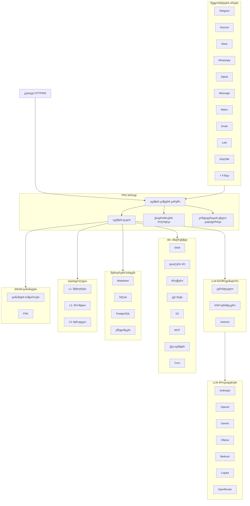

# PRX

**PRX** არის მაღალი წარმადობის, თვითგანვითარებადი AI აგენტის გაშვების გარემო, დაწერილი Rust-ზე. იგი აკავშირებს დიდ ენობრივ მოდელებს 19 შეტყობინებების პლატფორმასთან, უზრუნველყოფს 46-ზე მეტ ჩაშენებულ ინსტრუმენტს, მხარს უჭერს WASM დანამატების გაფართოებებს და ავტონომიურად აუმჯობესებს საკუთარ ქცევას 3-დონიანი თვითევოლუციის სისტემის მეშვეობით.

PRX შექმნილია დეველოპერებისა და გუნდებისთვის, რომლებსაც სჭირდებათ ერთიანი, უნიფიცირებული აგენტი, რომელიც მუშაობს ყველა შეტყობინებების პლატფორმაზე -- Telegram-იდან და Discord-იდან Slack-მდე, WhatsApp-მდე, Signal-მდე, iMessage-მდე, DingTalk-მდე, Lark-მდე და სხვა -- ამასთან ინარჩუნებს წარმოებისთვის მზა უსაფრთხოებას, დაკვირვებადობას და საიმედოობას.

## რატომ PRX?

AI აგენტის ფრეიმვორქების უმეტესობა ფოკუსირებულია ერთ ინტეგრაციის წერტილზე ან მოითხოვს ფართო შემაკავშირებელ კოდს სხვადასხვა სერვისების დასაკავშირებლად. PRX სხვა მიდგომას იყენებს:

- **ერთი ბინარი, ყველა არხი.** ერთი `prx` ბინარი ერთდროულად უკავშირდება ყველა 19 შეტყობინებების პლატფორმას. არანაირი ცალკეული ბოტები, არანაირი მიკროსერვისების გაფანტვა.
- **თვითგანვითარებადი.** PRX ავტონომიურად ხვეწს თავის მეხსიერებას, პრომფთებს და სტრატეგიებს ურთიერთქმედების უკუკავშირის საფუძველზე -- უსაფრთხოების დაბრუნებით ყოველ დონეზე.
- **Rust-ზე ორიენტირებული წარმადობა.** 177 ათასი ხაზი Rust კოდი უზრუნველყოფს დაბალ ლატენტურობას, მინიმალურ მეხსიერების მოცულობას და ნულოვან GC პაუზებს. დემონი კომფორტულად მუშაობს Raspberry Pi-ზეც კი.
- **თავიდანვე გაფართოებადი.** WASM დანამატები, MCP ინსტრუმენტების ინტეგრაცია და ტრეიტებზე დაფუძნებული არქიტექტურა PRX-ის გაფართოებას მარტივს ხდის ფორკინგის გარეშე.

## ძირითადი ფუნქციები

<div class="vp-features">

- **19 შეტყობინებების არხი** -- Telegram, Discord, Slack, WhatsApp, Signal, iMessage, Matrix, Email, Lark, DingTalk, QQ, IRC, Mattermost, Nextcloud Talk, LINQ, CLI და სხვა.

- **9 LLM პროვაიდერი** -- Anthropic Claude, OpenAI, Google Gemini, GitHub Copilot, Ollama, AWS Bedrock, GLM (Zhipu), OpenAI Codex, OpenRouter, ასევე ნებისმიერი OpenAI-თავსებადი ენდფოინთი.

- **46+ ჩაშენებული ინსტრუმენტი** -- Shell შესრულება, ფაილური I/O, ბრაუზერის ავტომატიზაცია, ვებ ძიება, HTTP მოთხოვნები, git ოპერაციები, მეხსიერების მართვა, cron დაგეგმვა, MCP ინტეგრაცია, ქვე-აგენტები და სხვა.

- **3-დონიანი თვითევოლუცია** -- L1 მეხსიერების ევოლუცია, L2 პრომფთის ევოლუცია, L3 სტრატეგიის ევოლუცია -- თითოეულს აქვს უსაფრთხოების საზღვრები და ავტომატური დაბრუნება.

- **WASM დანამატების სისტემა** -- გააფართოვეთ PRX WebAssembly კომპონენტებით 6 დანამატის სამყაროში: tool, middleware, hook, cron, provider და storage. სრული PDK 47 ჰოსტ ფუნქციით.

- **LLM მარშრუტიზატორი** -- ინტელექტუალური მოდელის შერჩევა ევრისტიკული ქულების (შესაძლებლობა, Elo, ღირებულება, ლატენტურობა), KNN სემანტიკური მარშრუტიზაციისა და Automix ნდობაზე დაფუძნებული ესკალაციის მეშვეობით.

- **წარმოებისთვის მზა უსაფრთხოება** -- 4-დონიანი ავტონომიის კონტროლი, პოლიტიკის ძრავა, სენდბოქსის იზოლაცია (Docker/Firejail/Bubblewrap/Landlock), ChaCha20 საიდუმლოებების საცავი, დაწყვილების ავთენტიფიკაცია.

- **დაკვირვებადობა** -- OpenTelemetry ტრეისინგი, Prometheus მეტრიკები, სტრუქტურირებული ლოგირება და ჩაშენებული ვებ კონსოლი.

</div>

## არქიტექტურა



## სწრაფი ინსტალაცია

```bash
curl -fsSL https://openprx.dev/install.sh | bash
```

ან დააინსტალირეთ Cargo-ს მეშვეობით:

```bash
cargo install openprx
```

შემდეგ გაუშვით ონბორდინგის ოსტატი:

```bash
prx onboard
```

იხილეთ [ინსტალაციის სახელმძღვანელო](./getting-started/installation) ყველა მეთოდისთვის, მათ შორის Docker და წყაროდან აგება.

## დოკუმენტაციის სექციები

| სექცია | აღწერა |
|--------|--------|
| [ინსტალაცია](./getting-started/installation) | დააინსტალირეთ PRX Linux-ზე, macOS-ზე ან Windows WSL2-ზე |
| [სწრაფი დაწყება](./getting-started/quickstart) | გაუშვით PRX 5 წუთში |
| [ონბორდინგის ოსტატი](./getting-started/onboarding) | დააკონფიგურირეთ თქვენი LLM პროვაიდერი და საწყისი პარამეტრები |
| [არხები](./channels/) | დაუკავშირდით Telegram-ს, Discord-ს, Slack-ს და კიდევ 16 პლატფორმას |
| [პროვაიდერები](./providers/) | დააკონფიგურირეთ Anthropic, OpenAI, Gemini, Ollama და სხვა |
| [ინსტრუმენტები](./tools/) | 46+ ჩაშენებული ინსტრუმენტი shell-ის, ბრაუზერის, git-ის, მეხსიერებისა და სხვა მიზნებისთვის |
| [თვითევოლუცია](./self-evolution/) | L1/L2/L3 ავტონომიური გაუმჯობესების სისტემა |
| [დანამატები (WASM)](./plugins/) | გააფართოვეთ PRX WebAssembly კომპონენტებით |
| [კონფიგურაცია](./config/) | სრული კონფიგურაციის მითითება და ცხელი გადატვირთვა |
| [უსაფრთხოება](./security/) | პოლიტიკის ძრავა, სენდბოქსი, საიდუმლოებები, საფრთხის მოდელი |
| [CLI მითითება](./cli/) | `prx` ბინარის ბრძანებების სრული მითითება |

## პროექტის ინფორმაცია

- **ლიცენზია:** MIT OR Apache-2.0
- **ენა:** Rust (2024 გამოცემა)
- **რეპოზიტორია:** [github.com/openprx/prx](https://github.com/openprx/prx)
- **მინიმალური Rust:** 1.92.0
