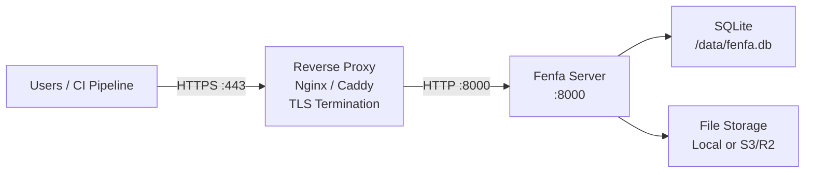

# 프로덕션 배포

이 가이드는 Fenfa를 프로덕션 환경에서 실행하는 데 필요한 모든 것을 다룹니다: TLS가 있는 리버스 프록시, 보안 토큰 설정, 백업 전략, 모니터링.

## 아키텍처



## 리버스 프록시 설정

### Caddy (권장)

Caddy는 Let's Encrypt에서 TLS 인증서를 자동으로 획득하고 갱신합니다:

```
dist.example.com {
    reverse_proxy localhost:8000
}
```

이것으로 충분합니다. Caddy는 HTTPS, HTTP/2, 인증서 관리를 자동으로 처리합니다.

### Nginx

```nginx
server {
    listen 443 ssl http2;
    server_name dist.example.com;

    ssl_certificate /etc/letsencrypt/live/dist.example.com/fullchain.pem;
    ssl_certificate_key /etc/letsencrypt/live/dist.example.com/privkey.pem;

    client_max_body_size 2G;

    location / {
        proxy_pass http://127.0.0.1:8000;
        proxy_set_header Host $host;
        proxy_set_header X-Real-IP $remote_addr;
        proxy_set_header X-Forwarded-For $proxy_add_x_forwarded_for;
        proxy_set_header X-Forwarded-Proto $scheme;

        # Large file uploads
        proxy_request_buffering off;
        proxy_read_timeout 600s;
    }
}

server {
    listen 80;
    server_name dist.example.com;
    return 301 https://$host$request_uri;
}
```

::: warning client_max_body_size
가장 큰 빌드에 맞게 `client_max_body_size`를 충분히 크게 설정하세요. IPA와 APK 파일은 수백 메가바이트가 될 수 있습니다. 위 예제는 최대 2 GB를 허용합니다.
:::

### TLS 인증서 획득

Certbot으로 Nginx 사용:

```bash
sudo certbot --nginx -d dist.example.com
```

Certbot 단독 사용:

```bash
sudo certbot certonly --standalone -d dist.example.com
```

## 보안 체크리스트

### 1. 기본 토큰 변경

보안 랜덤 토큰 생성:

```bash
# Generate a random 32-character token
openssl rand -hex 16
```

환경 변수나 설정으로 설정:

```bash
FENFA_ADMIN_TOKEN=$(openssl rand -hex 16)
FENFA_UPLOAD_TOKEN=$(openssl rand -hex 16)
```

### 2. 로컬호스트에 바인딩

리버스 프록시를 통해서만 Fenfa를 노출합니다:

```yaml
ports:
  - "127.0.0.1:8000:8000"  # Not 0.0.0.0:8000
```

### 3. 기본 도메인 설정

iOS 매니페스트와 콜백을 위한 올바른 공개 도메인 설정:

```bash
FENFA_PRIMARY_DOMAIN=https://dist.example.com
```

::: danger iOS 매니페스트
`primary_domain`이 잘못되면 iOS OTA 설치가 실패합니다. 매니페스트 plist에는 iOS가 IPA 파일을 가져오는 데 사용하는 다운로드 URL이 포함되어 있습니다. 이 URL은 사용자 기기에서 접근 가능해야 합니다.
:::

### 4. 별도의 업로드 토큰

다른 CI/CD 파이프라인이나 팀원에게 다른 업로드 토큰을 발급합니다:

```json
{
  "auth": {
    "upload_tokens": [
      "token-for-ios-pipeline",
      "token-for-android-pipeline",
      "token-for-desktop-pipeline"
    ],
    "admin_tokens": [
      "admin-token-for-ops-team"
    ]
  }
}
```

이를 통해 다른 파이프라인을 방해하지 않고 개별 토큰을 취소할 수 있습니다.

## 백업 전략

### 백업 대상

| 구성 요소 | 경로 | 크기 | 빈도 |
|---------|------|------|------|
| SQLite 데이터베이스 | `/data/fenfa.db` | 소용량 (보통 < 100 MB) | 매일 |
| 업로드된 파일 | `/app/uploads/` | 크게 될 수 있음 | 각 업로드 후 (또는 S3 사용) |
| 설정 파일 | `config.json` | 매우 소용량 | 변경 시 |

### SQLite 백업

```bash
# Copy the database file (safe while Fenfa is running -- SQLite uses WAL mode)
cp /data/fenfa.db /backups/fenfa-$(date +%Y%m%d).db
```

### 자동화된 백업 스크립트

```bash
#!/bin/bash
BACKUP_DIR="/backups/fenfa"
DATE=$(date +%Y%m%d-%H%M)

mkdir -p "$BACKUP_DIR"

# Database
cp /path/to/data/fenfa.db "$BACKUP_DIR/fenfa-$DATE.db"

# Uploads (if using local storage)
tar czf "$BACKUP_DIR/uploads-$DATE.tar.gz" /path/to/uploads/

# Cleanup old backups (keep 30 days)
find "$BACKUP_DIR" -name "*.db" -mtime +30 -delete
find "$BACKUP_DIR" -name "*.tar.gz" -mtime +30 -delete
```

::: tip S3 스토리지
S3 호환 스토리지 (R2, AWS S3, MinIO)를 사용하는 경우 업로드된 파일은 이미 중복 스토리지 백엔드에 있습니다. SQLite 데이터베이스만 로컬 백업이 필요합니다.
:::

## 모니터링

### 헬스 체크

`/healthz` 엔드포인트를 모니터링합니다:

```bash
curl -sf http://localhost:8000/healthz || echo "Fenfa is down"
```

### 가동 시간 모니터링으로

업타임 모니터링 서비스 (UptimeRobot, Hetrix 등)를 다음 주소로 설정합니다:

```
https://dist.example.com/healthz
```

예상 응답: HTTP 200과 함께 `{"ok": true}`.

### 로그 모니터링

Fenfa는 stdout에 로그를 기록합니다. 컨테이너 런타임의 로그 드라이버를 사용하여 집계 시스템으로 로그를 전달합니다:

```yaml
services:
  fenfa:
    logging:
      driver: "json-file"
      options:
        max-size: "10m"
        max-file: "3"
```

## 전체 프로덕션 Docker Compose

```yaml
version: "3.8"

services:
  fenfa:
    image: fenfa/fenfa:latest
    container_name: fenfa
    restart: unless-stopped
    ports:
      - "127.0.0.1:8000:8000"
    environment:
      FENFA_ADMIN_TOKEN: ${FENFA_ADMIN_TOKEN}
      FENFA_UPLOAD_TOKEN: ${FENFA_UPLOAD_TOKEN}
      FENFA_PRIMARY_DOMAIN: https://dist.example.com
    volumes:
      - fenfa-data:/data
      - fenfa-uploads:/app/uploads
    healthcheck:
      test: ["CMD", "wget", "-q", "--spider", "http://localhost:8000/healthz"]
      interval: 30s
      timeout: 5s
      retries: 3
      start_period: 10s
    logging:
      driver: "json-file"
      options:
        max-size: "10m"
        max-file: "3"
    deploy:
      resources:
        limits:
          memory: 512M

volumes:
  fenfa-data:
  fenfa-uploads:
```

## 다음 단계

- [Docker 배포](./docker) -- Docker 기본 사항 및 설정
- [설정 레퍼런스](../configuration/) -- 모든 설정
- [문제 해결](../troubleshooting/) -- 일반적인 프로덕션 문제
