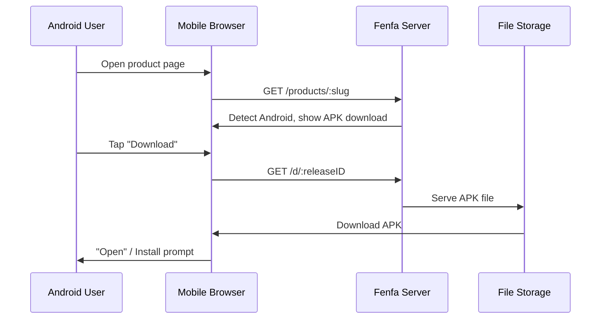

# Android 배포

Fenfa에서 Android 배포는 간단합니다: APK 파일을 업로드하면 사용자가 제품 페이지에서 직접 다운로드합니다. Fenfa는 Android 기기를 자동으로 감지하고 적절한 다운로드 버튼을 표시합니다.

## 작동 방식



iOS와 달리 Android는 설치를 위한 특별한 프로토콜이 필요하지 않습니다. APK 파일은 HTTP(S)를 통해 직접 다운로드되고 사용자는 시스템 패키지 설치 프로그램을 사용하여 설치합니다.

## Android 변형 설정

제품의 Android 변형을 생성합니다:

```bash
curl -X POST http://localhost:8000/admin/api/products/prd_abc123/variants \
  -H "X-Auth-Token: YOUR_ADMIN_TOKEN" \
  -H "Content-Type: application/json" \
  -d '{
    "platform": "android",
    "display_name": "Android",
    "identifier": "com.example.myapp",
    "arch": "universal",
    "installer_type": "apk"
  }'
```

::: tip 아키텍처 변형
아키텍처별로 별도의 APK를 빌드하는 경우 여러 변형을 생성합니다:
- `Android ARM64` (arch: `arm64-v8a`)
- `Android ARM` (arch: `armeabi-v7a`)
- `Android x86_64` (arch: `x86_64`)

유니버설 APK 또는 AAB를 배포하는 경우 `universal` 아키텍처의 단일 변형으로 충분합니다.
:::

## APK 파일 업로드

### 표준 업로드

```bash
curl -X POST http://localhost:8000/upload \
  -H "X-Auth-Token: YOUR_UPLOAD_TOKEN" \
  -F "variant_id=var_android" \
  -F "app_file=@app-release.apk" \
  -F "version=2.1.0" \
  -F "build=210" \
  -F "changelog=Added dark mode support"
```

### 스마트 업로드

스마트 업로드는 APK 파일에서 메타데이터를 자동 추출합니다:

```bash
curl -X POST http://localhost:8000/admin/api/smart-upload \
  -H "X-Auth-Token: YOUR_ADMIN_TOKEN" \
  -F "variant_id=var_android" \
  -F "app_file=@app-release.apk"
```

추출된 메타데이터에는 다음이 포함됩니다:
- 패키지 이름 (`com.example.myapp`)
- 버전 이름 (`2.1.0`)
- 버전 코드 (`210`)
- 앱 아이콘
- 최소 SDK 버전

## 사용자 설치

Android 기기에서 사용자가 제품 페이지를 방문하면:

1. 페이지가 Android 플랫폼을 자동 감지합니다.
2. 사용자가 **다운로드** 버튼을 탭합니다.
3. 브라우저가 APK 파일을 다운로드합니다.
4. Android가 사용자에게 APK 설치를 묻습니다.

::: warning 알 수 없는 소스
Fenfa에서 APK를 설치하기 전에 사용자가 기기 설정에서 "알 수 없는 소스에서 설치" (최신 Android 버전에서는 "알 수 없는 앱 설치")를 활성화해야 합니다. 이는 사이드로드된 앱에 대한 표준 Android 요구사항입니다.
:::

## 직접 다운로드 링크

각 릴리스는 모든 HTTP 클라이언트에서 작동하는 직접 다운로드 URL을 가집니다:

```bash
# curl로 다운로드
curl -LO http://localhost:8000/d/rel_xxx

# wget으로 다운로드
wget http://localhost:8000/d/rel_xxx
```

이 URL은 느린 연결에서 재개 가능한 다운로드를 위한 HTTP Range 요청을 지원합니다.

## 다음 단계

- [데스크탑 배포](./desktop) -- macOS, Windows, Linux 배포
- [릴리스 관리](../products/releases) -- APK 릴리스 버전 관리 및 관리
- [업로드 API](../api/upload) -- CI/CD에서 APK 업로드 자동화
