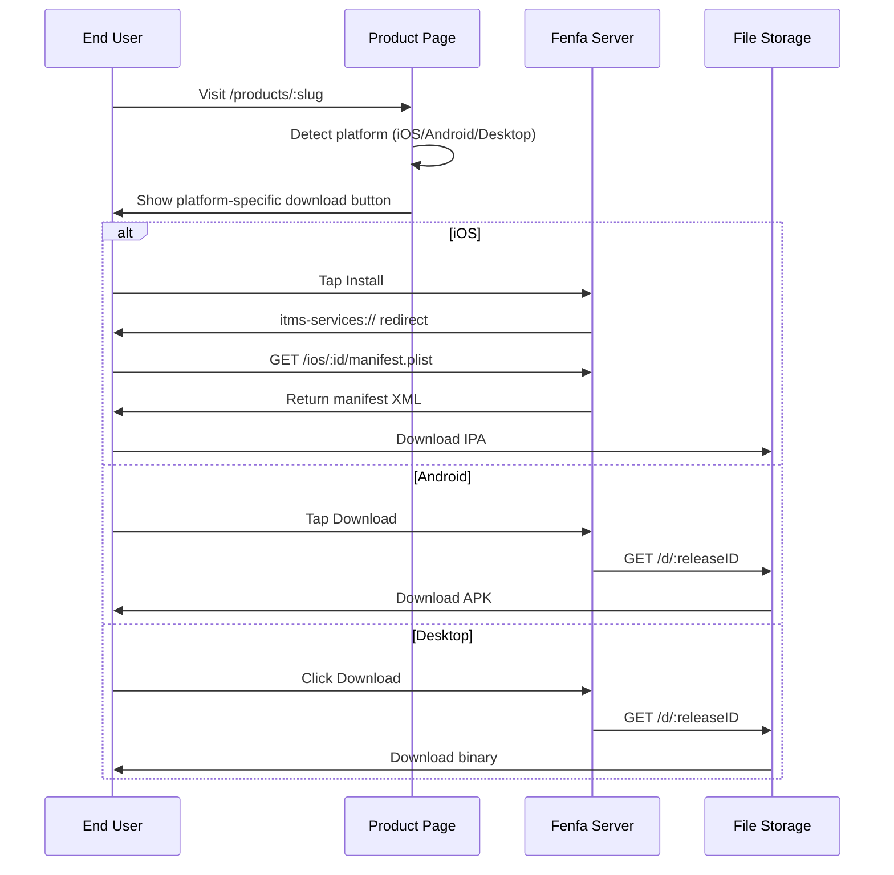

# 배포 개요

Fenfa는 모든 플랫폼에 대해 통합된 배포 경험을 제공합니다. 각 제품은 방문자의 플랫폼을 자동으로 감지하고 적절한 다운로드 버튼을 표시하는 공개 다운로드 페이지를 제공합니다.

## 배포 작동 방식



## 제품 다운로드 페이지

게시된 각 제품은 `/products/:slug`에 공개 페이지를 가집니다. 페이지에는 다음이 포함됩니다:

- 제품 설정의 **앱 아이콘과 이름**
- **플랫폼 감지** -- 페이지는 브라우저의 User-Agent를 사용하여 먼저 올바른 다운로드 버튼을 표시합니다
- **QR 코드** -- 쉬운 모바일 스캔을 위해 자동으로 생성됩니다
- **릴리스 기록** -- 선택된 변형의 모든 릴리스, 최신순
- **변경 로그** -- 인라인으로 표시되는 릴리스별 노트
- **여러 변형** -- 제품이 여러 플랫폼에 대한 변형을 가지는 경우 사용자가 전환할 수 있습니다

## 플랫폼별 배포

| 플랫폼 | 방법 | 세부 사항 |
|--------|------|---------|
| iOS | `itms-services://`를 통한 OTA | 매니페스트 plist + 직접 IPA 다운로드. HTTPS 필요. |
| Android | 직접 APK 다운로드 | 브라우저가 APK를 다운로드합니다. 사용자가 "알 수 없는 소스에서 설치"를 활성화합니다. |
| macOS | 직접 다운로드 | 브라우저를 통해 다운로드되는 DMG, PKG, ZIP 파일. |
| Windows | 직접 다운로드 | 브라우저를 통해 다운로드되는 EXE, MSI, ZIP 파일. |
| Linux | 직접 다운로드 | 브라우저를 통해 다운로드되는 DEB, RPM, AppImage, tar.gz 파일. |

## 직접 다운로드 링크

모든 릴리스는 직접 다운로드 URL을 가집니다:

```
https://your-domain.com/d/:releaseID
```

이 URL은:
- 올바른 `Content-Type`과 `Content-Disposition` 헤더와 함께 바이너리 파일을 반환합니다
- 재개 가능한 다운로드를 위한 HTTP Range 요청을 지원합니다
- 다운로드 카운터를 증가시킵니다
- 모든 HTTP 클라이언트 (curl, wget, 브라우저)에서 작동합니다

## 이벤트 추적

Fenfa는 세 가지 유형의 이벤트를 추적합니다:

| 이벤트 | 트리거 | 추적 데이터 |
|--------|--------|----------|
| `visit` | 사용자가 제품 페이지를 엽니다 | IP, User-Agent, 변형 |
| `click` | 사용자가 다운로드 버튼을 클릭합니다 | IP, User-Agent, 릴리스 ID |
| `download` | 파일이 실제로 다운로드됩니다 | IP, User-Agent, 릴리스 ID |

이벤트는 관리 패널에서 보거나 CSV로 내보낼 수 있습니다:

```bash
curl -o events.csv http://localhost:8000/admin/exports/events.csv \
  -H "X-Auth-Token: YOUR_ADMIN_TOKEN"
```

## HTTPS 요구사항

::: warning iOS는 HTTPS 필요
`itms-services://`를 통한 iOS OTA 설치는 유효한 TLS 인증서로 서버가 HTTPS를 사용해야 합니다. 로컬 테스트를 위해 `ngrok` 또는 `mkcert`와 같은 도구를 사용할 수 있습니다. 프로덕션의 경우 Let's Encrypt가 있는 리버스 프록시를 사용합니다. [프로덕션 배포](../deployment/production)를 참조하세요.
:::

## 플랫폼 가이드

- [iOS 배포](./ios) -- OTA 설치, 매니페스트 생성, UDID 기기 바인딩
- [Android 배포](./android) -- APK 배포 및 설치
- [데스크탑 배포](./desktop) -- macOS, Windows, Linux 배포
