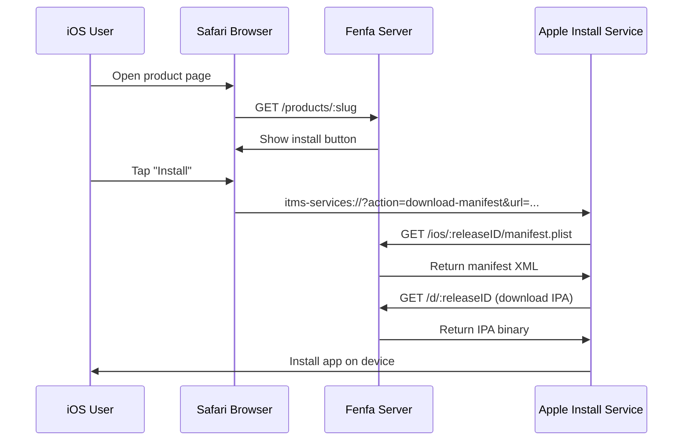
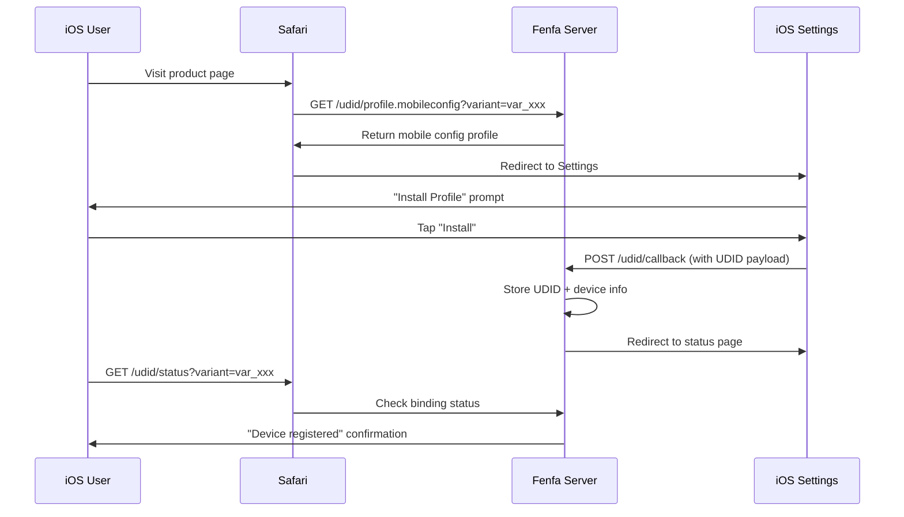

# iOS 배포

Fenfa는 `itms-services://` 매니페스트 생성, 임시 프로비저닝을 위한 UDID 기기 바인딩, 자동 기기 등록을 위한 선택적 Apple Developer API 통합을 포함한 전체 iOS OTA (Over-The-Air) 배포 지원을 제공합니다.

## iOS OTA 작동 방식



iOS는 `itms-services://` 프로토콜을 사용하여 웹 페이지에서 직접 앱을 설치합니다. 사용자가 설치 버튼을 탭하면 Safari는 시스템 설치 프로그램에 넘겨주며:

1. Fenfa에서 매니페스트 plist를 페칭합니다
2. IPA 파일을 다운로드합니다
3. 기기에 앱을 설치합니다

::: warning HTTPS 필요
iOS OTA 설치에는 유효한 TLS 인증서로 HTTPS가 필요합니다. 자체 서명 인증서는 작동하지 않습니다. 로컬 테스트를 위해 `ngrok`을 사용하여 임시 HTTPS 터널을 만듭니다.
:::

## 매니페스트 생성

Fenfa는 각 iOS 릴리스에 대해 `manifest.plist` 파일을 자동으로 생성합니다. 매니페스트는 다음 주소에서 제공됩니다:

```
GET /ios/:releaseID/manifest.plist
```

매니페스트에는 다음이 포함됩니다:
- 번들 식별자 (변형의 식별자 필드에서)
- 번들 버전 (릴리스 버전에서)
- 다운로드 URL (`/d/:releaseID`를 가리킴)
- 앱 제목

`itms-services://` 설치 링크는:

```
itms-services://?action=download-manifest&url=https://your-domain.com/ios/rel_xxx/manifest.plist
```

이 링크는 업로드 API 응답에 자동으로 포함되고 제품 페이지에 표시됩니다.

## UDID 기기 바인딩

임시 배포의 경우 iOS 기기가 앱의 프로비저닝 프로파일에 등록되어야 합니다. Fenfa는 사용자로부터 기기 식별자를 수집하는 UDID 바인딩 흐름을 제공합니다.

### UDID 바인딩 작동 방식



### UDID 엔드포인트

| 엔드포인트 | 방법 | 설명 |
|----------|------|------|
| `/udid/profile.mobileconfig?variant=:variantID` | GET | 모바일 구성 프로파일 다운로드 |
| `/udid/callback` | POST | 프로파일 설치 후 iOS의 콜백 (UDID 포함) |
| `/udid/status?variant=:variantID` | GET | 현재 기기의 바인딩 상태 확인 |

### 보안

UDID 바인딩 흐름은 재생 공격을 방지하기 위해 일회용 논스를 사용합니다:
- 각 프로파일 다운로드는 고유한 논스를 생성합니다
- 논스는 콜백 URL에 포함됩니다
- 한 번 사용되면 논스를 재사용할 수 없습니다
- 논스는 설정 가능한 타임아웃 후에 만료됩니다

## Apple Developer API 통합

Fenfa는 Apple Developer 계정에 기기를 자동으로 등록하여 Apple Developer Portal에서 수동으로 UDID를 추가하는 단계를 제거할 수 있습니다.

### 설정

1. **관리 패널 > 설정 > Apple Developer API**로 이동합니다.
2. App Store Connect API 자격 증명을 입력합니다:

| 필드 | 설명 |
|------|------|
| Key ID | API 키 ID (예: "ABC123DEF4") |
| Issuer ID | 발급자 ID (UUID 형식) |
| Private Key | PEM 형식 개인 키 내용 |
| Team ID | Apple Developer 팀 ID |

::: tip API 키 생성
[Apple Developer Portal](https://developer.apple.com/account/resources/authkeys/list)에서 "기기" 권한으로 API 키를 생성합니다. `.p8` 개인 키 파일을 다운로드합니다 -- 한 번만 다운로드할 수 있습니다.
:::

### 기기 등록

설정 후 관리 패널에서 Apple에 기기를 등록할 수 있습니다:

**단일 기기:**

```bash
curl -X POST http://localhost:8000/admin/api/devices/DEVICE_ID/register-apple \
  -H "X-Auth-Token: YOUR_ADMIN_TOKEN"
```

**일괄 등록:**

```bash
curl -X POST http://localhost:8000/admin/api/devices/register-apple \
  -H "X-Auth-Token: YOUR_ADMIN_TOKEN"
```

### Apple API 상태 확인

```bash
curl http://localhost:8000/admin/api/apple/status \
  -H "X-Auth-Token: YOUR_ADMIN_TOKEN"
```

### Apple 등록된 기기 목록 조회

```bash
curl http://localhost:8000/admin/api/apple/devices \
  -H "X-Auth-Token: YOUR_ADMIN_TOKEN"
```

## 임시 배포 워크플로우

iOS 임시 배포의 전체 워크플로우:

1. **사용자가 기기를 바인딩합니다** -- 제품 페이지를 방문하고, mobileconfig 프로파일을 설치하고, UDID가 캡처됩니다.
2. **관리자가 기기를 등록합니다** -- 관리 패널에서 Apple에 기기를 등록합니다 (또는 일괄 등록 사용).
3. **개발자가 IPA를 재서명합니다** -- 새 기기를 포함하도록 프로비저닝 프로파일을 업데이트하고 IPA를 재서명합니다.
4. **새 빌드를 업로드합니다** -- 재서명된 IPA를 Fenfa에 업로드합니다.
5. **사용자가 설치합니다** -- 이제 사용자가 제품 페이지를 통해 앱을 설치할 수 있습니다.

::: info 엔터프라이즈 배포
Apple Enterprise Developer 계정이 있는 경우 UDID 바인딩을 완전히 건너뛸 수 있습니다. 엔터프라이즈 프로파일은 모든 기기에서 설치를 허용합니다. 변형을 적절히 설정하고 엔터프라이즈 서명된 IPA를 업로드합니다.
:::

## iOS 기기 관리

관리 패널 또는 API를 통해 바인딩된 모든 기기를 봅니다:

```bash
curl http://localhost:8000/admin/api/ios_devices \
  -H "X-Auth-Token: YOUR_ADMIN_TOKEN"
```

기기를 CSV로 내보냅니다:

```bash
curl -o devices.csv http://localhost:8000/admin/exports/ios_devices.csv \
  -H "X-Auth-Token: YOUR_ADMIN_TOKEN"
```

## 다음 단계

- [Android 배포](./android) -- Android APK 배포
- [업로드 API](../api/upload) -- CI/CD에서 iOS 업로드 자동화
- [프로덕션 배포](../deployment/production) -- iOS OTA를 위한 HTTPS 설정
