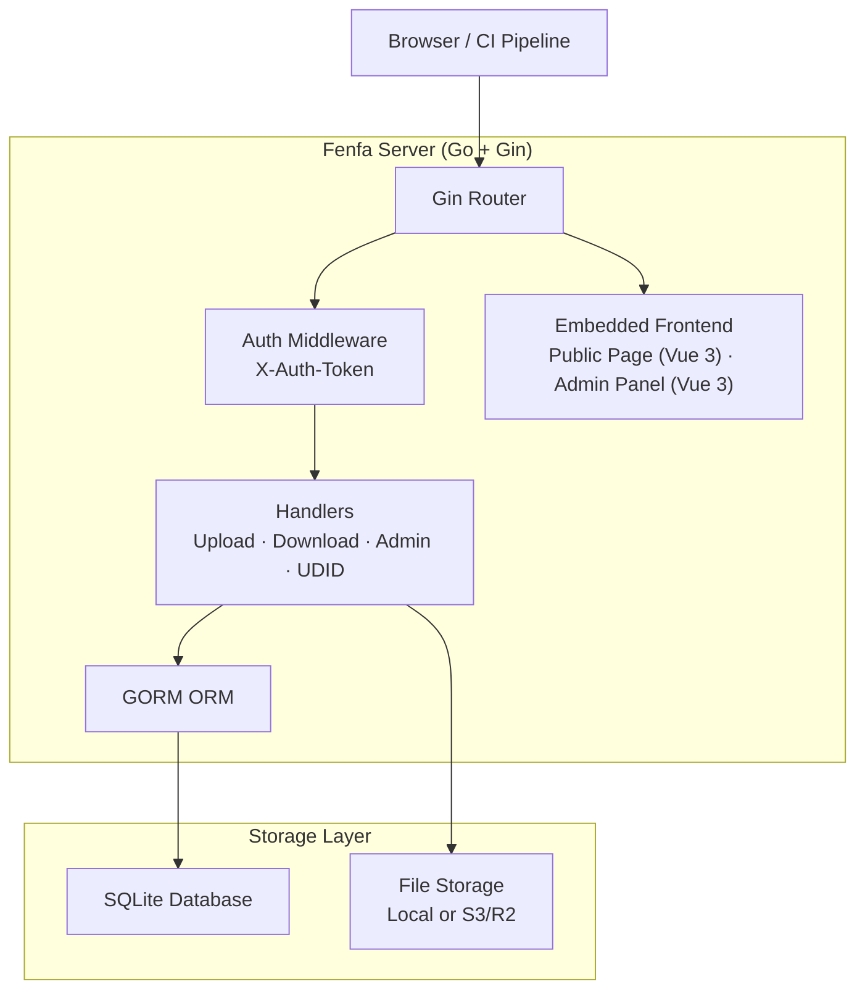
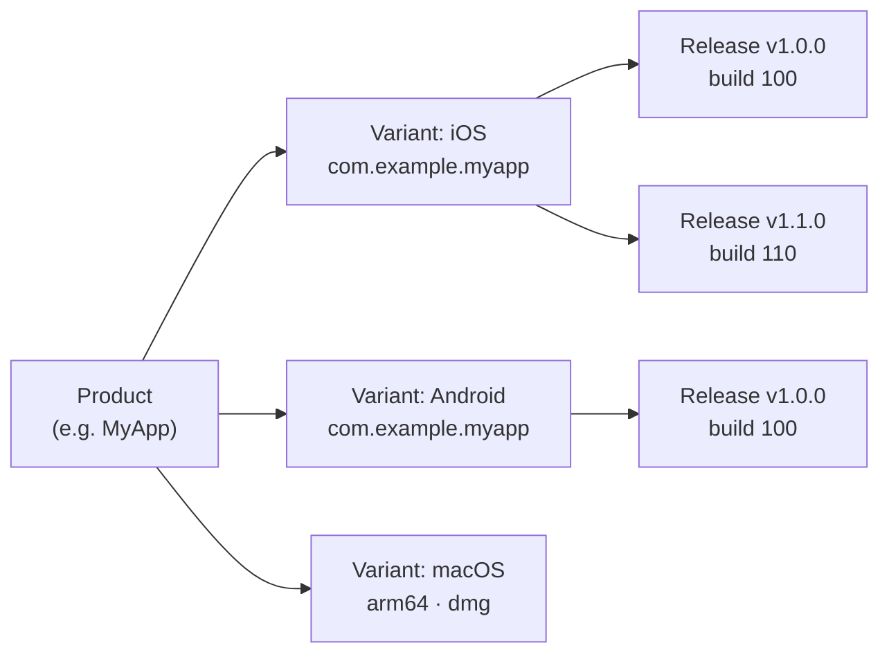

# Fenfa

**Fenfa** (分发, 중국어로 "배포"를 의미)는 iOS, Android, macOS, Windows, Linux를 위한 셀프호스팅 앱 배포 플랫폼입니다. 빌드를 업로드하고, QR 코드가 있는 설치 페이지를 제공하고, 깔끔한 관리 패널을 통해 릴리스를 관리합니다 -- 내장된 프론트엔드와 SQLite 스토리지가 있는 단일 Go 바이너리에서 모두 가능합니다.

Fenfa는 iOS OTA 설치, Android APK 배포, 데스크탑 앱 전달을 공개 앱 스토어나 서드파티 서비스에 의존하지 않고 처리하는 개인적이고 제어 가능한 앱 배포 채널이 필요한 개발 팀, QA 엔지니어, 기업 IT 부서를 위해 설계되었습니다.

## Fenfa를 선택하는 이유

공개 앱 스토어는 검토 지연, 콘텐츠 제한, 개인 정보 보호 문제를 부과합니다. 서드파티 배포 서비스는 다운로드당 요금을 부과하고 데이터를 제어합니다. Fenfa는 완전한 제어권을 제공합니다:

- **셀프호스팅.** 귀하의 빌드, 귀하의 서버, 귀하의 데이터. 벤더 종속 없음, 다운로드당 비용 없음.
- **멀티 플랫폼.** 단일 제품 페이지가 자동 플랫폼 감지로 iOS, Android, macOS, Windows, Linux 빌드를 제공합니다.
- **제로 의존성.** 내장된 SQLite가 있는 단일 Go 바이너리. Redis, PostgreSQL, 메시지 큐 없음.
- **iOS OTA 배포.** `itms-services://` 매니페스트 생성, UDID 기기 바인딩, 임시 프로비저닝을 위한 Apple Developer API 통합을 완전히 지원합니다.

## 주요 기능

<div class="vp-features">

- **스마트 업로드** -- IPA 및 APK 패키지에서 앱 메타데이터 (번들 ID, 버전, 아이콘)를 자동 감지합니다. 파일만 업로드하면 나머지는 Fenfa가 처리합니다.

- **제품 페이지** -- QR 코드, 플랫폼 감지, 릴리스별 변경 로그가 있는 공개 다운로드 페이지. 모든 플랫폼을 위한 단일 URL을 공유합니다.

- **iOS UDID 바인딩** -- 임시 배포를 위한 기기 등록 흐름. 사용자는 안내된 모바일 구성 프로파일을 통해 기기 UDID를 바인딩하고, 관리자는 Apple Developer API를 통해 기기를 자동으로 등록할 수 있습니다.

- **S3/R2 스토리지** -- 확장 가능한 파일 호스팅을 위한 선택적 S3 호환 객체 스토리지 (Cloudflare R2, AWS S3, MinIO). 로컬 스토리지도 즉시 작동합니다.

- **관리 패널** -- 제품, 변형, 릴리스, 기기, 시스템 설정을 관리하는 완전한 Vue 3 관리 패널. 중국어 및 영어 UI를 지원합니다.

- **토큰 인증** -- 업로드 및 관리 토큰 범위를 분리합니다. CI/CD 파이프라인은 업로드 토큰을 사용하고, 관리자는 전체 제어를 위해 관리 토큰을 사용합니다.

- **이벤트 추적** -- 릴리스별 페이지 방문, 다운로드 클릭, 파일 다운로드를 추적합니다. 분석을 위해 이벤트를 CSV로 내보냅니다.

</div>

## 아키텍처



## 데이터 모델



- **제품**: 이름, 슬러그, 아이콘, 설명이 있는 논리적 앱. 단일 제품 페이지가 모든 플랫폼을 제공합니다.
- **변형**: 자체 식별자, 아키텍처, 설치 프로그램 유형이 있는 플랫폼별 빌드 대상 (iOS, Android, macOS, Windows, Linux).
- **릴리스**: 버전, 빌드 번호, 변경 로그, 바이너리 파일이 있는 특정 업로드된 빌드.

## 빠른 설치

```bash
docker run -d --name fenfa -p 8000:8000 fenfa/fenfa:latest
```

`http://localhost:8000/admin`을 방문하고 토큰 `dev-admin-token`으로 로그인합니다.

Docker Compose, 소스 빌드, 프로덕션 설정은 [설치 가이드](./getting-started/installation)를 참조하세요.

## 문서 섹션

| 섹션 | 설명 |
|------|------|
| [설치](./getting-started/installation) | Docker로 Fenfa 설치 또는 소스에서 빌드 |
| [빠른 시작](./getting-started/quickstart) | 5분 안에 Fenfa 실행 및 첫 번째 빌드 업로드 |
| [제품 관리](./products/) | 멀티 플랫폼 제품 생성 및 관리 |
| [플랫폼 변형](./products/variants) | iOS, Android, 데스크탑 변형 설정 |
| [릴리스 관리](./products/releases) | 릴리스 업로드, 버전 관리, 관리 |
| [배포 개요](./distribution/) | Fenfa가 최종 사용자에게 앱을 배포하는 방법 |
| [iOS 배포](./distribution/ios) | iOS OTA 설치, 매니페스트 생성, UDID 바인딩 |
| [Android 배포](./distribution/android) | Android APK 배포 |
| [데스크탑 배포](./distribution/desktop) | macOS, Windows, Linux 배포 |
| [API 개요](./api/) | REST API 레퍼런스 |
| [업로드 API](./api/upload) | API 또는 CI/CD를 통해 빌드 업로드 |
| [관리 API](./api/admin) | 전체 관리 API 레퍼런스 |
| [설정](./configuration/) | 모든 설정 옵션 |
| [Docker 배포](./deployment/docker) | Docker 및 Docker Compose 배포 |
| [프로덕션 배포](./deployment/production) | 리버스 프록시, TLS, 백업, 모니터링 |
| [문제 해결](./troubleshooting/) | 일반적인 문제와 해결책 |

## 프로젝트 정보

- **라이선스:** MIT
- **언어:** Go 1.25+ (백엔드), Vue 3 + Vite (프론트엔드)
- **데이터베이스:** SQLite (GORM을 통해)
- **저장소:** [github.com/openprx/fenfa](https://github.com/openprx/fenfa)
- **조직:** [OpenPRX](https://github.com/openprx)
