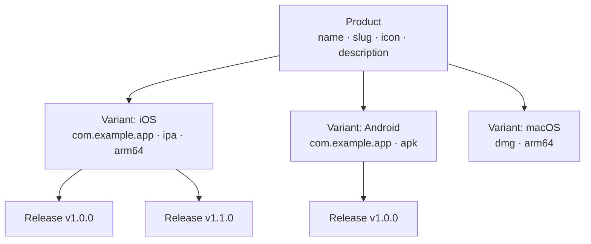

# 제품 관리

제품은 Fenfa의 최상위 조직 단위입니다. 각 제품은 단일 애플리케이션을 나타내며 여러 플랫폼 변형 (iOS, Android, macOS, Windows, Linux)을 포함할 수 있습니다. 제품은 자체 공개 다운로드 페이지, 아이콘, 슬러그 URL을 가집니다.

## 개념



- **제품**: 논리적 애플리케이션. 다운로드 페이지 URL (`/products/:slug`)이 되는 고유한 슬러그를 가집니다.
- **변형**: 제품 아래의 플랫폼별 빌드 대상. [플랫폼 변형](./variants)을 참조하세요.
- **릴리스**: 변형 아래의 특정 업로드된 빌드. [릴리스 관리](./releases)를 참조하세요.

## 제품 생성

### 관리 패널을 통해

1. 사이드바에서 **제품**으로 이동합니다.
2. **제품 생성**을 클릭합니다.
3. 필드를 입력합니다:

| 필드 | 필수 | 설명 |
|------|------|------|
| 이름 | 예 | 표시 이름 (예: "MyApp") |
| 슬러그 | 예 | URL 식별자 (예: "myapp"). 고유해야 합니다. |
| 설명 | 아니오 | 다운로드 페이지에 표시되는 앱에 대한 간략한 설명 |
| 아이콘 | 아니오 | 앱 아이콘 (이미지 파일로 업로드됨) |

4. **저장**을 클릭합니다.

### API를 통해

```bash
curl -X POST http://localhost:8000/admin/api/products \
  -H "X-Auth-Token: YOUR_ADMIN_TOKEN" \
  -H "Content-Type: application/json" \
  -d '{
    "name": "MyApp",
    "slug": "myapp",
    "description": "A cross-platform mobile app"
  }'
```

## 제품 목록 조회

### 관리 패널을 통해

관리 패널의 **제품** 페이지는 모든 제품과 변형 수 및 총 다운로드 수를 표시합니다.

### API를 통해

```bash
curl http://localhost:8000/admin/api/products \
  -H "X-Auth-Token: YOUR_ADMIN_TOKEN"
```

응답:

```json
{
  "ok": true,
  "data": [
    {
      "id": "prd_abc123",
      "name": "MyApp",
      "slug": "myapp",
      "description": "A cross-platform mobile app",
      "published": true,
      "created_at": "2025-01-15T10:30:00Z"
    }
  ]
}
```

## 제품 업데이트

```bash
curl -X PUT http://localhost:8000/admin/api/products/prd_abc123 \
  -H "X-Auth-Token: YOUR_ADMIN_TOKEN" \
  -H "Content-Type: application/json" \
  -d '{
    "name": "MyApp Pro",
    "description": "Updated description"
  }'
```

## 제품 삭제

::: danger 계단식 삭제
제품을 삭제하면 모든 변형, 릴리스, 업로드된 파일이 영구적으로 제거됩니다.
:::

```bash
curl -X DELETE http://localhost:8000/admin/api/products/prd_abc123 \
  -H "X-Auth-Token: YOUR_ADMIN_TOKEN"
```

## 게시 및 게시 취소

제품은 게시하거나 게시를 취소할 수 있습니다. 게시되지 않은 제품은 공개 다운로드 페이지에서 404를 반환합니다.

```bash
# 게시 취소
curl -X PUT http://localhost:8000/admin/api/apps/prd_abc123/unpublish \
  -H "X-Auth-Token: YOUR_ADMIN_TOKEN"

# 게시
curl -X PUT http://localhost:8000/admin/api/apps/prd_abc123/publish \
  -H "X-Auth-Token: YOUR_ADMIN_TOKEN"
```

## 공개 다운로드 페이지

게시된 각 제품은 다음 주소에 공개 다운로드 페이지를 가집니다:

```
https://your-domain.com/products/:slug
```

페이지는 다음을 제공합니다:
- 앱 아이콘, 이름, 설명
- 플랫폼별 다운로드 버튼 (방문자의 기기에 따라 자동 감지)
- 모바일 스캔용 QR 코드
- 버전 번호와 변경 로그가 있는 릴리스 기록
- OTA 설치를 위한 iOS `itms-services://` 링크

## ID 형식

제품 ID는 접두사 `prd_` 다음에 임의 문자열이 사용됩니다 (예: `prd_abc123`). ID는 자동으로 생성되며 변경할 수 없습니다.

## 다음 단계

- [플랫폼 변형](./variants) -- 제품에 iOS, Android, 데스크탑 변형 추가
- [릴리스 관리](./releases) -- 빌드 업로드 및 관리
- [배포 개요](../distribution/) -- 최종 사용자가 앱을 설치하는 방법
