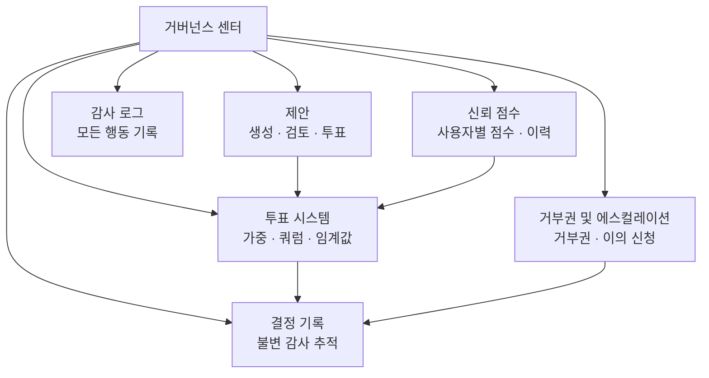

# 거버넌스 센터

거버넌스 센터는 프로젝트 관리에 투명하고 구조화된 의사결정을 가져오는 OpenPR의 핵심 모듈입니다. 제안, 투표, 결정 기록, 신뢰 점수, 거부권 메커니즘, 포괄적인 감사 추적을 제공합니다.

## 거버넌스가 필요한 이유

기존의 프로젝트 관리 도구는 작업 추적에 집중하지만 의사결정을 구조화하지 않습니다. OpenPR의 거버넌스 센터는 다음을 보장합니다:

- **결정이 문서화됩니다.** 모든 제안, 투표, 결정이 완전한 감사 추적과 함께 기록됩니다.
- **프로세스가 투명합니다.** 투표 임계값, 쿼럼 규칙, 신뢰 점수가 모든 멤버에게 표시됩니다.
- **권력이 분산됩니다.** 거부권 메커니즘과 에스컬레이션 경로가 일방적인 결정을 방지합니다.
- **역사가 보존됩니다.** 결정 기록은 무엇이 결정되었는지, 누가, 왜 결정했는지에 대한 불변 로그를 생성합니다.

## 거버넌스 모듈

| 모듈 | 설명 |
|------|------|
| [제안](./proposals) | 제안 생성, 검토, 투표 |
| [투표 및 결정](./voting) | 쿼럼 및 임계값 규칙이 있는 가중 투표 |
| [신뢰 점수](./trust-scores) | 이력이 있는 사용자별 평판 점수 |
| 거부권 및 에스컬레이션 | 에스컬레이션 투표 및 이의 신청이 있는 거부권 |
| 결정 도메인 | 도메인별 결정 분류 |
| 영향 검토 | 지표로 제안 영향 평가 |
| 감사 로그 | 모든 거버넌스 행동의 완전한 기록 |

## API 엔드포인트

| 카테고리 | 기본 경로 | 작업 |
|---------|----------|------|
| 제안 | `/api/proposals/*` | 생성, 투표, 제출, 보관 |
| 거버넌스 | `/api/governance/*` | 설정, 감사 로그 |
| 결정 | `/api/decisions/*` | 결정 기록 |
| 신뢰 점수 | `/api/trust-scores/*` | 점수, 이력, 이의 신청 |
| 거부권 | `/api/veto/*` | 거부권, 에스컬레이션, 투표 |

## MCP 도구

| 도구 | 파라미터 | 설명 |
|------|---------|------|
| `proposals.list` | `project_id` | 선택적 상태 필터와 함께 제안 나열 |
| `proposals.get` | `proposal_id` | 제안 상세 조회 |
| `proposals.create` | `project_id`, `title`, `description` | 거버넌스 제안 생성 |

## 다음 단계

- [제안](./proposals) -- 거버넌스 제안 생성 및 관리
- [투표 및 결정](./voting) -- 투표 규칙 설정 및 결정 보기
- [신뢰 점수](./trust-scores) -- 신뢰 점수 메커니즘 이해
