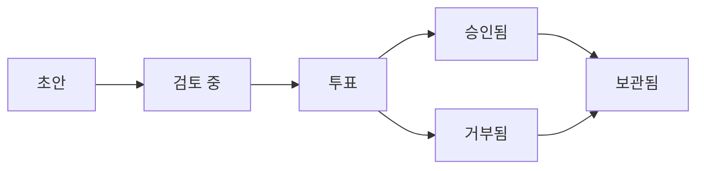

# 제안

제안은 OpenPR에서 거버넌스 결정의 진입점입니다. 제안은 팀 입력이 필요한 변경, 개선 또는 결정을 설명하며, 생성부터 투표를 거쳐 최종 결정까지 구조화된 생명주기를 따릅니다.

## 제안 생명주기



1. **초안** -- 작성자가 제목, 설명, 컨텍스트로 제안을 생성합니다.
2. **검토 중** -- 팀 멤버가 댓글을 통해 논의하고 피드백을 제공합니다.
3. **투표** -- 투표 기간이 열립니다. 멤버가 거버넌스 규칙에 따라 투표합니다.
4. **승인됨/거부됨** -- 투표가 종료됩니다. 결과가 임계값 및 쿼럼에 의해 결정됩니다.
5. **보관됨** -- 결정이 기록되고 제안이 보관됩니다.

## 제안 생성

### 웹 UI를 통해

1. 프로젝트로 이동합니다.
2. **거버넌스** > **제안**으로 이동합니다.
3. **새 제안**을 클릭합니다.
4. 제목, 설명, 연결된 이슈를 입력합니다.
5. **생성**을 클릭합니다.

### API를 통해

```bash
curl -X POST http://localhost:8080/api/proposals \
  -H "Content-Type: application/json" \
  -H "Authorization: Bearer <token>" \
  -d '{
    "project_id": "<project_uuid>",
    "title": "Adopt TypeScript for frontend modules",
    "description": "Proposal to migrate frontend modules from JavaScript to TypeScript for better type safety."
  }'
```

### MCP를 통해

```json
{
  "method": "tools/call",
  "params": {
    "name": "proposals.create",
    "arguments": {
      "project_id": "<project_uuid>",
      "title": "Adopt TypeScript for frontend modules",
      "description": "Proposal to migrate frontend modules from JavaScript to TypeScript."
    }
  }
}
```

## 제안 템플릿

워크스페이스 관리자는 제안 형식을 표준화하기 위한 제안 템플릿을 만들 수 있습니다. 템플릿은 다음을 정의합니다:

- 제목 패턴
- 설명의 필수 섹션
- 기본 투표 파라미터

템플릿은 **워크스페이스 설정** > **거버넌스** > **템플릿**에서 관리됩니다.

## 제안을 이슈에 연결

제안은 `proposal_issue_links` 테이블을 통해 관련 이슈에 연결할 수 있습니다. 이는 양방향 참조를 생성합니다:

- 제안에서 어떤 이슈가 영향을 받는지 볼 수 있습니다.
- 이슈에서 어떤 제안이 참조하는지 볼 수 있습니다.

## 제안 댓글

각 제안은 이슈 댓글과 별도의 고유한 토론 스레드를 가집니다. 제안 댓글은 마크다운 서식을 지원하며 모든 워크스페이스 멤버에게 표시됩니다.

## MCP 도구

| 도구 | 파라미터 | 설명 |
|------|---------|------|
| `proposals.list` | `project_id` | 제안 나열, 선택적 `status` 필터 |
| `proposals.get` | `proposal_id` | 완전한 제안 상세 조회 |
| `proposals.create` | `project_id`, `title`, `description` | 새 제안 생성 |

## 다음 단계

- [투표 및 결정](./voting) -- 투표가 이루어지고 결정이 만들어지는 방법
- [신뢰 점수](./trust-scores) -- 신뢰 점수가 투표 가중치에 영향을 미치는 방법
- [거버넌스 개요](./index) -- 완전한 거버넌스 모듈 레퍼런스
