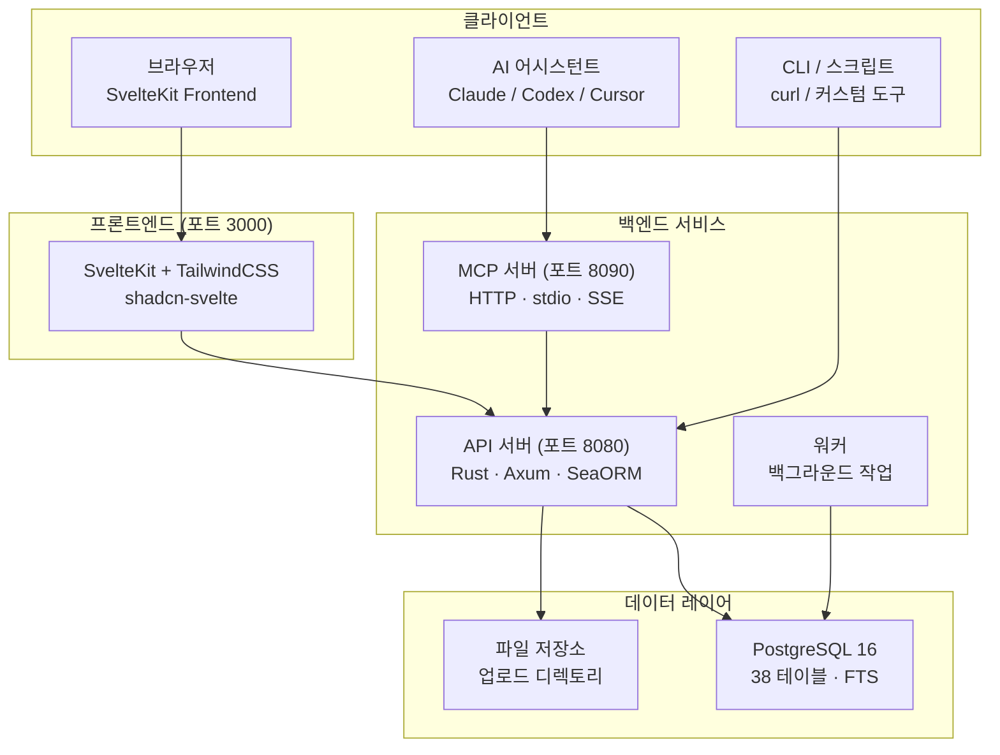

# OpenPR

**OpenPR**은 투명한 거버넌스, AI 지원 워크플로우, 프로젝트 데이터에 대한 완전한 제어가 필요한 팀을 위한 오픈소스 프로젝트 관리 플랫폼입니다. 이슈 추적, 스프린트 계획, 칸반 보드와 완전한 거버넌스 센터 -- 제안, 투표, 신뢰 점수, 거부권 메커니즘 -- 를 단일 자체 호스팅 플랫폼에 통합합니다.

OpenPR은 백엔드에 **Rust**(Axum + SeaORM), 프론트엔드에 **SvelteKit**, 데이터베이스로 **PostgreSQL**을 사용합니다. REST API와 세 가지 전송 프로토콜에 걸쳐 34개의 도구를 갖춘 내장 MCP 서버를 제공하며, Claude, Codex 등 MCP 호환 클라이언트를 위한 최고급 도구 제공자가 됩니다.

## OpenPR을 선택하는 이유

대부분의 프로젝트 관리 도구는 커스터마이징이 제한된 클로즈드 소스 SaaS 플랫폼이거나 거버넌스 기능이 없는 오픈소스 대안입니다. OpenPR은 다른 접근 방식을 취합니다:

- **자체 호스팅 및 감사 가능.** 프로젝트 데이터는 인프라에 남습니다. 모든 기능, 모든 결정 기록, 모든 감사 로그가 제어됩니다.
- **내장 거버넌스.** 제안, 투표, 신뢰 점수, 거부권, 에스컬레이션은 부가적인 기능이 아닌 완전한 API 지원을 갖춘 핵심 모듈입니다.
- **AI 네이티브.** 내장 MCP 서버가 OpenPR을 AI 에이전트를 위한 도구 제공자로 전환합니다. 봇 토큰, AI 작업 할당, 웹훅 콜백이 완전 자동화 워크플로우를 가능하게 합니다.
- **Rust 성능.** 백엔드는 최소한의 리소스 사용으로 수천 개의 동시 요청을 처리합니다. PostgreSQL 전문 검색이 모든 엔티티에 걸쳐 즉각적인 조회를 제공합니다.

## 주요 기능

| 카테고리 | 기능 |
|---------|------|
| **프로젝트 관리** | 워크스페이스, 프로젝트, 이슈, 칸반 보드, 스프린트, 레이블, 댓글, 파일 첨부, 활동 피드, 알림, 전문 검색 |
| **거버넌스 센터** | 제안, 쿼럼이 있는 투표, 결정 기록, 거부권 및 에스컬레이션, 이력 및 이의 신청이 있는 신뢰 점수, 제안 템플릿, 영향 검토, 감사 로그 |
| **AI 통합** | 봇 토큰(`opr_` 접두사), AI 에이전트 등록, 진행 추적이 있는 AI 작업 할당, 제안에 대한 AI 검토, MCP 서버(34개 도구, 3개 전송), 웹훅 콜백 |
| **인증** | JWT(액세스 + 갱신 토큰), 봇 토큰 인증, 역할 기반 접근(admin/user), 워크스페이스 범위 권한(owner/admin/member) |
| **배포** | Docker Compose, Podman, Caddy/Nginx 리버스 프록시, PostgreSQL 15+ |

## 아키텍처



## 기술 스택

| 레이어 | 기술 |
|--------|------|
| **백엔드** | Rust, Axum, SeaORM, PostgreSQL |
| **프론트엔드** | SvelteKit, TailwindCSS, shadcn-svelte |
| **MCP** | JSON-RPC 2.0 (HTTP + stdio + SSE) |
| **인증** | JWT (액세스 + 갱신) + 봇 토큰 (`opr_`) |
| **배포** | Docker Compose, Podman, Caddy, Nginx |

## 빠른 시작

```bash
git clone https://github.com/openprx/openpr.git
cd openpr
cp .env.example .env
docker-compose up -d
```

서비스 시작 위치:
- **프론트엔드**: http://localhost:3000
- **API**: http://localhost:8080
- **MCP 서버**: http://localhost:8090

첫 번째 등록된 사용자가 자동으로 admin이 됩니다.

자세한 설정 지침은 [설치 가이드](./getting-started/installation)를 참조하세요.

## 문서 섹션

| 섹션 | 설명 |
|------|------|
| [설치](./getting-started/installation) | Docker Compose, 소스 빌드, 배포 옵션 |
| [빠른 시작](./getting-started/quickstart) | 5분 안에 OpenPR 실행 |
| [워크스페이스 관리](./workspace/) | 워크스페이스, 프로젝트, 멤버 역할 |
| [이슈 및 추적](./issues/) | 이슈, 워크플로우 상태, 스프린트, 레이블 |
| [거버넌스 센터](./governance/) | 제안, 투표, 결정, 신뢰 점수 |
| [REST API](./api/) | 인증, 엔드포인트, 응답 형식 |
| [MCP 서버](./mcp-server/) | 34개 도구와 3개 전송을 통한 AI 통합 |
| [설정](./configuration/) | 환경 변수 및 설정 |
| [배포](./deployment/docker) | Docker 및 프로덕션 배포 가이드 |
| [문제 해결](./troubleshooting/) | 일반적인 문제 및 해결 방법 |

## 관련 프로젝트

| 리포지토리 | 설명 |
|-----------|------|
| [openpr](https://github.com/openprx/openpr) | 핵심 플랫폼 (이 프로젝트) |
| [openpr-webhook](https://github.com/openprx/openpr-webhook) | 외부 통합을 위한 웹훅 수신기 |
| [prx](https://github.com/openprx/prx) | 내장 OpenPR MCP가 있는 AI 어시스턴트 프레임워크 |
| [prx-memory](https://github.com/openprx/prx-memory) | 코딩 에이전트를 위한 로컬 우선 MCP 메모리 |

## 프로젝트 정보

- **라이선스:** MIT OR Apache-2.0
- **언어:** Rust (2024 에디션)
- **리포지토리:** [github.com/openprx/openpr](https://github.com/openprx/openpr)
- **최소 Rust:** 1.75.0
- **프론트엔드:** SvelteKit
