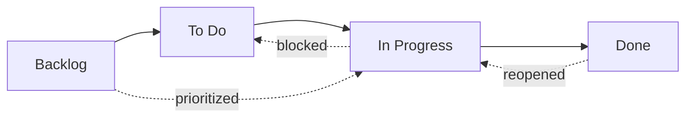
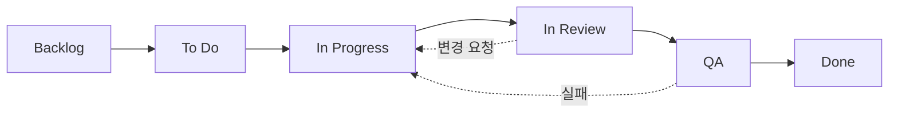

# 워크플로우 상태

OpenPR의 모든 이슈는 워크플로우에서 위치를 나타내는 **상태**를 가집니다. 칸반 보드 열은 이 상태에 직접 매핑됩니다.

OpenPR은 4개의 기본 상태와 함께 제공되지만, 3단계 해결 시스템을 통해 완전한 **커스텀 워크플로우 상태**를 지원합니다. 프로젝트별, 워크스페이스별로 다른 워크플로우를 정의하거나 시스템 기본값을 사용할 수 있습니다.

## 기본 상태



| 상태 | 값 | 설명 |
|------|-----|------|
| **Backlog** | `backlog` | 아이디어, 미래 작업, 계획되지 않은 항목. 아직 예정되지 않음. |
| **To Do** | `todo` | 계획되고 우선순위가 지정됨. 작업 시작 준비. |
| **In Progress** | `in_progress` | 담당자가 현재 작업 중. |
| **Done** | `done` | 완료 및 검증됨. |

이것은 모든 새 워크스페이스가 시작하는 내장 상태입니다. 아래 [커스텀 워크플로우](#custom-workflows)에 설명된 대로 사용자 정의하거나 추가 상태를 추가할 수 있습니다.

## 상태 전환

OpenPR은 유연한 상태 전환을 허용합니다. 강제 제약이 없습니다 -- 어떤 상태에서 다른 상태로도 전환할 수 있습니다. 일반적인 패턴:

| 전환 | 트리거 | 예시 |
|------|--------|------|
| Backlog -> To Do | 스프린트 계획, 우선순위 지정 | 다음 스프린트로 이슈 끌어올리기 |
| To Do -> In Progress | 개발자가 작업 시작 | 담당자가 구현 시작 |
| In Progress -> Done | 작업 완료 | 풀 리퀘스트 병합 |
| In Progress -> To Do | 작업 차단 또는 일시 중단 | 외부 의존성 대기 |
| Done -> In Progress | 이슈 재개 | 버그 회귀 발견 |
| Backlog -> In Progress | 긴급 핫픽스 | 심각한 프로덕션 이슈 |

## 커스텀 워크플로우

OpenPR은 **3단계 해결** 시스템을 통해 커스텀 워크플로우 상태를 지원합니다. API가 작업 항목의 상태를 검증할 때 세 가지 수준을 순서대로 확인하여 유효 워크플로우를 해결합니다:

```
프로젝트 워크플로우  >  워크스페이스 워크플로우  >  시스템 기본값
```

프로젝트가 자체 워크플로우를 정의하면 그것이 우선합니다. 그렇지 않으면 워크스페이스 수준 워크플로우가 사용됩니다. 둘 다 없으면 4개의 시스템 기본 상태가 적용됩니다.

### 커스텀 워크플로우 예시: 6단계 엔지니어링 워크플로우



| 상태 | 키 | 카테고리 | 초기 | 최종 |
|------|-----|---------|------|------|
| Backlog | `backlog` | backlog | 예 | 아니오 |
| To Do | `todo` | planned | 아니오 | 아니오 |
| In Progress | `in_progress` | active | 아니오 | 아니오 |
| In Review | `in_review` | active | 아니오 | 아니오 |
| QA | `qa` | active | 아니오 | 아니오 |
| Done | `done` | completed | 아니오 | 예 |

### API를 통한 커스텀 워크플로우 생성

**1단계 -- 프로젝트에 대한 워크플로우 생성:**

```bash
curl -X POST http://localhost:8080/api/workflows \
  -H "Content-Type: application/json" \
  -H "Authorization: Bearer <token>" \
  -d '{
    "name": "Engineering Flow",
    "project_id": "<project_uuid>"
  }'
```

**2단계 -- 워크플로우에 상태 추가:**

```bash
curl -X POST http://localhost:8080/api/workflows/<workflow_id>/states \
  -H "Content-Type: application/json" \
  -H "Authorization: Bearer <token>" \
  -d '{
    "key": "in_review",
    "display_name": "In Review",
    "category": "active",
    "position": 3,
    "color": "#f59e0b",
    "is_initial": false,
    "is_terminal": false
  }'
```

## 칸반 보드

보드 뷰는 이슈를 워크플로우 상태에 해당하는 열의 카드로 표시합니다. 카드를 열 사이에 드래그 앤 드롭하여 상태를 변경합니다. 커스텀 워크플로우가 활성화되면 보드는 자동으로 커스텀 상태와 설정된 순서를 반영합니다.

각 카드에 표시되는 내용:
- 이슈 식별자 (예: `API-42`)
- 제목
- 우선순위 표시
- 담당자 아바타
- 레이블 배지

## API를 통한 상태 업데이트

```bash
# 이슈를 "in_progress"로 이동
curl -X PATCH http://localhost:8080/api/issues/<issue_id> \
  -H "Content-Type: application/json" \
  -H "Authorization: Bearer <token>" \
  -d '{"state": "in_progress"}'
```

## 우선순위 레벨

상태 외에도 각 이슈는 우선순위 레벨을 가질 수 있습니다:

| 우선순위 | 값 | 설명 |
|---------|-----|------|
| Low | `low` | 좋으면 좋고, 시간 압박 없음 |
| Medium | `medium` | 표준 우선순위, 계획된 작업 |
| High | `high` | 중요, 곧 처리해야 함 |
| Urgent | `urgent` | 중요, 즉각적인 주의 필요 |

## 다음 단계

- [스프린트 계획](./sprints) -- 이슈를 시간 제한 반복으로 구성
- [레이블](./labels) -- 이슈에 분류 추가
- [이슈 개요](./index) -- 완전한 이슈 필드 레퍼런스
