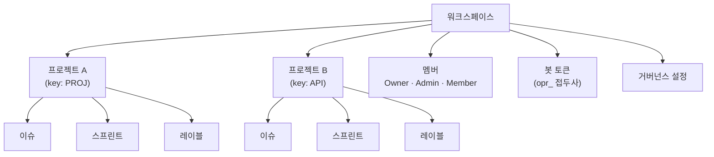

# 워크스페이스 관리

**워크스페이스**는 OpenPR의 최상위 조직 단위입니다. 멀티 테넌트 격리를 제공합니다 -- 각 워크스페이스는 자체 프로젝트, 멤버, 레이블, 봇 토큰, 거버넌스 설정을 가집니다. 사용자는 여러 워크스페이스에 속할 수 있습니다.

## 워크스페이스 생성

로그인 후 대시보드에서 **워크스페이스 생성**을 클릭하거나 **설정** > **워크스페이스** > **새로 만들기**로 이동합니다.

다음을 제공합니다:

| 필드 | 필수 | 설명 |
|------|------|------|
| 이름 | 예 | 표시 이름 (예: "Engineering Team") |
| 슬러그 | 예 | URL 친화적 식별자 (예: "engineering") |

생성 사용자는 자동으로 **Owner** 역할을 받습니다.

## 워크스페이스 구조



## 워크스페이스 설정

사이드바의 기어 아이콘이나 **설정**을 통해 워크스페이스 설정에 접근합니다:

- **일반** -- 워크스페이스 이름, 슬러그, 설명 업데이트.
- **멤버** -- 사용자 초대, 역할 변경, 멤버 제거. [멤버](./members) 참조.
- **봇 토큰** -- MCP 봇 토큰 생성 및 관리.
- **거버넌스** -- 투표 임계값, 제안 템플릿, 신뢰 점수 규칙 설정. [거버넌스](../governance/) 참조.
- **웹훅** -- 외부 통합을 위한 웹훅 엔드포인트 설정.

## API 접근

```bash
# 워크스페이스 나열
curl -H "Authorization: Bearer <token>" \
  http://localhost:8080/api/workspaces

# 워크스페이스 상세 조회
curl -H "Authorization: Bearer <token>" \
  http://localhost:8080/api/workspaces/<workspace_id>
```

## MCP 접근

MCP 서버를 통해 AI 어시스턴트는 `OPENPR_WORKSPACE_ID` 환경 변수로 지정된 워크스페이스 내에서 작동합니다. 모든 MCP 도구는 자동으로 해당 워크스페이스로 작업 범위를 지정합니다.

## 다음 단계

- [프로젝트](./projects) -- 워크스페이스 내에서 프로젝트 생성 및 관리
- [멤버 및 권한](./members) -- 사용자 초대 및 역할 설정
