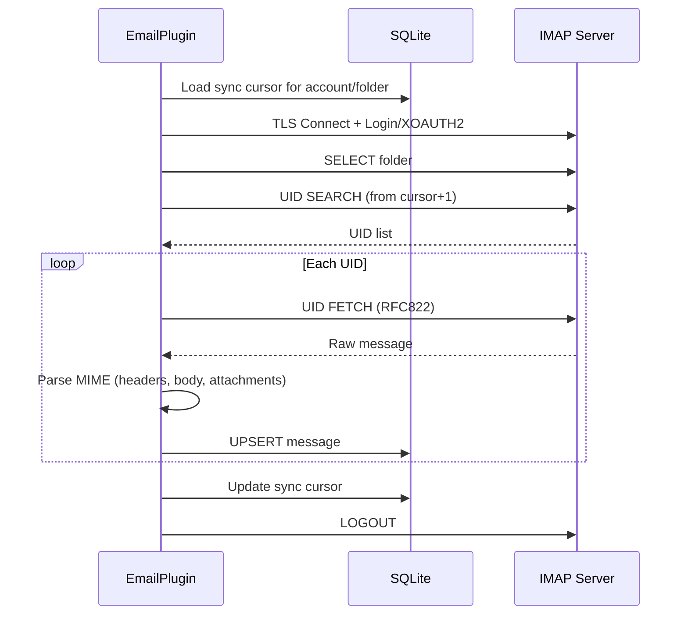

# IMAP 설정

PRX-Email은 `rustls` 라이브러리를 사용하여 TLS를 통해 IMAP 서버에 연결합니다. 비밀번호 인증과 Gmail 및 Outlook을 위한 XOAUTH2를 지원합니다. 받은 편지함 동기화는 UID 기반이고 증분적이며, SQLite 데이터베이스에 커서를 퍼시스턴스합니다.

## 기본 IMAP 설정

```rust
use prx_email::plugin::{ImapConfig, AuthConfig};

let imap = ImapConfig {
    host: "imap.example.com".to_string(),
    port: 993,
    user: "you@example.com".to_string(),
    auth: AuthConfig {
        password: Some("your-app-password".to_string()),
        oauth_token: None,
    },
};
```

### 설정 필드

| 필드 | 타입 | 필수 | 설명 |
|------|------|------|------|
| `host` | `String` | 예 | IMAP 서버 호스트명 (빈 값 불가) |
| `port` | `u16` | 예 | IMAP 서버 포트 (TLS의 경우 일반적으로 993) |
| `user` | `String` | 예 | IMAP 사용자 이름 (보통 이메일 주소) |
| `auth.password` | `Option<String>` | 둘 중 하나 | IMAP LOGIN을 위한 앱 비밀번호 |
| `auth.oauth_token` | `Option<String>` | 둘 중 하나 | XOAUTH2를 위한 OAuth 액세스 토큰 |

::: warning 인증
`password` 또는 `oauth_token` 중 정확히 하나만 설정해야 합니다. 둘 다 설정하거나 둘 다 설정하지 않으면 유효성 검사 오류가 발생합니다.
:::

## 일반 프로바이더 설정

| 프로바이더 | 호스트 | 포트 | 인증 방법 |
|---------|------|------|---------|
| Gmail | `imap.gmail.com` | 993 | 앱 비밀번호 또는 XOAUTH2 |
| Outlook / Office 365 | `outlook.office365.com` | 993 | XOAUTH2 (권장) |
| Yahoo | `imap.mail.yahoo.com` | 993 | 앱 비밀번호 |
| Fastmail | `imap.fastmail.com` | 993 | 앱 비밀번호 |
| ProtonMail Bridge | `127.0.0.1` | 1143 | 브릿지 비밀번호 |

## 받은 편지함 동기화

`sync` 메서드는 IMAP 서버에 연결하고, 폴더를 선택하고, UID로 새 메시지를 페칭하고, SQLite에 저장합니다:

```rust
use prx_email::plugin::SyncRequest;

plugin.sync(SyncRequest {
    account_id: 1,
    folder: Some("INBOX".to_string()),
    cursor: None,        // 마지막 저장된 커서에서 재개
    now_ts: now,
    max_messages: 100,   // 동기화당 최대 100개 메시지 페칭
})?;
```

### 동기화 흐름



### 증분 동기화

PRX-Email은 메시지 재페칭을 방지하기 위해 UID 기반 커서를 사용합니다. 각 동기화 후:

1. 확인된 가장 높은 UID가 커서로 저장됩니다
2. 다음 동기화는 `cursor + 1`에서 시작합니다
3. 기존 `(account_id, message_id)` 쌍이 있는 메시지는 업데이트됩니다 (UPSERT)

커서는 복합 키 `(account_id, folder_id)`와 함께 `sync_state` 테이블에 저장됩니다.

## 멀티 폴더 동기화

동일한 계정의 여러 폴더를 동기화합니다:

```rust
for folder in &["INBOX", "Sent", "Drafts", "Archive"] {
    plugin.sync(SyncRequest {
        account_id,
        folder: Some(folder.to_string()),
        cursor: None,
        now_ts: now,
        max_messages: 100,
    })?;
}
```

## 동기화 스케줄러

주기적인 동기화를 위해 내장된 동기화 러너를 사용합니다:

```rust
use prx_email::plugin::{SyncJob, SyncRunnerConfig};

let jobs = vec![
    SyncJob { account_id: 1, folder: "INBOX".into(), max_messages: 100 },
    SyncJob { account_id: 1, folder: "Sent".into(), max_messages: 50 },
    SyncJob { account_id: 2, folder: "INBOX".into(), max_messages: 100 },
];

let config = SyncRunnerConfig {
    max_concurrency: 4,         // 러너 틱당 최대 작업 수
    base_backoff_seconds: 10,   // 실패 시 초기 백오프
    max_backoff_seconds: 300,   // 최대 백오프 (5분)
};

let report = plugin.run_sync_runner(&jobs, now, &config);
println!(
    "Run {}: attempted={}, succeeded={}, failed={}",
    report.run_id, report.attempted, report.succeeded, report.failed
);
```

### 스케줄러 동작

- **동시성 제한**: 틱당 최대 `max_concurrency`개의 작업만 실행됨
- **실패 백오프**: `base * 2^failures` 공식의 지수적 백오프, `max_backoff_seconds`로 제한됨
- **기한 확인**: 백오프 윈도우가 경과하지 않은 경우 작업 건너뜀
- **상태 추적**: `account::folder` 키별로 `(next_allowed_at, failure_count)` 추적

## 메시지 파싱

수신 메시지는 다음 추출이 있는 `mail-parser` 크레이트를 사용하여 파싱됩니다:

| 필드 | 소스 | 비고 |
|------|------|------|
| `message_id` | `Message-ID` 헤더 | 원시 바이트의 SHA-256으로 폴백 |
| `subject` | `Subject` 헤더 | |
| `sender` | `From` 헤더의 첫 번째 주소 | |
| `recipients` | `To` 헤더의 모든 주소 | 쉼표로 구분 |
| `body_text` | 첫 번째 `text/plain` 파트 | |
| `body_html` | 첫 번째 `text/html` 파트 | 폴백: 원시 섹션 추출 |
| `snippet` | body_text 또는 body_html의 첫 120자 | |
| `references_header` | `References` 헤더 | 스레딩용 |
| `attachments` | MIME 첨부 파트 | JSON 직렬화된 메타데이터 |

## TLS

모든 IMAP 연결은 `webpki-roots` 인증서 번들이 있는 `rustls`를 통해 TLS를 사용합니다. TLS를 비활성화하거나 STARTTLS를 사용하는 옵션은 없습니다 -- 연결은 항상 처음부터 암호화됩니다.

## 다음 단계

- [SMTP 설정](./smtp) -- 이메일 전송 설정
- [OAuth 인증](./oauth) -- Gmail 및 Outlook을 위한 XOAUTH2 설정
- [SQLite 스토리지](../storage/) -- 데이터베이스 스키마 이해
