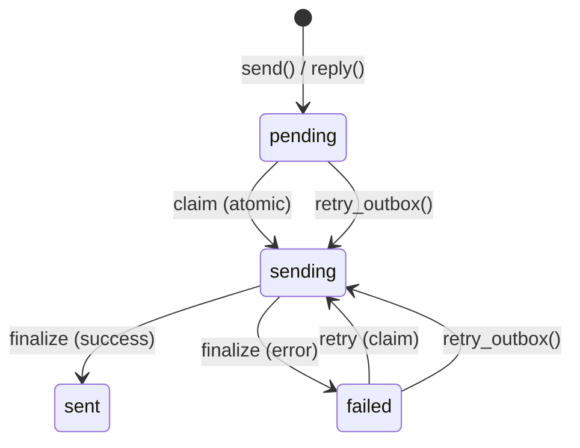

# SMTP 설정

PRX-Email은 `rustls` TLS가 있는 `lettre` 크레이트를 사용하여 SMTP를 통해 이메일을 전송합니다. 아웃박스 파이프라인은 원자적 클레임-전송-파이널라이즈 워크플로우를 사용하여 중복 전송을 방지하며, 지수적 백오프 재시도와 결정론적 Message-ID 멱등성 키를 제공합니다.

## 기본 SMTP 설정

```rust
use prx_email::plugin::{SmtpConfig, AuthConfig};

let smtp = SmtpConfig {
    host: "smtp.example.com".to_string(),
    port: 465,
    user: "you@example.com".to_string(),
    auth: AuthConfig {
        password: Some("your-app-password".to_string()),
        oauth_token: None,
    },
};
```

### 설정 필드

| 필드 | 타입 | 필수 | 설명 |
|------|------|------|------|
| `host` | `String` | 예 | SMTP 서버 호스트명 (빈 값 불가) |
| `port` | `u16` | 예 | SMTP 서버 포트 (암시적 TLS의 경우 465, STARTTLS의 경우 587) |
| `user` | `String` | 예 | SMTP 사용자 이름 (보통 이메일 주소) |
| `auth.password` | `Option<String>` | 둘 중 하나 | SMTP AUTH PLAIN/LOGIN을 위한 비밀번호 |
| `auth.oauth_token` | `Option<String>` | 둘 중 하나 | XOAUTH2를 위한 OAuth 액세스 토큰 |

## 일반 프로바이더 설정

| 프로바이더 | 호스트 | 포트 | 인증 방법 |
|---------|------|------|---------|
| Gmail | `smtp.gmail.com` | 465 | 앱 비밀번호 또는 XOAUTH2 |
| Outlook / Office 365 | `smtp.office365.com` | 587 | XOAUTH2 |
| Yahoo | `smtp.mail.yahoo.com` | 465 | 앱 비밀번호 |
| Fastmail | `smtp.fastmail.com` | 465 | 앱 비밀번호 |

## 이메일 전송

### 기본 전송

```rust
use prx_email::plugin::SendEmailRequest;

let response = plugin.send(SendEmailRequest {
    account_id: 1,
    to: "recipient@example.com".to_string(),
    subject: "Hello".to_string(),
    body_text: "Message body here.".to_string(),
    now_ts: now,
    attachment: None,
    failure_mode: None,
});
```

### 메시지 답장

```rust
use prx_email::plugin::ReplyEmailRequest;

let response = plugin.reply(ReplyEmailRequest {
    account_id: 1,
    in_reply_to_message_id: "<original-msg-id@example.com>".to_string(),
    body_text: "Thanks for your message!".to_string(),
    now_ts: now,
    attachment: None,
    failure_mode: None,
});
```

답장은 자동으로 다음을 수행합니다:
- `In-Reply-To` 헤더 설정
- 상위 메시지에서 `References` 체인 구축
- 상위 메시지의 발신자에서 수신자 파생
- 제목에 `Re:` 접두사 추가

## 아웃박스 파이프라인

아웃박스 파이프라인은 원자적 상태 머신을 통해 신뢰할 수 있는 이메일 전달을 보장합니다:



### 상태 머신 규칙

| 전환 | 조건 | 가드 |
|------|------|------|
| `pending` -> `sending` | `claim_outbox_for_send()` | `status IN ('pending','failed') AND next_attempt_at <= now` |
| `sending` -> `sent` | 프로바이더 수락 | `update_outbox_status_if_current(status='sending')` |
| `sending` -> `failed` | 프로바이더 거부 또는 네트워크 오류 | `update_outbox_status_if_current(status='sending')` |
| `failed` -> `sending` | `retry_outbox()` | `status IN ('pending','failed') AND next_attempt_at <= now` |

### 멱등성

각 아웃박스 메시지는 결정론적 Message-ID를 받습니다:

```
<outbox-{id}-{retries}@prx-email.local>
```

이를 통해 재시도를 원래 전송과 구별할 수 있으며, Message-ID로 중복을 제거하는 프로바이더는 각 재시도를 수락합니다.

### 재시도 백오프

실패한 전송은 지수적 백오프를 사용합니다:

```
next_attempt_at = now + base_backoff * 2^retries
```

기본 백오프가 5초인 경우:

| 재시도 | 백오프 |
|--------|--------|
| 1 | 10초 |
| 2 | 20초 |
| 3 | 40초 |
| 4 | 80초 |
| 5 | 160초 |
| 6 | 320초 |
| 7 | 640초 |
| 10 | 5,120초 (~85분) |

### 수동 재시도

```rust
use prx_email::plugin::RetryOutboxRequest;

let response = plugin.retry_outbox(RetryOutboxRequest {
    outbox_id: 42,
    now_ts: now,
    failure_mode: None,
});
```

다음의 경우 재시도가 거부됩니다:
- 아웃박스 상태가 `sent` 또는 `sending`인 경우 (재시도 불가)
- `next_attempt_at`에 아직 도달하지 않은 경우 (`retry_not_due`)

## 첨부 파일

### 첨부 파일과 함께 전송

```rust
use prx_email::plugin::{SendEmailRequest, AttachmentInput};

let response = plugin.send(SendEmailRequest {
    account_id: 1,
    to: "recipient@example.com".to_string(),
    subject: "Report attached".to_string(),
    body_text: "Please find the report attached.".to_string(),
    now_ts: now,
    attachment: Some(AttachmentInput {
        filename: "report.pdf".to_string(),
        content_type: "application/pdf".to_string(),
        base64: Some(base64_encoded_content),
        path: None,
    }),
    failure_mode: None,
});
```

### 첨부 파일 정책

`AttachmentPolicy`는 크기 및 MIME 타입 제한을 적용합니다:

```rust
use prx_email::plugin::AttachmentPolicy;

let policy = AttachmentPolicy {
    max_size_bytes: 25 * 1024 * 1024,  // 25 MiB
    allowed_content_types: [
        "application/pdf",
        "image/jpeg",
        "image/png",
        "text/plain",
        "application/zip",
    ].into_iter().map(String::from).collect(),
};
```

| 규칙 | 동작 |
|------|------|
| 크기가 `max_size_bytes` 초과 | `attachment exceeds size limit`으로 거부 |
| MIME 타입이 `allowed_content_types`에 없음 | `attachment content type is not allowed`으로 거부 |
| `attachment_store` 없이 경로 기반 첨부 파일 | `attachment store not configured`으로 거부 |
| 경로가 스토리지 루트를 벗어남 (`../` 탐색) | `attachment path escapes storage root`으로 거부 |

### 경로 기반 첨부 파일

디스크에 저장된 첨부 파일의 경우 첨부 파일 스토어를 설정합니다:

```rust
use prx_email::plugin::AttachmentStoreConfig;

let store = AttachmentStoreConfig {
    enabled: true,
    dir: "/var/lib/prx-email/attachments".to_string(),
};
```

경로 해석에는 디렉토리 탐색 가드가 포함됩니다 -- 심볼릭 링크 기반 탈출을 포함하여 설정된 스토리지 루트 외부로 해석되는 모든 경로는 거부됩니다.

## API 응답 형식

모든 전송 작업은 `ApiResponse<SendResult>`를 반환합니다:

```rust
pub struct SendResult {
    pub outbox_id: i64,
    pub status: String,          // "sent" or "failed"
    pub retries: i64,
    pub provider_message_id: Option<String>,
    pub next_attempt_at: i64,
}
```

## 다음 단계

- [OAuth 인증](./oauth) -- XOAUTH2가 필요한 프로바이더를 위한 설정
- [설정 레퍼런스](../configuration/) -- 모든 설정 및 환경 변수
- [문제 해결](../troubleshooting/) -- 일반적인 SMTP 문제와 해결책
