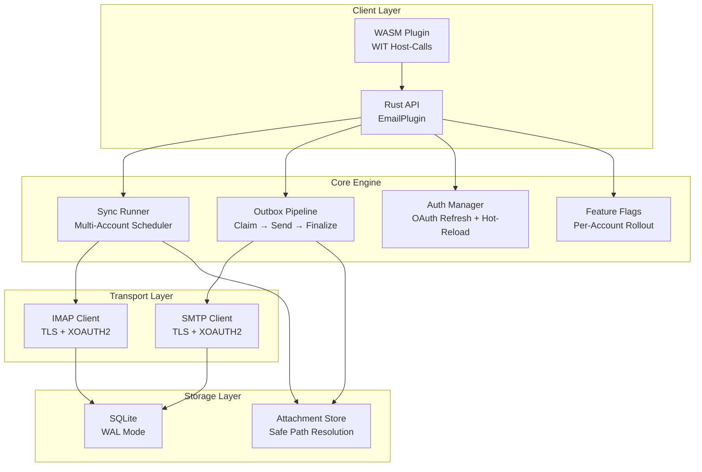

# PRX-Email

**PRX-Email**은 SQLite 퍼시스턴스와 프로덕션 강화 프리미티브가 있는 Rust로 작성된 셀프호스팅 이메일 클라이언트 플러그인입니다. IMAP 받은 편지함 동기화, 원자적 아웃박스 파이프라인을 사용한 SMTP 전송, Gmail 및 Outlook을 위한 OAuth 2.0 인증, 첨부 파일 거버넌스, PRX 에코시스템 통합을 위한 WASM 플러그인 인터페이스를 제공합니다.

PRX-Email은 신뢰할 수 있는 임베딩 가능한 이메일 백엔드가 필요한 개발자와 팀을 위해 설계되었습니다. 멀티 계정 동기화 스케줄링, 재시도 및 백오프가 있는 안전한 아웃박스 전달, OAuth 토큰 수명 주기 관리, 기능 플래그 롤아웃을 처리하며, 서드파티 SaaS 이메일 API에 의존하지 않습니다.

## PRX-Email을 선택하는 이유

대부분의 이메일 통합은 벤더별 API나 중복 전송, 토큰 만료, 첨부 파일 안전성과 같은 프로덕션 문제를 무시하는 취약한 IMAP/SMTP 래퍼에 의존합니다. PRX-Email은 다른 접근 방식을 취합니다:

- **프로덕션 강화 아웃박스.** 원자적 클레임-앤-파이널라이즈 상태 머신이 중복 전송을 방지합니다. 지수적 백오프와 결정론적 Message-ID 멱등성 키로 안전한 재시도를 보장합니다.
- **OAuth 우선 인증.** IMAP 및 SMTP 모두를 위한 네이티브 XOAUTH2 지원, 토큰 만료 추적, 플러그 가능한 갱신 프로바이더, 환경 변수에서의 핫 리로드를 제공합니다.
- **SQLite 네이티브 스토리지.** WAL 모드, 경계 체크포인팅, 파라미터화된 쿼리로 외부 데이터베이스 의존성 없이 빠르고 신뢰할 수 있는 로컬 퍼시스턴스를 제공합니다.
- **WASM으로 확장 가능.** 플러그인이 WebAssembly로 컴파일되고 WIT 호스트 콜을 통해 이메일 작업을 노출하며, 기본적으로 실제 IMAP/SMTP를 비활성화하는 네트워크 안전 스위치가 있습니다.

## 주요 기능

<div class="vp-features">

- **IMAP 받은 편지함 동기화** -- TLS로 모든 IMAP 서버에 연결합니다. UID 기반 증분 페칭과 커서 퍼시스턴스로 여러 계정과 폴더를 동기화합니다.

- **SMTP 아웃박스 파이프라인** -- 원자적 클레임-전송-파이널라이즈 워크플로우가 중복 전송을 방지합니다. 실패한 메시지는 지수적 백오프와 설정 가능한 제한으로 재시도합니다.

- **OAuth 2.0 인증** -- Gmail 및 Outlook을 위한 XOAUTH2. 토큰 만료 추적, 플러그 가능한 갱신 프로바이더, 재시작 없이 환경 기반 핫 리로드를 지원합니다.

- **멀티 계정 동기화 스케줄러** -- 설정 가능한 동시성, 실패 백오프, 실행당 하드 캡으로 계정 및 폴더별 주기적 폴링을 수행합니다.

- **SQLite 퍼시스턴스** -- WAL 모드, NORMAL 동기화, 5초 바쁨 타임아웃. 계정, 폴더, 메시지, 아웃박스, 동기화 상태, 기능 플래그가 있는 전체 스키마를 제공합니다.

- **첨부 파일 거버넌스** -- 최대 크기 제한, MIME 화이트리스트 적용, 디렉토리 탐색 가드가 과도하거나 악의적인 첨부 파일을 보호합니다.

- **기능 플래그 롤아웃** -- 퍼센트 기반 롤아웃이 있는 계정별 기능 플래그. 받은 편지함 읽기, 검색, 전송, 답장, 재시도 기능을 독립적으로 제어합니다.

- **WASM 플러그인 인터페이스** -- PRX 런타임에서 샌드박스 실행을 위해 WebAssembly로 컴파일합니다. 호스트 콜이 email.sync, list, get, search, send, reply 작업을 제공합니다.

- **관찰 가능성** -- 인메모리 런타임 메트릭 (동기화 시도/성공/실패, 전송 실패, 재시도 횟수)과 계정, 폴더, message_id, run_id, error_code가 있는 구조화된 로그 페이로드를 제공합니다.

</div>

## 아키텍처



## 빠른 설치

저장소를 클론하고 빌드합니다:

```bash
git clone https://github.com/openprx/prx_email.git
cd prx_email
cargo build --release
```

또는 `Cargo.toml`에 의존성으로 추가합니다:

```toml
[dependencies]
prx_email = { git = "https://github.com/openprx/prx_email.git" }
```

WASM 플러그인 컴파일을 포함한 전체 설정 지침은 [설치 가이드](./getting-started/installation)를 참조하세요.

## 문서 섹션

| 섹션 | 설명 |
|------|------|
| [설치](./getting-started/installation) | PRX-Email 설치, 의존성 설정, WASM 플러그인 빌드 |
| [빠른 시작](./getting-started/quickstart) | 5분 안에 첫 번째 계정 설정 및 이메일 전송 |
| [계정 관리](./accounts/) | 이메일 계정 추가, 설정, 관리 |
| [IMAP 설정](./accounts/imap) | IMAP 서버 설정, TLS, 폴더 동기화 |
| [SMTP 설정](./accounts/smtp) | SMTP 서버 설정, TLS, 전송 파이프라인 |
| [OAuth 인증](./accounts/oauth) | Gmail 및 Outlook을 위한 OAuth 2.0 설정 |
| [SQLite 스토리지](./storage/) | 데이터베이스 스키마, WAL 모드, 성능 튜닝, 유지 관리 |
| [WASM 플러그인](./plugins/) | WIT 호스트 콜로 WASM 플러그인 빌드 및 배포 |
| [설정 레퍼런스](./configuration/) | 모든 환경 변수, 런타임 설정, 정책 옵션 |
| [문제 해결](./troubleshooting/) | 일반적인 문제와 해결책 |

## 프로젝트 정보

- **라이선스:** MIT OR Apache-2.0
- **언어:** Rust (2024 에디션)
- **저장소:** [github.com/openprx/prx_email](https://github.com/openprx/prx_email)
- **스토리지:** SQLite (번들 기능이 있는 rusqlite)
- **IMAP:** rustls TLS가 있는 `imap` 크레이트
- **SMTP:** rustls TLS가 있는 `lettre` 크레이트
