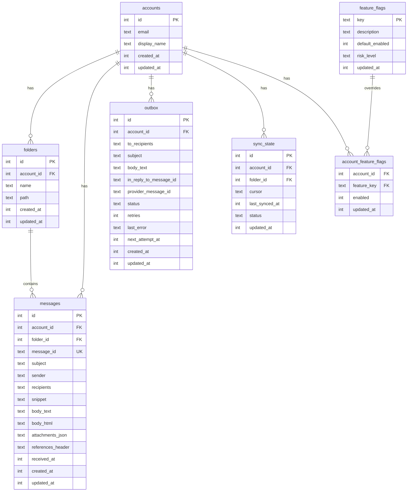

# SQLite 스토리지

PRX-Email은 번들 SQLite 컴파일이 있는 `rusqlite` 크레이트를 통해 액세스되는 SQLite를 유일한 스토리지 백엔드로 사용합니다. 데이터베이스는 외래 키가 활성화된 WAL 모드로 실행되어 빠른 동시 읽기와 신뢰할 수 있는 쓰기 격리를 제공합니다.

## 데이터베이스 설정

### 기본 설정

| 설정 | 값 | 설명 |
|------|------|------|
| `journal_mode` | WAL | 동시 읽기를 위한 Write-Ahead Logging |
| `synchronous` | NORMAL | 균형 잡힌 내구성/성능 |
| `foreign_keys` | ON | 참조 무결성 적용 |
| `busy_timeout` | 5000ms | 잠긴 데이터베이스 대기 시간 |
| `wal_autocheckpoint` | 1000페이지 | 자동 WAL 체크포인트 임계값 |

### 사용자 정의 설정

```rust
use prx_email::db::{EmailStore, StoreConfig, SynchronousMode};

let config = StoreConfig {
    enable_wal: true,
    busy_timeout_ms: 5_000,
    wal_autocheckpoint_pages: 1_000,
    synchronous: SynchronousMode::Normal,
};

let store = EmailStore::open_with_config("./email.db", &config)?;
```

### 동기화 모드

| 모드 | 내구성 | 성능 | 사용 사례 |
|------|--------|------|---------|
| `Full` | 최대 | 가장 느린 쓰기 | 금융 또는 컴플라이언스 워크로드 |
| `Normal` | 양호 (기본값) | 균형 | 일반 프로덕션 사용 |
| `Off` | 최소 | 가장 빠른 쓰기 | 개발 및 테스트만 |

### 인메모리 데이터베이스

테스트를 위해 인메모리 데이터베이스를 사용합니다:

```rust
let store = EmailStore::open_in_memory()?;
store.migrate()?;
```

## 스키마

데이터베이스 스키마는 증분 마이그레이션을 통해 적용됩니다. `store.migrate()`를 실행하면 보류 중인 모든 마이그레이션이 적용됩니다.

### 테이블



### 인덱스

| 테이블 | 인덱스 | 목적 |
|--------|--------|------|
| `messages` | `(account_id)` | 계정별 메시지 필터링 |
| `messages` | `(folder_id)` | 폴더별 메시지 필터링 |
| `messages` | `(subject)` | 제목에 대한 LIKE 검색 |
| `messages` | `(account_id, message_id)` | UPSERT를 위한 고유 제약 조건 |
| `outbox` | `(account_id)` | 계정별 아웃박스 필터링 |
| `outbox` | `(status, next_attempt_at)` | 처리 가능한 아웃박스 레코드 클레임 |
| `sync_state` | `(account_id, folder_id)` | UPSERT를 위한 고유 제약 조건 |
| `account_feature_flags` | `(account_id)` | 기능 플래그 조회 |

## 마이그레이션

마이그레이션은 바이너리에 내장되어 순서대로 적용됩니다:

| 마이그레이션 | 설명 |
|------------|------|
| `0001_init.sql` | 계정, 폴더, 메시지, sync_state 테이블 |
| `0002_outbox.sql` | 전송 파이프라인을 위한 아웃박스 테이블 |
| `0003_rollout.sql` | 기능 플래그 및 계정 기능 플래그 |
| `0005_m41.sql` | M4.1 스키마 개선 |
| `0006_m42_perf.sql` | M4.2 성능 인덱스 |

추가 컬럼 (`body_html`, `attachments_json`, `references_header`)은 존재하지 않는 경우 `ALTER TABLE`을 통해 추가됩니다.

## 성능 튜닝

### 읽기 집중 워크로드

쓰기보다 읽기가 훨씬 많은 애플리케이션 (일반적인 이메일 클라이언트):

```rust
let config = StoreConfig {
    enable_wal: true,              // 동시 읽기
    busy_timeout_ms: 10_000,       // 경쟁을 위한 더 높은 타임아웃
    wal_autocheckpoint_pages: 2_000, // 덜 빈번한 체크포인트
    synchronous: SynchronousMode::Normal,
};
```

### 쓰기 집중 워크로드

대용량 동기화 작업:

```rust
let config = StoreConfig {
    enable_wal: true,
    busy_timeout_ms: 5_000,
    wal_autocheckpoint_pages: 500, // 더 빈번한 체크포인트
    synchronous: SynchronousMode::Normal,
};
```

### 쿼리 계획 분석

`EXPLAIN QUERY PLAN`으로 느린 쿼리를 확인합니다:

```sql
EXPLAIN QUERY PLAN
SELECT * FROM messages
WHERE account_id = 1 AND subject LIKE '%invoice%'
ORDER BY received_at DESC LIMIT 50;
```

## 용량 계획

### 성장 동인

| 테이블 | 성장 패턴 | 보존 전략 |
|--------|---------|---------|
| `messages` | 지배적인 테이블; 각 동기화와 함께 성장 | 이전 메시지 주기적으로 삭제 |
| `outbox` | 전송 + 실패 기록 누적 | 이전 전송 레코드 삭제 |
| WAL 파일 | 쓰기 버스트 중 급증 | 자동 체크포인트 |

### 모니터링 임계값

- DB 파일 크기와 WAL 크기를 독립적으로 추적
- 여러 체크포인트에 걸쳐 WAL이 크게 유지될 때 알림
- 아웃박스 실패 백로그가 운영 SLO를 초과할 때 알림

## 데이터 유지 관리

### 정리 헬퍼

```rust
// 30일보다 오래된 전송된 아웃박스 레코드 삭제
let cutoff = now - 30 * 86400;
let deleted = repo.delete_sent_outbox_before(cutoff)?;
println!("Deleted {} old sent records", deleted);

// 90일보다 오래된 메시지 삭제
let cutoff = now - 90 * 86400;
let deleted = repo.delete_old_messages_before(cutoff)?;
println!("Deleted {} old messages", deleted);
```

### 유지 관리 SQL

아웃박스 상태 분포 확인:

```sql
SELECT status, COUNT(*) FROM outbox GROUP BY status;
```

메시지 나이 분포:

```sql
SELECT
  CASE
    WHEN received_at >= strftime('%s','now') - 86400 THEN 'lt_1d'
    WHEN received_at >= strftime('%s','now') - 604800 THEN 'lt_7d'
    ELSE 'ge_7d'
  END AS age_bucket,
  COUNT(*)
FROM messages
GROUP BY age_bucket;
```

WAL 체크포인트 및 압축:

```sql
PRAGMA wal_checkpoint(TRUNCATE);
VACUUM;
```

::: warning VACUUM
`VACUUM`은 전체 데이터베이스 파일을 재빌드하며 데이터베이스 크기와 동일한 여유 디스크 공간이 필요합니다. 대량 삭제 후 유지 관리 윈도우에서 실행하세요.
:::

## SQL 안전성

모든 데이터베이스 쿼리는 SQL 인젝션을 방지하기 위해 파라미터화된 구문을 사용합니다:

```rust
// 안전: 파라미터화된 쿼리
conn.execute(
    "SELECT * FROM messages WHERE account_id = ?1 AND message_id = ?2",
    params![account_id, message_id],
)?;
```

동적 식별자 (테이블 이름, 컬럼 이름)는 SQL 문자열에 사용하기 전에 `^[a-zA-Z_][a-zA-Z0-9_]{0,62}$`에 대해 유효성 검사됩니다.

## 다음 단계

- [설정 레퍼런스](../configuration/) -- 모든 런타임 설정
- [문제 해결](../troubleshooting/) -- 데이터베이스 관련 문제
- [IMAP 설정](../accounts/imap) -- 동기화 데이터 흐름 이해
