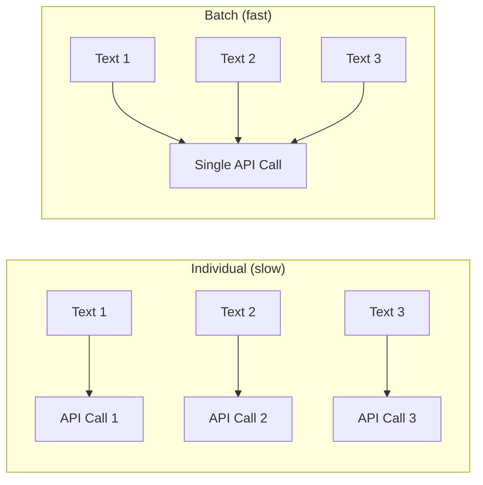

# 배치 처리

대규모 메모리 세트로 작업할 때 텍스트를 하나씩 임베딩하는 것은 비효율적입니다. PRX-Memory는 API 왕복 횟수를 줄이고 처리량을 향상시키는 배치 임베딩을 지원합니다.

## 배치 임베딩 동작 방식

각 메모리에 대해 개별 API 호출을 하는 대신 배치 처리는 여러 텍스트를 단일 요청으로 그룹화합니다. 대부분의 임베딩 프로바이더는 호출당 100--2048개의 텍스트 배치 크기를 지원합니다.



## 사용 사례

### 초기 가져오기

기존 지식의 대규모 세트를 가져올 때 `memory_import`를 사용하여 메모리를 로드하고 배치 임베딩을 트리거합니다:

```json
{
  "jsonrpc": "2.0",
  "id": 1,
  "method": "tools/call",
  "params": {
    "name": "memory_import",
    "arguments": {
      "data": "... exported memory JSON ..."
    }
  }
}
```

### 모델 변경 후 재임베딩

새 임베딩 모델로 전환할 때 `memory_reembed` 도구는 배치로 모든 저장된 메모리를 처리합니다:

```json
{
  "jsonrpc": "2.0",
  "id": 1,
  "method": "tools/call",
  "params": {
    "name": "memory_reembed",
    "arguments": {}
  }
}
```

### 스토리지 압축

`memory_compact` 도구는 스토리지를 최적화하고 오래되거나 누락된 벡터가 있는 항목에 대한 재임베딩을 트리거할 수 있습니다:

```json
{
  "jsonrpc": "2.0",
  "id": 1,
  "method": "tools/call",
  "params": {
    "name": "memory_compact",
    "arguments": {}
  }
}
```

## 성능 팁

| 팁 | 설명 |
|----|------|
| 배치 친화적 프로바이더 사용 | Jina 및 OpenAI 호환 엔드포인트는 대용량 배치 크기를 지원 |
| 사용량이 적은 시간에 예약 | 배치 작업은 실시간 쿼리와 동일한 API 할당량을 경쟁 |
| 메트릭을 통한 모니터링 | `/metrics` 엔드포인트를 사용하여 임베딩 호출 횟수와 지연 시간 추적 |
| 효율적인 모델 선택 | 더 작은 모델(768차원)이 더 큰 모델(3072차원)보다 빠르게 임베딩 |

## 속도 제한

대부분의 임베딩 프로바이더는 속도 제한을 적용합니다. PRX-Memory는 속도 제한 응답(HTTP 429)을 자동 백오프로 처리합니다. 지속적인 속도 제한이 발생하면:

- 한 번에 더 적은 메모리를 처리하여 배치 크기를 줄입니다.
- 더 높은 속도 제한이 있는 프로바이더를 사용합니다.
- 배치 작업을 더 긴 시간 창에 걸쳐 분산합니다.

::: tip
대규모 재임베딩 작업의 경우 속도 제한을 완전히 피하기 위해 로컬 추론 서버를 사용하는 것을 고려하세요. `PRX_EMBED_PROVIDER=openai-compatible`을 설정하고 `PRX_EMBED_BASE_URL`을 로컬 서버로 지정하세요.
:::

## 다음 단계

- [지원 모델](./models) -- 올바른 임베딩 모델 선택
- [스토리지 백엔드](../storage/) -- 벡터가 저장되는 위치
- [설정 레퍼런스](../configuration/) -- 모든 환경 변수
