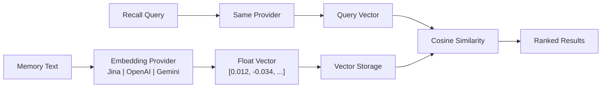

# 임베딩 엔진

임베딩 엔진은 PRX-Memory의 시맨틱 검색 기능의 기반입니다. 텍스트 메모리를 의미를 포착하는 고차원 벡터로 변환하여 키워드 매칭을 넘어서는 유사도 기반 검색을 가능하게 합니다.

## 동작 방식

임베딩이 활성화된 상태로 메모리가 저장되면 PRX-Memory는:

1. 메모리 텍스트를 설정된 임베딩 프로바이더로 전송합니다.
2. 벡터 표현(일반적으로 768--3072 차원)을 수신합니다.
3. 메모리 메타데이터와 함께 벡터를 저장합니다.
4. 회상 중 코사인 유사도 검색에 벡터를 사용합니다.



## 프로바이더 아키텍처

`prx-memory-embed` 크레이트는 모든 임베딩 백엔드가 구현하는 프로바이더 트레이트를 정의합니다. 이 설계를 통해 애플리케이션 코드를 변경하지 않고 프로바이더를 전환할 수 있습니다.

지원 프로바이더:

| 프로바이더 | 환경 키 | 설명 |
|-----------|--------|------|
| OpenAI 호환 | `PRX_EMBED_PROVIDER=openai-compatible` | 모든 OpenAI 호환 API (OpenAI, Azure, 로컬 서버) |
| Jina | `PRX_EMBED_PROVIDER=jina` | Jina AI 임베딩 모델 |
| Gemini | `PRX_EMBED_PROVIDER=gemini` | Google Gemini 임베딩 모델 |

## 설정

환경 변수를 통해 프로바이더와 자격 증명을 설정합니다:

```bash
PRX_EMBED_PROVIDER=jina
PRX_EMBED_API_KEY=your_api_key
PRX_EMBED_MODEL=jina-embeddings-v3
PRX_EMBED_BASE_URL=https://api.jina.ai  # optional, for custom endpoints
```

::: tip 프로바이더 폴백 키
`PRX_EMBED_API_KEY`가 설정되지 않으면 시스템은 프로바이더별 키로 폴백합니다:
- Jina: `JINA_API_KEY`
- Gemini: `GEMINI_API_KEY`
:::

## 임베딩 활성화 시기

| 시나리오 | 임베딩 필요 여부 |
|---------|----------------|
| 소규모 메모리 세트 (<100개 항목) | 선택적 -- 어휘 검색으로 충분할 수 있음 |
| 대규모 메모리 세트 (1000개 이상) | 권장 -- 벡터 유사도가 회상을 크게 향상 |
| 자연어 쿼리 | 권장 -- 시맨틱 의미를 포착 |
| 정확한 태그/범위 필터링 | 필요 없음 -- 어휘 검색이 처리 |
| 교차 언어 회상 | 권장 -- 다국어 모델이 여러 언어에서 작동 |

## 성능 특성

- **지연 시간:** 프로바이더와 모델에 따라 임베딩 호출당 50--200ms.
- **배치 모드:** 단일 API 호출에 여러 텍스트를 그룹화하여 왕복 횟수를 줄입니다.
- **로컬 캐싱:** 벡터는 로컬에 저장되어 재사용됩니다; 새로운 또는 변경된 메모리만 임베딩 호출이 필요합니다.
- **100k 벤치마크:** 10만 개 항목에서 어휘+중요도+최신성 회상의 p95 검색이 123ms 이하 (네트워크 호출 없이).

## 다음 단계

- [지원 모델](./models) -- 상세 모델 비교
- [배치 처리](./batch-processing) -- 효율적인 대량 임베딩
- [리랭킹](../reranking/) -- 더 나은 정밀도를 위한 2단계 리랭킹
